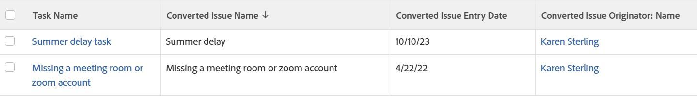

# View: display original issue information on task and project list

You can display the following information from the original issue on a view of task and project lists, after the issue has been converted to the tasks and projects in the list:

* Converted Issue Name
* Converted Issue Entry Date
* Converted Issue Originator Name

For information about creating a view using the standard report builder, see [Views overview in Adobe Workfront](../../../reports-and-dashboards/reports/reporting-elements/views-overview.md).

For more information about including additional issue information on projects and tasks lists, also see [View: originating issue details for tasks and projects](../../../reports-and-dashboards/reports/custom-view-filter-grouping-samples/view-originating-issue-details-tasks-projects.md).

<!--
Applying this view is identical for tasks and projects. To apply this view to a task list: Go to a list of tasks which have been converted from issues From the View drop-down menu, select New View. In the Column Preview area, eliminate all columns except for one. Click the header of the remaining column, then click Switch to Text Mode. Mouse over the text mode area, and click Click to edit text. Remove the text you find in the Text Mode box, and replace it with the following code: Copy column.0.descriptionkey=name column.0.isInlineEditable=false column.0.link.linkproperty.20.name=ID column.0.link.linkproperty.0.valuefield=ID column.0.link.linkproperty.0.valueformat=int column.0.link.linkproperty.0.valueformat=int column.0.link.lookup=link.view column.0.link.valuefield=objCode column.0.link.valueformat=val column.0.linkedname=direct column.0.listsort=string(name) column.0.querysort=name column.0.section=0 column.0.shortview=false column.0.stretch=100 column.0.valuefield=name column.0.valueformat=HTML column.0.width=150 column.1.displayname=Converted Issue Name column.1.linkedname=convertedOpTask column.1.textmode=true column.1.valuefield=convertedOpTaskName column.1.valueformat=HTML column.2.displayname=Converted Issue Entry Date column.2.textmode=true column.2.valuefield=convertedOpTaskEntryDate column.2.valueformat=HTML column.3.displayname=Originator Name column.3.textmode=true column.3.valuefield=convertedOpTaskOriginator:name column.3.valueformat=HTML Click Save View.
-->

