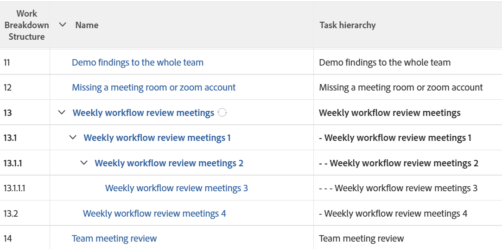

# View: display task indentations in a task list

In this task view, you can add code to the Task Name column to display the tasks indented according to the Work Breakdown Structure of the project.



## Access requirements

You must have the following access to perform the steps in this article:

<table style="table-layout:auto"> 
 <col> 
 <col> 
 <tbody> 
  <tr> 
   <td role="rowheader">Adobe Workfront plan*</td> 
   <td> <p>Any</p> </td> 
  </tr> 
  <tr> 
   <td role="rowheader">Adobe Workfront license*</td> 
   <td> <p>Request to modify a view </p>
   <p>Plan to modify a report</p> </td> 
  </tr> 
  <tr> 
   <td role="rowheader">Access level configurations*</td> 
   <td> <p>Edit access to Reports, Dashboards, Calendars to modify a report</p> <p>Edit access to Filters, Views, Groupings to modify a view</p> <p><b>NOTE</b>
   
   If you still don't have access, ask your Workfront administrator if they set additional restrictions in your access level. For information on how a Workfront administrator can modify your access level, see <a href="../../../administration-and-setup/add-users/configure-and-grant-access/create-modify-access-levels.md" class="MCXref xref">Create or modify custom access levels</a>.</p> </td> 
  </tr> 
  <tr> 
   <td role="rowheader">Object permissions</td> 
   <td> <p>Manage permissions to a report</p> <p>For information on requesting additional access, see <a href="../../../workfront-basics/grant-and-request-access-to-objects/request-access.md" class="MCXref xref">Request access to objects </a>.</p> </td> 
  </tr> 
 </tbody> 
</table>

&#42;To find out what plan, license type, or access you have, contact your Workfront administrator.

## Display task indentations in a column of a task list

1. Go to a list of tasks.
1. From the **View** drop-down menu, click **New View**.

1. Click **Add Column** and start typing "Task&nbsp;Name" in the **Show in this column** field then select it when it displays in the list.

1. From the new column, click **Switch to Text Mode**.
1. Hover over the text mode area, and click **Click to edit text**.
1. Remove the text you find in the `valuefield=` line and replace it with the following code:

   ```
   valueexpression=IF({indent}<1,{name},IF({indent}<2,CONCAT(' - ',{name}),IF({indent}<3,CONCAT(' - - ',{name}),IF({indent}<4,CONCAT(' - - - ',{name}),CONCAT(' - - - - ',{name})))))
   ```

1. Click **Save**, then **Save View**.
