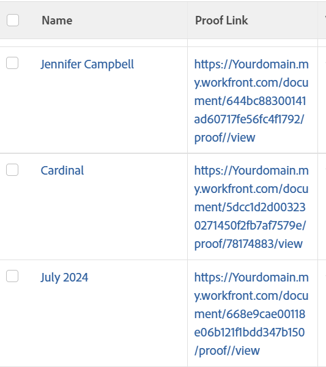

# View: document report with link to a proof

<!--Audited: 11/2024-->

In this document view, you can insert a link to a proof of the current version of the document.



## Access requirements

+++ Expand to view access requirements for the functionality in this article. 

You must have the following access to perform the steps in this article:

<table style="table-layout:auto"> 
 <col> 
 <col> 
 <tbody> 
  <tr> 
   <td role="rowheader">Adobe Workfront plan</td> 
   <td> <p>Any</p> </td> 
  </tr> 
  <tr> 
   <td role="rowheader">Adobe Workfront license*</td> 
   <td> 
    <p>New:</p>
   <ul><li><p>Contributor to modify a filter </p></li>
   <li><p>Standard to modify a report</p></li> </ul>

   <p>Current:</p>
   <ul><li><p>Request to modify a filter </p></li>
   <li><p>Plan to modify a report</p></li> </ul></td> 
  </tr> 
  <tr> 
   <td role="rowheader">Access level configurations</td> 
   <td> <p>Edit access to Reports, Dashboards, Calendars to modify a report</p> <p>Edit access to Filters, Views, Groupings to modify a filter</p> </td> 
  </tr> 
  <tr> 
   <td role="rowheader">Object permissions</td> 
   <td> <p>Manage permissions to a report</p>  </td> 
  </tr> 
 </tbody> 
</table>

*For information, see [Access requirements in Workfront documentation](/help/quicksilver/administration-and-setup/add-users/access-levels-and-object-permissions/access-level-requirements-in-documentation.md). 

+++

## View a document report with link to a proof

To apply this view:

1. Go to a list of documents.
1. From the **View** drop-down menu, select **New View**.
1. Click **Add Column**. 
1. Click **Switch to Text Mode**, then **Edit Text Mode**.
1. Remove the text you find in the **Edit Text Mode** box, and replace it with the following code:

   ```
   displayname=Proof Link
   shortview=true
   textmode=true
   valueexpression=CONCAT("https://Your domain.my.workfront.com/document/",{currentVersion}.{ID},"/proof/",{currentVersion}.{proofID},"/view")
   valueformat=HTML
   ```

   >[!TIP]
   >
   >Replace "Your domain" with your actual Workfront domain. For example, if your company's Workfront url is *Company.my.workfront.com*, your domain is "Company."

1. Click **Done**, then **Save View**.
1. (Optional) Update the view name, then click **Save View**.
1. (Optional) To ensure you display only documents with proofs, add a filter by doing the following:

   1. Click the **Filter** drop-down menu, then click **New Filter**.
   1. Click **Add a Filter Rule** and start typing "Proof Owner", then select **Proof Owner ID** when it displays in the list.
   1. Select **Is Not Blank** for the filter modifier.
   1. Click **Save Filter**.
   1. (Optional) Update the filter name, then click **Save Filter**.

1. Click the link in the Proof Link column to access the proof of the last version of the document.
