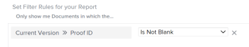

# View: document report with link to a proof

In this document view, you can insert a link to a proof of the current version of the document.


## Access requirements

You must have the following access to perform the steps in this article:

<table cellspacing="0"> 
 <col> 
 <col> 
 <tbody> 
  <tr> 
   <td role="rowheader">Adobe Workfront plan*</td> 
   <td> <p>Any</p> </td> 
  </tr> 
  <tr> 
   <td role="rowheader">Adobe Workfront license*</td> 
   <td> <p>Plan </p> </td> 
  </tr> 
  <tr> 
   <td role="rowheader">Access level configurations*</td> 
   <td> <p>Edit access to&nbsp;Reports,&nbsp;Dashboards,&nbsp;Calendars</p> <p>Edit access to Filters, Views, Groupings</p> <p>Note: If you still don't have access, ask your Workfront administrator if they set additional restrictions in your access level. For information on how a Workfront administrator can modify your access level, see <a href="../../../administration-and-setup/add-users/configure-and-grant-access/create-modify-access-levels.md" class="MCXref xref">Create or modify custom access levels</a>.</p> </td> 
  </tr> 
  <tr> 
   <td role="rowheader">Object permissions</td> 
   <td> <p>Manage permissions to a report</p> <p>For information on requesting additional access, see <a href="../../../workfront-basics/grant-and-request-access-to-objects/request-access.md" class="MCXref xref">Request access to objects in Adobe Workfront</a>.</p> </td> 
  </tr> 
 </tbody> 
</table>

&#42;To find out what plan, license type, or access you have, contact your Workfront administrator.

## View a document report with link to a proof

To apply this view:

1. Go to a list of documents.
1. From the **View** drop-down menu, select **New View**.

1. Click **Add Column**. 
1. Click **Switch to Text Mode**.
1. Hover over the text mode area, and click **Click to edit text**.
1. Remove the text you find in the **Text Mode** box, and replace it with the following code:

   ```
   displayname=Proof Link
   ```

   ```
   shortview=true
   ```

   ```
   textmode=true
   ```

   ```
   valueexpression=CONCAT("https://Your domain.my.workfront.com/document/",{currentVersion}.{ID},"/proof/",{currentVersion}.{proofID},"/view")
   ```

   ```
   valueformat=HTML
   ```

   >[!TIP]
   >
   >Replace "Your domain" with your actual Workfront domain. For example, if your company's Workfront url is *Company.my.workfront.com*, your domain is "Company."

1. Click&nbsp;**Save**, then&nbsp;**Save View**.
1. Type a name for the view, then click **Save View**.
1. (Optional) To ensure you display only documents with proofs, add a filter by doing the following:

   1. Click the **Filter** drop-down menu, then click **New Filter**.
   1. Click **Add a Filter Rule** and start typing Current Version, then select **Current Version Proof ID** when it displays in the list.
   1. Select **Is Not Blank** for the filter modifier.

      

   1. Click **Save Filter**, type the name of the filter, then click&nbsp;**Save Filter**.

1. Click the link in the Proof Link column to access the proof of the last version of the document.

