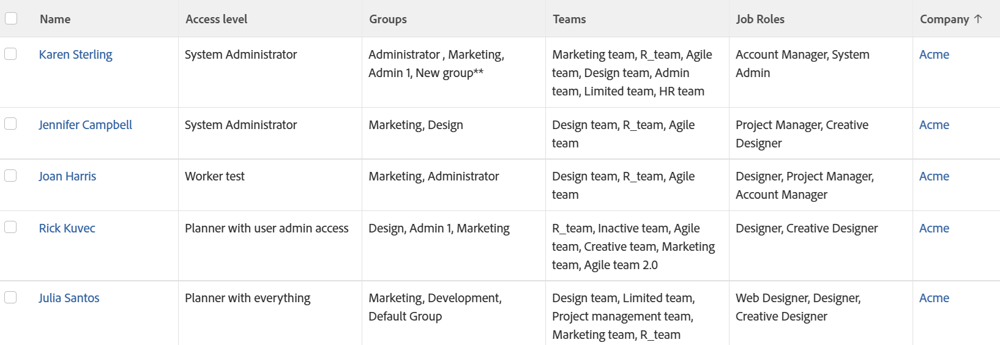

# View: expanded user details

This User&nbsp;view displays information about your users. In addition to their name, access levels, and Company, it also shows lists of their Groups, Teams, and Job Roles.

## Access requirements

You must have the following access to perform the steps in this article:

<table style="table-layout:auto"> 
 <col> 
 <col> 
 <tbody> 
  <tr> 
   <td role="rowheader">Adobe Workfront plan*</td> 
   <td> 
Any
 </td> 
  </tr> 
  <tr> 
   <td role="rowheader">Adobe Workfront license*</td> 
   <td> 
Request to modify a view 

   
Plan to modify a report
 </td> 
  </tr> 
  <tr> 
   <td role="rowheader">Access level configurations*</td> 
   <td> 
Edit access to Reports, Dashboards, Calendars to modify a report
 
Edit access to Filters, Views, Groupings to modify a view
 
<b>NOTE</b>
   
   If you still don't have access, ask your Workfront administrator if they set additional restrictions in your access level. For information on how a Workfront administrator can modify your access level, see <a href="../../../administration-and-setup/add-users/configure-and-grant-access/create-modify-access-levels.md" class="MCXref xref">Create or modify custom access levels</a>.
 </td> 
  </tr> 
  <tr> 
   <td role="rowheader">Object permissions</td> 
   <td> 
Manage permissions to a report
 
For information on requesting additional access, see <a href="../../../workfront-basics/grant-and-request-access-to-objects/request-access.md" class="MCXref xref">Request access to objects </a>.
 </td> 
  </tr> 
 </tbody> 
</table>

&#42;To find out what plan, license type, or access you have, contact your Workfront administrator.

## View expanded user details

To apply this view:

1. Go to a list of users.
1. From the **View** drop-down menu, select **New View**.

1. In the**Column Preview** area, eliminate all columns except for one.
1. Click the header of the remaining column, then click **Switch to Text Mode**.
1. Mouse over the text mode area, and click **Click to edit text**.
1. Remove the text you find in the **Text Mode** box, and replace it with the following code: 

   <!--
   <MadCap:conditionalText data-mc-conditions="QuicksilverOrClassic.Draft mode">
   (NOTE: extra tag here that adds extra spaces in Preview)
   </MadCap:conditionalText>
   -->

   <pre>column.0.descriptionkey=name  column.0.link.linkproperty.0.name=ID column.0.link.linkproperty.0.valuefield=ID column.0.link.linkproperty.0.valueformat=int column.0.link.lookup=link.view column.0.link.valuefield=objCode column.0.link.valueformat=val column.0.linkedname=direct column.0.listsort=string(name) column.0.namekey=name.abbr column.0.querysort=name column.0.shortview=false column.0.stretch=0 column.0.valuefield=name column.0.valueformat=HTML column.0.width=150 column.1.descriptionkey=accesslevel column.1.link.linkproperty.0.name=ID column.1.link.linkproperty.0.valuefield=accessLevel:ID column.1.link.linkproperty.0.valueformat=int column.1.link.lookup=link.view column.1.link.valuefield=accessLevel:objCode column.1.link.valueformat=val column.1.linkedname=accessLevel column.1.listsort=string(displayName) column.1.namekey=accesslevel column.1.querysort=name column.1.shortview=false column.1.stretch=0 column.1.valuefield=accessLevel:displayName column.1.valueformat=HTML column.1.viewalias=accessLevel:displayName column.1.width=100 column.2.link.linkproperty.0.name=ID column.2.link.linkproperty.0.valuefield=ID column.2.link.linkproperty.0.valueformat=int column.2.link.lookup=link.view column.2.link.value=val(objCode) column.2.listdelimiter= column.2.listmethod=nested(userGroups).lists column.2.namekey=group.plural column.2.stretch=50 column.2.type=iterate column.2.valuefield=group:name column.2.valueformat=HTML column.2.width=150 column.3.displayname=Teams column.3.listdelimiter= column.3.listmethod=nested(teams).lists column.3.textmode=true column.3.type=iterate column.3.valueexpression={name} column.3.valueformat=HTML column.4.link.linkproperty.0.name=ID column.4.link.linkproperty.0.valuefield=ID column.4.link.linkproperty.0.valueformat=int column.4.link.lookup=link.view column.4.link.value=val(objCode) column.4.listdelimiter= column.4.listmethod=nested(userRoles).lists column.4.namekey=jobrole.plural column.4.stretch=50 column.4.type=iterate column.4.valuefield=role:name column.4.valueformat=HTML column.4.width=150 column.5.descriptionkey=company column.5.link.linkproperty.0.name=ID column.5.link.linkproperty.0.valuefield=company:ID column.5.link.linkproperty.0.valueformat=int column.5.link.lookup=link.view column.5.link.valuefield=company:objCode column.5.link.valueformat=val column.5.linkedname=company column.5.listsort=nested(company).string(name) column.5.namekey=company column.5.querysort=company:name column.5.shortview=false column.5.stretch=0 column.5.valuefield=company:name column.5.valueformat=HTML column.5.width=150</pre>

1. Click **Save View**.
