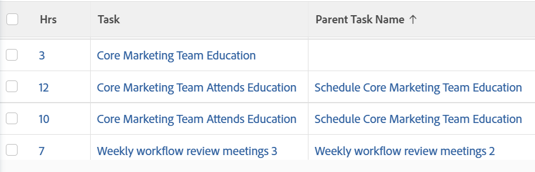

# View: hours with parent task information

This hour view displays the name of the task where the hours were logged as well as the name of the parent task.

## Access requirements

You must have the following access to perform the steps in this article:

<table style="table-layout:auto"> 
 <col> 
 <col> 
 <tbody> 
  <tr> 
   <td role="rowheader">Adobe Workfront plan*</td> 
   <td> 
Any
 </td> 
  </tr> 
  <tr> 
   <td role="rowheader">Adobe Workfront license*</td> 
   <td> 
Request to modify a view 

   
Plan to modify a report
 </td> 
  </tr> 
  <tr> 
   <td role="rowheader">Access level configurations*</td> 
   <td> 
Edit access to Reports, Dashboards, Calendars to modify a report
 
Edit access to Filters, Views, Groupings to modify a view
 
<b>NOTE</b>
   
   If you still don't have access, ask your Workfront administrator if they set additional restrictions in your access level. For information on how a Workfront administrator can modify your access level, see <a href="../../../administration-and-setup/add-users/configure-and-grant-access/create-modify-access-levels.md" class="MCXref xref">Create or modify custom access levels</a>.
 </td> 
  </tr>  
  <tr> 
   <td role="rowheader">Object permissions</td> 
   <td> 
Manage permissions to a report
 
For information on requesting additional access, see <a href="../../../workfront-basics/grant-and-request-access-to-objects/request-access.md" class="MCXref xref">Request access to objects </a>.
 </td> 
  </tr> 
 </tbody> 
</table>

&#42;To find out what plan, license type, or access you have, contact your Workfront administrator.

## View hours with parent task information

1. Go to a list of hours.
1. From the **View** drop-down menu, select **New View**.

1. In the**Column Preview** area, eliminate all columns except for one.
1. Click the header of the remaining column, then click **Switch to Text Mode**.
1. Mouse over the text mode area, and click **Click to edit text**.
1. Remove the text you find in the **Text Mode** box, and replace it with the following code:
   <pre>column.0.aggregator.displayformat=doubleAsString column.0.aggregator.function=SUM column.0.aggregator.namekey=hours column.0.aggregator.valuefield=hours column.0.aggregator.valueformat=doubleAsDouble column.0.descriptionkey=hours column.0.link.linkproperty.0.name=ID column.0.link.linkproperty.0.valuefield=ID column.0.link.linkproperty.0.valueformat=int column.0.link.lookup=link.view column.0.link.valuefield=objCode column.0.link.valueformat=val column.0.linkedname=direct column.0.listsort=doubleAsDouble(hours) column.0.namekey=hours.abbr column.0.querysort=hours column.0.shortview=false column.0.stretch=100 column.0.valuefield=hours column.0.valueformat=doubleAsString column.0.width=150 column.1.descriptionkey=task column.1.link.linkproperty.0.name=ID column.1.link.linkproperty.0.valuefield=task:ID column.1.link.linkproperty.0.valueformat=int column.1.link.lookup=link.view column.1.link.valuefield=task:objCode column.1.link.valueformat=val column.1.linkedname=task column.1.listsort=nested(task).string(name) column.1.namekey=task column.1.querysort=task:name column.1.shortview=false column.1.stretch=0 column.1.valuefield=task:name column.1.valueformat=HTML column.1.width=150 column.2.description=Parent Task Name column.2.link.linkproperty.0.name=ID column.2.link.linkproperty.0.valuefield=task:parent:ID column.2.link.linkproperty.0.valueformat=int column.2.link.lookup=link.view column.2.link.valuefield=task:objCode column.2.link.valueformat=val column.2.linkedname=task column.2.listsort=nested(task:parent).string(name) column.2.name=Parent Task Name column.2.querysort=task:parent:name column.2.shortview=false column.2.stretch=0 column.2.valuefield=task:parent:name column.2.valueformat=HTML column.2.width=150</pre>

1. Click **Save View**.
