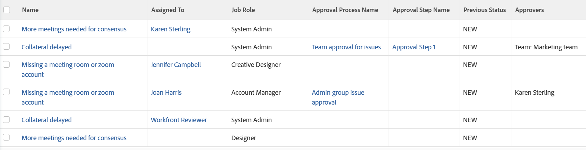

# View: issues with approval information

The following issue view shows the approval process, step, names of the approvers, and the status of the issue before the approval was granted. Some of these fields are not accessible through the standard interface builder.

## Access requirements

You must have the following access to perform the steps in this article:

<table style="table-layout:auto"> 
 <col> 
 <col> 
 <tbody> 
  <tr> 
   <td role="rowheader">Adobe Workfront plan*</td> 
   <td> 
Any
 </td> 
  </tr> 
  <tr> 
   <td role="rowheader">Adobe Workfront license*</td> 
   <td> 
Request to modify a view 

   
Plan to modify a report
 </td> 
  </tr> 
  <tr> 
   <td role="rowheader">Access level configurations*</td> 
   <td> 
Edit access to Reports, Dashboards, Calendars to modify a report
 
Edit access to Filters, Views, Groupings to modify a view
 
<b>NOTE</b>
   
   If you still don't have access, ask your Workfront administrator if they set additional restrictions in your access level. For information on how a Workfront administrator can modify your access level, see <a href="../../../administration-and-setup/add-users/configure-and-grant-access/create-modify-access-levels.md" class="MCXref xref">Create or modify custom access levels</a>.
 </td> 
  </tr> 
  <tr> 
   <td role="rowheader">Object permissions</td> 
   <td> 
Manage permissions to a report
 
For information on requesting additional access, see <a href="../../../workfront-basics/grant-and-request-access-to-objects/request-access.md" class="MCXref xref">Request access to objects </a>.
 </td> 
  </tr> 
 </tbody> 
</table>

&#42;To find out what plan, license type, or access you have, contact your Workfront administrator.

## View issues with approval information

1. Go to a list of issues.
1. From the **View** drop-down menu, select **New View**.

1. In the**Column Preview** area, eliminate all columns except for one.
1. Click the header of the remaining column, then click **Switch to Text Mode**.
1. Mouse over the text mode area, and click **Click to edit text**.
1. Remove the text you find in the **Text Mode** box, and replace it with the following code:  
   <pre style="font-style: normal;">column.0.descriptionkey=name column.0.link.linkproperty.0.name=ID column.0.link.linkproperty.0.valuefield=ID column.0.link.linkproperty.0.valueformat=int column.0.link.lookup=link.view column.0.link.valuefield=objCode column.0.link.valueformat=val column.0.linkedname=direct column.0.listsort=string(name) column.0.namekey=name.abbr column.0.querysort=name column.0.shortview=false column.0.stretch=40 column.0.valuefield=name column.0.valueformat=HTML column.0.width=220 column.1.descriptionkey=assignedto column.1.linkedname=assignedTo column.1.listsort=nested(assignedTo).string(name) column.1.namekey=assignedto column.1.querysort=assignedTo:name column.1.shortview=true column.1.stretch=0 column.1.valuefield=assignedTo:name column.1.valueformat=HTML column.1.width=150 column.2.descriptionkey=role column.2.linkedname=role column.2.listsort=nested(role).string(name) column.2.namekey=role column.2.querysort=role:name column.2.shortview=false column.2.stretch=25 column.2.valuefield=role:name column.2.valueformat=HTML column.2.width=150 column.3.description=Approval Process Name column.3.linkedname=direct column.3.listsort=string(name) column.3.name=Approval Process Name column.3.querysort=name column.3.shortview=false column.3.stretch=35 column.3.valuefield=approvalProcess:name column.3.valueformat=HTML column.3.width=220 column.4.description=Approval Step Name column.4.linkedname=direct column.4.listsort=string(name) column.4.name=Approval Step Name column.4.querysort=name column.4.shortview=false column.4.stretch=0 column.4.valuefield=currentApprovalStep:name column.4.valueformat=HTML column.4.width=220 column.5.description=Previous Status column.5.linkedname=direct column.5.listsort=string(name) column.5.name=Previous Status column.5.querysort=name column.5.shortview=false column.5.stretch=0 column.5.valuefield=previousStatus column.5.valueformat=HTML column.5.width=220 column.6.linkedname=direct column.6.listsort=HTML(approversString) column.6.namekey=approver.plural.abbr column.6.querysort=approversString column.6.shortview=false column.6.stretch=0 column.6.valuefield=approversString column.6.valueformat=HTML column.6.viewalias=approver.plural column.6.width=200 </pre>

1. Click **Save View**.
