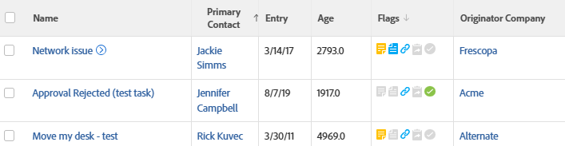

# View: issues with the company name of the originator

This issue view displays the company name associated with the user who submitted the issue.

## Access requirements

You must have the following access to perform the steps in this article:

<table style="table-layout:auto"> 
 <col> 
 <col> 
 <tbody> 
  <tr> 
   <td role="rowheader">Adobe Workfront plan*</td> 
   <td> 
Any
 </td> 
  </tr> 
  <tr> 
   <td role="rowheader">Adobe Workfront license*</td> 
   <td> 
Request to modify a view 

   
Plan to modify a report
 </td> 
  </tr> 
  <tr> 
   <td role="rowheader">Access level configurations*</td> 
   <td> 
Edit access to Reports, Dashboards, Calendars to modify a report
 
Edit access to Filters, Views, Groupings to modify a view
 
<b>NOTE</b>
   
   If you still don't have access, ask your Workfront administrator if they set additional restrictions in your access level. For information on how a Workfront administrator can modify your access level, see <a href="../../../administration-and-setup/add-users/configure-and-grant-access/create-modify-access-levels.md" class="MCXref xref">Create or modify custom access levels</a>.
 </td> 
  </tr> 
  <tr> 
   <td role="rowheader">Object permissions</td> 
   <td> 
Manage permissions to a report
 
For information on requesting additional access, see <a href="../../../workfront-basics/grant-and-request-access-to-objects/request-access.md" class="MCXref xref">Request access to objects </a>.
 </td> 
  </tr> 
 </tbody> 
</table>

&#42;To find out what plan, license type, or access you have, contact your Workfront administrator.

## View issues with the company name of the originator

To apply this view:

1. Go to a list of issues.
1. From the **View** drop-down menu, select **New View**.

1. In the**Column Preview** area, eliminate all columns except for one.
1. Click the header of the remaining column, then click **Switch to Text Mode**.
1. Mouse over the text mode area, and click **Click to edit text**.
1. Remove the text you find in the **Text Mode** box, and replace it with the following code:  
   <pre>column.0.descriptionkey=name column.0.link.linkproperty.0.name=ID column.0.link.linkproperty.0.valuefield=ID column.0.link.linkproperty.0.valueformat=val column.0.link.lookup=link.view column.0.link.value=val(objCode) column.0.listsort=string(name) column.0.namekey=name column.0.querysort=name column.0.valuefield=name column.0.valueformat=HTML column.0.width=140 column.1.descriptionkey=originator column.1.link.linkproperty.0.name=ID column.1.link.linkproperty.0.valuefield=ownerID column.1.link.linkproperty.0.valueformat=int column.1.link.lookup=link.view column.1.link.valuefield=owner:objCode column.1.link.valueformat=val column.1.listsort=nested(owner).string(name) column.1.namekey=originator.abbr column.1.querysort=owner:name column.1.valuefield=owner:name column.1.valueformat=HTML column.1.width=151 column.2.descriptionkey=entrydate column.2.listsort=atDateAsAtDate(entryDate) column.2.namekey=entrydate.abbr column.2.querysort=entryDate column.2.valuefield=entryDate column.2.valueformat=atDate column.2.width=75 column.3.descriptionkey=age column.3.listsort=doubleAsDouble(age) column.3.namekey=age column.3.querysort=age column.3.valuefield=howOld column.3.valueformat=val column.3.width=80 column.4.viewalias=statusicons column.4.displayname=Flags column.4.linkedname=direct column.4.namekey=statusicons column.4.valuefield= column.4.valueformat=HTML column.4.querysort= column.4.tile.name=component.issuestatusicons column.4.tile.pdfcomponent=issueStatusIcons column.4.delimiter= column.4.tile.template=/WEB-INF/jsp/lists/components/issueStatusIcons.jsp column.5.description=Originator's Company Name column.5.link.linkproperty.0.name=ID column.5.link.linkproperty.0.valuefield=owner:companyID column.5.link.linkproperty.0.valueformat=int column.5.link.lookup=link.view column.5.link.valuefield=owner:company:objCode column.5.link.valueformat=val column.5.listsort=nested(owner:company).string(name) column.5.name=Originator Company column.5.querysort=owner:company:name column.5.valuefield=owner:company:name column.5.valueformat=HTML column.5.width=151</pre>

1. Click **Save View**.
