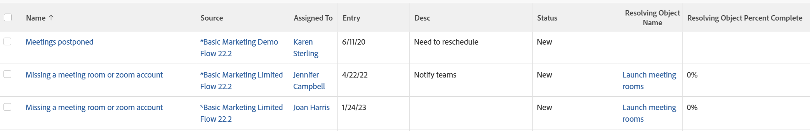

# View: issues with resolving object details

This issue view displays the name and percentage complete of the resolving object of the Issue, allowing the issue originator to have insight into the progress of the issue even without access to the resolving task or project.

This view uses the 

```
sharecol=true
```

tag to combine multiple fields under the same column header. For more information on the 

```
sharecol
```

tag, see [View: merge information from multiple columns in one shared column](../../../reports-and-dashboards/reports/custom-view-filter-grouping-samples/view-merge-columns.md).



## Access requirements

You must have the following access to perform the steps in this article:

<table style="table-layout:auto"> 
 <col> 
 <col> 
 <tbody> 
  <tr> 
   <td role="rowheader">Adobe Workfront plan*</td> 
   <td> <p>Any</p> </td> 
  </tr> 
  <tr> 
   <td role="rowheader">Adobe Workfront license*</td> 
   <td> <p>Request to modify a view </p>
   <p>Plan to modify a report</p> </td> 
  </tr> 
  <tr> 
   <td role="rowheader">Access level configurations*</td> 
   <td> <p>Edit access to Reports, Dashboards, Calendars to modify a report</p> <p>Edit access to Filters, Views, Groupings to modify a view</p> <p><b>NOTE</b>
   
   If you still don't have access, ask your Workfront administrator if they set additional restrictions in your access level. For information on how a Workfront administrator can modify your access level, see <a href="../../../administration-and-setup/add-users/configure-and-grant-access/create-modify-access-levels.md" class="MCXref xref">Create or modify custom access levels</a>.</p> </td> 
  </tr> 
  <tr> 
   <td role="rowheader">Object permissions</td> 
   <td> <p>Manage permissions to a report</p> <p>For information on requesting additional access, see <a href="../../../workfront-basics/grant-and-request-access-to-objects/request-access.md" class="MCXref xref">Request access to objects </a>.</p> </td> 
  </tr> 
 </tbody> 
</table>

&#42;To find out what plan, license type, or access you have, contact your Workfront administrator.

## View issues with resolving object details

1. Go to a list of issues.
1. From the **View** drop-down menu, select **New View**.

1. In the**Column Preview** area, eliminate all columns except for one.
1. Click the header of the remaining column, then click **Switch to Text Mode**.
1. Mouse over the text mode area, and click **Click to edit text**.
1. Remove the text you find in the **Text Mode** box, and replace it with the following code:<pre>column.0.querysort=name</pre><pre>column.0.stretch=0<br>column.0.valuefield=name<br>column.0.valueformat=HTML<br>column.0.width=150<br>column.1.descriptionkey=sourceobject<br>column.1.linkedname=direct<br>column.1.listsort=nested(referenceObject).HTML(name)<br>column.1.namekey=sourceobject.abbr<br>column.1.shortview=false<br>column.1.stretch=0<br>column.1.valuefield=referenceObject:name<br>column.1.valueformat=HTML<br>column.1.viewalias=source<br>column.1.width=100<br>column.2.descriptionkey=assignedto<br>column.2.link.linkproperty.0.name=ID<br>column.2.link.linkproperty.0.valuefield=assignedTo:ID<br>column.2.link.linkproperty.0.valueformat=int<br>column.2.link.lookup=link.view<br>column.2.link.valuefield=assignedTo:objCode<br>column.2.link.valueformat=val<br>column.2.linkedname=assignedTo<br>column.2.listsort=nested(assignedTo).string(name)<br>column.2.namekey=assignedto<br>column.2.querysort=assignedTo:name<br>column.2.shortview=false<br>column.2.stretch=25<br>column.2.valuefield=assignedTo:name<br>column.2.valueformat=HTML<br>column.2.width=150<br>column.3.descriptionkey=entrydate<br>column.3.linkedname=direct<br>column.3.listsort=atDateAsAtDate(entryDate)<br>column.3.namekey=entrydate.abbr<br>column.3.querysort=entryDate<br>column.3.shortview=false<br>column.3.stretch=0<br>column.3.valuefield=entryDate<br>column.3.valueformat=atDate<br>column.3.width=150<br>column.4.descriptionkey=description<br>column.4.linkedname=direct<br>column.4.listsort=string(description)<br>column.4.namekey=description.abbr<br>column.4.querysort=description<br>column.4.shortview=false<br>column.4.stretch=75<br>column.4.valuefield=description<br>column.4.valueformat=HTML<br>column.4.width=150<br>column.5.descriptionkey=status<br>column.5.enumclass=com.attask.common.constants.OpTaskStatusEnum<br>column.5.linkedname=direct<br>column.5.listsort=string(status)<br>column.5.namekey=status.abbr<br>column.5.querysort=status<br>column.5.shortview=false<br>column.5.stretch=0<br>column.5.type=enum<br>column.5.valuefield=status<br>column.5.valueformat=val<br>column.5.width=150<br>column.6.displayname=Resolving Object Name<br>column.6.linkedname=resolveTask<br>column.6.namekey=view.relatedcolumn<br>column.6.namekeyargkey.0=resolveTask<br>column.6.namekeyargkey.1=name<br>column.6.querysort=resolveTask:name<br>column.6.sharecol=true<br>column.6.textmode=true<br>column.6.valuefield=resolveTask:name<br>column.6.valueformat=HTML<br>column.7.displayname=<br>column.7.linkedname=resolveOpTask<br>column.7.namekey=view.relatedcolumn<br>column.7.namekeyargkey.0=resolveOpTask<br>column.7.namekeyargkey.1=name<br>column.7.querysort=resolveOpTask:name<br>column.7.sharecol=true<br>column.7.textmode=true<br>column.7.valuefield=resolveOpTask:name<br>column.7.valueformat=HTML<br>column.8.displayname=<br>column.8.linkedname=resolveProject<br>column.8.namekey=view.relatedcolumn<br>column.8.namekeyargkey.0=resolveProject<br>column.8.namekeyargkey.1=name<br>column.8.querysort=resolveProject:name<br>column.8.textmode=true<br>column.8.valuefield=resolveProject:name<br>column.8.valueformat=HTML<br>column.9.displayname=Resolving Object Percent Complete<br>column.9.textmode=true<br>column.9.valueexpression=IF(ISBLANK({resolveTask}.{ID}),{resolveProject}.{percentComplete},IF(ISBLANK({resolveProject}.{ID}),{resolveTask}.{percentComplete},''))<br>column.9.valueformat=doubleAsPercentRounded</pre>

1. Click **Save View**.
