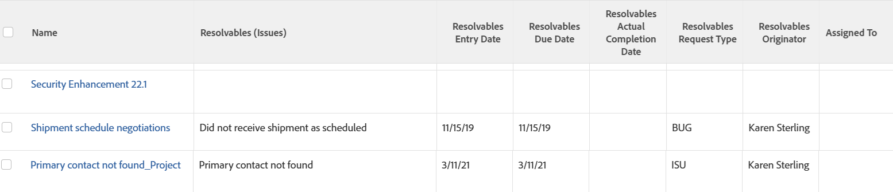

# View: originating issue details for tasks and projects

When an issue is converted into a task or a project a resolving object relationship is established between the task or project and the issue. This view displays the following fields of the issue that&nbsp;completes automatically when the task or project completes:

* Name
* Entry Date
* Planned Completion Date
* Actual Completion Date
* Request Type
* Originator Name
* Assigned To user

For more information, also see [View: display original issue information on task and project lists](../../../reports-and-dashboards/reports/custom-view-filter-grouping-samples/view-display-original-issue-info-task-project-list.md).

## Access requirements

You must have the following access to perform the steps in this article:

<table style="table-layout:auto"> 
 <col> 
 <col> 
 <tbody> 
  <tr> 
   <td role="rowheader">Adobe Workfront plan*</td> 
   <td> 
Any
 </td> 
  </tr> 
  <tr> 
   <td role="rowheader">Adobe Workfront license*</td> 
   <td> 
Request to modify a view 

   
Plan to modify a report
 </td> 
  </tr> 
  <tr> 
   <td role="rowheader">Access level configurations*</td> 
   <td> 
Edit access to Reports, Dashboards, Calendars to modify a report
 
Edit access to Filters, Views, Groupings to modify a view
 
<b>NOTE</b>
   
   If you still don't have access, ask your Workfront administrator if they set additional restrictions in your access level. For information on how a Workfront administrator can modify your access level, see <a href="../../../administration-and-setup/add-users/configure-and-grant-access/create-modify-access-levels.md" class="MCXref xref">Create or modify custom access levels</a>.
 </td> 
  </tr>  
  <tr> 
   <td role="rowheader">Object permissions</td> 
   <td> 
Manage permissions to a report
 
For information on requesting additional access, see <a href="../../../workfront-basics/grant-and-request-access-to-objects/request-access.md" class="MCXref xref">Request access to objects </a>.
 </td> 
  </tr> 
 </tbody> 
</table>

&#42;To find out what plan, license type, or access you have, contact your Workfront administrator.

## View originating issue details for tasks and projects

1. Go to a list of tasks or a list of projects.
1. From the **View** drop-down menu, select **New View**.

1. In the**Column Preview** area, eliminate all columns except for one.
1. Click the header of the remaining column, then click **Switch to Text Mode**.
1. Mouse over the text mode area, and click **Click to edit text**.
1. Remove the text you find in the **Text Mode** box, and replace it with the following code:

   <!-- [Copy](javascript:void(0);) --> 
   <pre><code>column.0.textmode=false column.0.valuefield=name column.0.valueformat=HTML column.0.descriptionkey=name column.0.linkedname=direct column.0.listsort=string(name) column.0.namekey=name column.0.querysort=name column.0.shortview=false column.0.stretch=100 column.0.width=150 column.1.displayname=Resolvables (Issues) column.1.listdelimiter=  column.1.listmethod=nested(resolvables).lists column.1.textmode=true column.1.type=iterate column.1.valueexpression={name} column.1.valueformat=HTML column.2.displayname=Resolvables Entry Date column.2.listdelimiter=  column.2.listmethod=nested(resolvables).lists column.2.textmode=true column.2.type=iterate column.2.valueexpression={entryDate} column.2.valueformat=HTML column.3.displayname=Resolvables Due Date column.3.listdelimiter=  column.3.listmethod=nested(resolvables).lists column.3.textmode=true column.3.type=iterate column.3.valueexpression={plannedCompletionDate} column.3.valueformat=HTML column.4.displayname=Resolvables Actual Completion Date column.4.listdelimiter=  column.4.listmethod=nested(resolvables).lists column.4.textmode=true column.4.type=iterate column.4.valueexpression={actualCompletionDate} column.4.valueformat=HTML column.5.displayname=Resolvables Request Type column.5.listdelimiter=  column.5.listmethod=nested(resolvables).lists column.5.textmode=true column.5.type=iterate column.5.valueexpression={opTaskType} column.5.valueformat=HTML column.6.displayname=Resolvables Originator column.6.listdelimiter=  column.6.listmethod=nested(resolvables).lists column.6.textmode=true column.6.type=iterate column.6.valueexpression={owner}.{name} column.6.valueformat=HTML column.7.descriptionkey=assignedto column.7.linkedname=assignedTo column.7.listsort=nested(assignedTo).string(name) column.7.namekey=assignedto column.7.querysort=assignedTo:name column.7.shortview=false column.7.stretch=0 column.7.textmode=true column.7.valuefield=assignedTo:name column.7.valueformat=HTML column.7.width=150</code></pre>

1. Click **Save View**.
