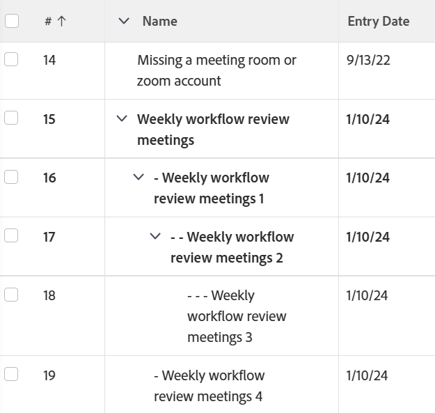

# View: display the parent-child relationship in a task by indenting the tasks

You can maintain the distinction of parent - child relationships in an exported task list by adding a custom view to the task list and ensuring this view is selected before you export the list. 



## Access requirements

You must have the following access to perform the steps in this article:

<table style="table-layout:auto"> 
 <col> 
 <col> 
 <tbody> 
  <tr> 
   <td role="rowheader">Adobe Workfront plan*</td> 
   <td> <p>Any</p> </td> 
  </tr> 
  <tr> 
   <td role="rowheader">Adobe Workfront license*</td> 
   <td> <p>Request to modify a view </p>
   <p>Plan to modify a report</p> </td> 
  </tr> 
  <tr> 
   <td role="rowheader">Access level configurations*</td> 
   <td> <p>Edit access to Reports, Dashboards, Calendars to modify a report</p> <p>Edit access to Filters, Views, Groupings to modify a view</p> <p><b>NOTE</b>
   
   If you still don't have access, ask your Workfront administrator if they set additional restrictions in your access level. For information on how a Workfront administrator can modify your access level, see <a href="../../../administration-and-setup/add-users/configure-and-grant-access/create-modify-access-levels.md" class="MCXref xref">Create or modify custom access levels</a>.</p> </td> 
  </tr>  
  <tr> 
   <td role="rowheader">Object permissions</td> 
   <td> <p>Manage permissions to a report</p> <p>For information on requesting additional access, see <a href="../../../workfront-basics/grant-and-request-access-to-objects/request-access.md" class="MCXref xref">Request access to objects </a>.</p> </td> 
  </tr> 
 </tbody> 
</table>

&#42;To find out what plan, license type, or access you have, contact your Workfront administrator.

## Display the parent-child relationship in a task by indenting the tasks

1. Go to the project with the task list you'd like to export.
1. Click the **View** drop-down menu, and select **New View**.

1. Name the filter in the top-left corner of the screen.
1. Click in the **Task Name** column header.  

1. Select&nbsp;**Switch to Text Mode** in the top-right corner.
1. Click anywhere in the textbox to edit text, and remove all existing text.
1. Paste the following text:  

   ```
   displayname=<br>linkedname=direct<br>namekey=name<br>querysort=name<br>textmode=true<br>valueexpression=IF({indent}<1,{name},IF({indent}<2,CONCAT(" - ",{name}),IF({indent}<3,CONCAT(" - - ",{name}),IF({indent}<4,CONCAT(" - - - ",{name}),CONCAT(" - - - - ",{name})))))<br>valueformat=HTML
   ```

1. Click **Save**.
1. Click **Save View**.
