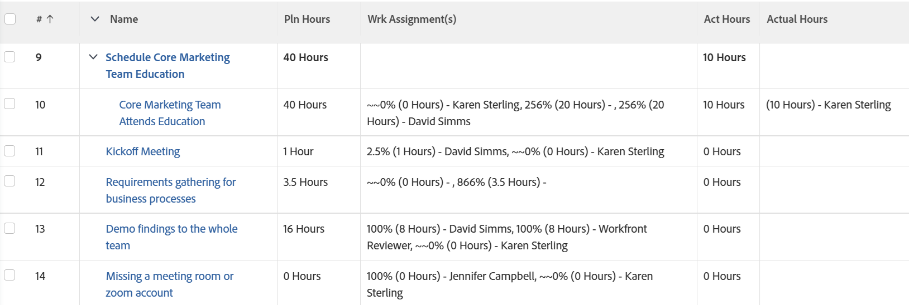

# View: Planned Hours vs. Actual Hours per assignment in a task view

<!--Audited: 11/2024-->

This task view displays the total Planned Hours of a task, the number of Planned Hours allocated to each assignee (when the task is assigned to multiple users), the total Actual Hours of the task, and the number of Actual Hours logged by each assignee.



## Access requirements

+++ Expand to view access requirements for the functionality in this article.

You must have the following access to perform the steps in this article:

<table style="table-layout:auto"> 
 <col> 
 <col> 
 <tbody> 
  <tr> 
   <td role="rowheader">Adobe Workfront plan</td> 
   <td> <p>Any</p> </td> 
  </tr> 
  <tr> 
   <td role="rowheader">Adobe Workfront license</td> 
   <td> <p> Current: 
   <ul>
   <li>Request to modify a view</li> 
   <li>Plan to modify a report</li>
   </ul>
     </p>
     <p> New: 
   <ul>
   <li>Contributor to modify a view</li> 
   <li>Standard to modify a report</li>
   </ul>
     </p>
    </td> 
  </tr> 
  <tr> 
   <td role="rowheader">Access level configurations*</td> 
   <td> <p>Edit access to Reports, Dashboards, Calendars to modify a report</p> <p>Edit access to Filters, Views, Groupings to modify a view</p> </td> 
  </tr> 
  <tr> 
   <td role="rowheader">Object permissions</td> 
   <td> <p>Manage permissions to a report</p> </td> 
  </tr> 
 </tbody> 
</table>

For more detail about the information in this table, see [Access requirements in Workfront documentation](/help/quicksilver/administration-and-setup/add-users/access-levels-and-object-permissions/access-level-requirements-in-documentation.md).

+++

## View Planned Hours vs. Actual Hours per assignment in a task View

1. Go to a list of tasks.
1. From the **View** drop-down menu, select **New View**.

1. In the**Column Preview** area, eliminate all columns except for one.
1. Click the header of the remaining column and click **Switch to Text Mode** > **Edit Text Mode**.
1. Remove the text you find in the **Edit Text Mode** box, and replace it with the following code:

   ```
   column.0.descriptionkey=name
   column.0.isInlineEditable=false
   column.0.link.linkproperty.0.name=ID
   column.0.link.linkproperty.0.valuefield=ID
   column.0.link.linkproperty.0.valueformat=int
   column.0.link.lookup=link.view
   column.0.link.valuefield=objCode
   column.0.link.valueformat=val
   column.0.linkedname=direct
   column.0.listsort=string(name)
   column.0.namekey=name.abbr
   column.0.querysort=name
   column.0.section=0
   column.0.shortview=false
   column.0.stretch=0
   column.0.valuefield=name
   column.0.valueformat=HTML
   column.0.width=150
   column.1.descriptionkey=workrequired
   column.1.isInlineEditable=false
   column.1.linkedname=direct
   column.1.listsort=doubleAsDouble(workRequired)
   column.1.namekey=workrequired.abbr
   column.1.querysort=workRequired
   column.1.section=0
   column.1.shortview=false
   column.1.stretch=0
   column.1.valuefield=workFieldLong
   column.1.valueformat=compound
   column.1.viewalias=workrequired
   column.1.width=100
   column.2.listdelimiter=
   column.2.listmethod=nested(assignments).lists
   column.2.name=Wrk Assignment(s)
   column.2.stretch=0
   column.2.type=iterate
   column.2.valueexpression=CONCAT(right(CONCAT('~~~',{assignmentPercent}),3),'% (', {workRequired}/60 ,' Hours) - ',{assignedTo}.{name})
   column.2.valueformat=HTML
   column.2.width=300
   column.3.descriptionkey=actualworkrequired
   column.3.isInlineEditable=false
   column.3.linkedname=direct
   column.3.listsort=intAsInt(actualWorkRequired)
   column.3.namekey=actualworkrequired.abbr
   column.3.querysort=actualWork
   column.3.section=0
   column.3.shortview=false
   column.3.stretch=100
   column.3.valuefield=actualWorkFieldLong
   column.3.valueformat=compound
   column.3.viewalias=actualworkrequired
   column.3.width=100
   column.4.listdelimiter=
   column.4.listmethod=nested(hours).lists
   column.4.name=Actual Hours
   column.4.stretch=0
   column.4.type=iterate
   column.4.valueexpression=CONCAT('(', {hours} ,' Hours) - ',{owner}.{name})
   column.4.valueformat=HTML
   column.4.width=300
   ```

1. Click **Done** > **Save View**.
