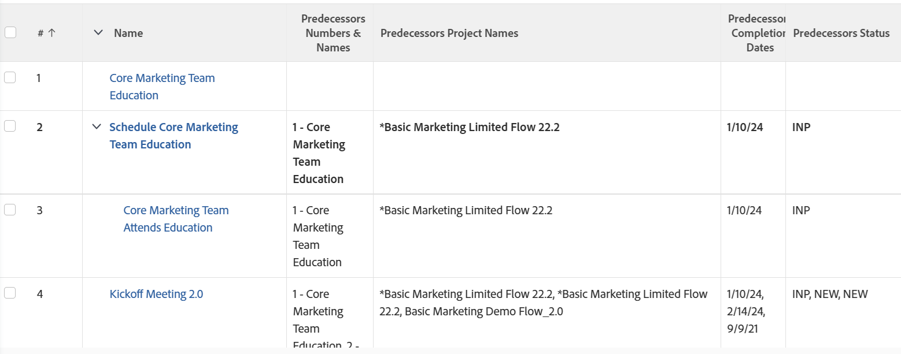

# View: predecessor details

<!--Audited: 11/2024-->

This task view shows details of the predecessors of the tasks using a collection view. In a collection view, you can display information about objects that are in a "one-to-many" relationship. In this case, each task (one) can have multiple predecessors (many). The view displays the name of the tasks, as well as its Predecessors' Names, Predecessors' Project Names, Predecessors' Planned Completion Dates, and Predecessors' Statuses.

For information about referencing collections in reports, see [Reference collections in a report](../../../reports-and-dashboards/reports/text-mode/reference-collections-report.md).



## Access requirements

+++ Expand to view access requirements for the functionality in this article.

You must have the following access to perform the steps in this article:

<table style="table-layout:auto"> 
 <col> 
 <col> 
 <tbody> 
  <tr> 
   <td role="rowheader">Adobe Workfront plan</td> 
   <td> <p>Any</p> </td> 
  </tr> 
  <tr> 
   <td role="rowheader">Adobe Workfront license</td> 
   <td> <p> Current: 
   <ul>
   <li>Request to modify a view</li> 
   <li>Plan to modify a report</li>
   </ul>
     </p>
     <p> New: 
   <ul>
   <li>Contributor to modify a view</li> 
   <li>Standard to modify a report</li>
   </ul>
     </p>
    </td> 
  </tr> 
  <tr> 
   <td role="rowheader">Access level configurations*</td> 
   <td> <p>Edit access to Reports, Dashboards, Calendars to modify a report</p> <p>Edit access to Filters, Views, Groupings to modify a view</p> </td> 
  </tr> 
  <tr> 
   <td role="rowheader">Object permissions</td> 
   <td> <p>Manage permissions to a report</p> </td> 
  </tr> 
 </tbody> 
</table>

For more detail about the information in this table, see [Access requirements in Workfront documentation](/help/quicksilver/administration-and-setup/add-users/access-levels-and-object-permissions/access-level-requirements-in-documentation.md).

+++

## View predecessor details

1. Go to a list of tasks.
1. From the **View** drop-down menu, select **New View**.

1. In the**Column Preview** area, eliminate all columns except for one.
1. Click the header of the remaining column and click **Switch to Text Mode** > **Edit Text Mode**.
1. Remove the text you find in the **Edit Text Mode** box, and replace it with the following code:  

   ```
   column.0.displayname=
   column.0.linkedname=direct
   column.0.namekey=name
   column.0.querysort=name
   column.0.valuefield=name
   column.0.valueformat=HTML
   column.1.displayname=Predecessors Numbers & Names
   column.1.listdelimiter=
   column.1.listmethod=nested(predecessors).lists
   column.1.textmode=true
   column.1.type=iterate
   column.1.valueexpression=CONCAT({predecessor}.{taskNumber},' - ',{predecessor}.{name})
   column.1.valueformat=HTML
   column.2.displayname=Predecessors Project Names
   column.2.listdelimiter=
   column.2.listmethod=nested(predecessors).lists
   column.2.textmode=true
   column.2.type=iterate
   column.2.valueexpression={predecessor}.{project}.{name}
   column.2.valueformat=HTML
   column.3.displayname=Predecessors Completion Dates
   column.3.listdelimiter=
   column.3.listmethod=nested(predecessors).lists
   column.3.textmode=true
   column.3.type=iterate
   column.3.valueexpression={predecessor}.{plannedCompletionDate}
   column.3.valueformat=HTML
   column.4.displayname=Predecessors Status
   column.4.listdelimiter=
   column.4.listmethod=nested(predecessors).lists
   column.4.textmode=true
   column.4.type=iterate
   column.4.valueexpression={predecessor}.{status}
   column.4.valueformat=HTML
   ```

1. Click **Done** > **Save View**.
