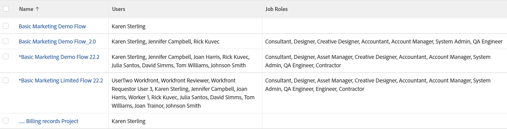

# View: project with all project team users and roles

<!--Audited: 11/2024-->

This project view shows a list of users and job roles assigned to the project team.

>[!NOTE]
>
>If the job role is listed on the same row as a user, this does not imply that the user is filling that role on the project, nor that the user is assigned that role in their profile.

## Access requirements

+++ Expand to view access requirements for the functionality in this article.

You must have the following access to perform the steps in this article:

<table style="table-layout:auto"> 
 <col> 
 <col> 
 <tbody> 
  <tr> 
   <td role="rowheader">Adobe Workfront plan</td> 
   <td> 
Any
 </td> 
  </tr> 
  <tr> 
   <td role="rowheader">Adobe Workfront license</td> 
   <td> 
 Current: 
   <ul>
   <li>Request to modify a view</li> 
   <li>Plan to modify a report</li>
   </ul>
     

     
 New: 
   <ul>
   <li>Contributor to modify a view</li> 
   <li>Standard to modify a report</li>
   </ul>
     

    </td> 
  </tr> 
  <tr> 
   <td role="rowheader">Access level configurations*</td> 
   <td> 
Edit access to Reports, Dashboards, Calendars to modify a report
 
Edit access to Filters, Views, Groupings to modify a view
 </td> 
  </tr> 
  <tr> 
   <td role="rowheader">Object permissions</td> 
   <td> 
Manage permissions to a report
 </td> 
  </tr> 
 </tbody> 
</table>

For more detail about the information in this table, see [Access requirements in Workfront documentation](/help/quicksilver/administration-and-setup/add-users/access-levels-and-object-permissions/access-level-requirements-in-documentation.md).

+++

## View a project with all project team users and roles

1. Go to a list of projects.
1. From the **View** drop-down menu, select **New View**.

1. In the **Column Preview** area, eliminate all columns except for one.
1. Click the header of the remaining column, then click **Switch to Text Mode** > **Edit Text Mode**.
1. Remove the text you find in the **Edit Text Mode** box, and replace it with the following code:

   <pre>column.0.link.linkproperty.0.name=ID column.0.link.linkproperty.0.valuefield=ID column.0.link.linkproperty.0.valueformat=int column.0.link.lookup=link.view column.0.link.valuefield=objCode column.0.link.valueformat=val column.0.linkedname=direct column.0.listsort=string(name) column.0.namekey=name.abbr column.0.querysort=name column.0.shortview=false column.0.stretch=60 column.0.valuefield=name column.0.valueformat=HTML column.0.width=150 column.1.description=Team Users column.1.link.linkproperty.0.name=ID column.1.link.linkproperty.0.valuefield=userID column.1.link.linkproperty.0.valueformat=int column.1.link.page=/userView.cmd column.1.listdelimiter= column.1.listmethod=nested(projectUsers).lists column.1.namekey=user.plural column.1.stretch=30 column.1.type=iterate column.1.valuefield=user:name column.1.valueformat=HTML column.1.width=150 column.2.description=Team Roles column.2.link.linkproperty.0.name=ID column.2.link.linkproperty.0.valuefield=ID column.2.link.linkproperty.0.valueformat=int column.2.link.page=/roleView.cmd column.2.listdelimiter= column.2.listmethod=nested(roles).lists column.2.namekey=jobrole.plural column.2.stretch=10 column.2.type=iterate column.2.valuefield=name column.2.valueformat=HTML column.2.width=150.stretch=0</pre>

1. Click **Done** > **Save View**.
