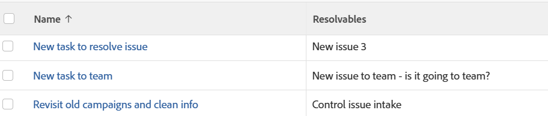

# View: Resolvable Objects in a task or project report

You can display a list of all Resolvable Objects in a project or task view or report.

For more information about Resolvable Objects, see the article [Overview of Resolving and Resolvable Objects](../../../manage-work/issues/convert-issues/resolving-and-resolvable-objects.md).

Applying this view is identical for tasks and projects.

## Access requirements

You must have the following access to perform the steps in this article:

<table style="table-layout:auto"> 
 <col> 
 <col> 
 <tbody> 
  <tr> 
   <td role="rowheader">Adobe Workfront plan*</td> 
   <td> 
Any
 </td> 
  </tr> 
  <tr> 
   <td role="rowheader">Adobe Workfront license*</td> 
   <td> 
Request to modify a view 

   
Plan to modify a report
 </td> 
  </tr> 
  <tr> 
   <td role="rowheader">Access level configurations*</td> 
   <td> 
Edit access to Reports, Dashboards, Calendars to modify a report
 
Edit access to Filters, Views, Groupings to modify a view
 
<b>NOTE</b>
   
   If you still don't have access, ask your Workfront administrator if they set additional restrictions in your access level. For information on how a Workfront administrator can modify your access level, see <a href="../../../administration-and-setup/add-users/configure-and-grant-access/create-modify-access-levels.md" class="MCXref xref">Create or modify custom access levels</a>.
 </td> 
  </tr>  
  <tr> 
   <td role="rowheader">Object permissions</td> 
   <td> 
Manage permissions to a report
 
For information on requesting additional access, see <a href="../../../workfront-basics/grant-and-request-access-to-objects/request-access.md" class="MCXref xref">Request access to objects </a>.
 </td> 
  </tr> 
 </tbody> 
</table>

&#42;To find out what plan, license type, or access you have, contact your Workfront administrator.

## View Resolvable Objects in a task or project report

1. Go to a list of tasks which have been converted from issues.
1. From the&nbsp;**View**&nbsp;drop-down menu, select&nbsp;**New View**.

1. In the**Column Preview**&nbsp;area, click **Add Column**.

1. Click the header of the new column, then click **Switch to Text Mode**.
1. Mouse over the text mode area, and click&nbsp;**Click to edit text**.
1. Remove the text you find in the&nbsp;**Text Mode**&nbsp;box, and replace it with the following code:
   <pre>displayname=Resolvables listdelimiter=  listmethod=nested(resolvables).lists textmode=true type=iterate valuefield=name valueformat=HTML </pre>

1. Click **Save View**.  
   A list of all Resolvable Objects displays in the new column. The names of the objects in the list cannot be linked directly to the objects.
