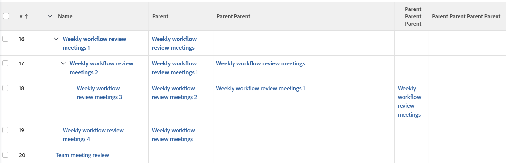

# View: show parent tasks up to 4 levels deep

This task view shows the task name in the first column and (if they exist) up to 4 parent tasks in separate columns in the same list.



## Access requirements

You must have the following access to perform the steps in this article:

<table style="table-layout:auto"> 
 <col> 
 <col> 
 <tbody> 
  <tr> 
   <td role="rowheader">Adobe Workfront plan*</td> 
   <td> <p>Any</p> </td> 
  </tr> 
  <tr> 
   <td role="rowheader">Adobe Workfront license*</td> 
   <td> <p>Request to modify a view </p>
   <p>Plan to modify a report</p> </td> 
  </tr> 
  <tr> 
   <td role="rowheader">Access level configurations*</td> 
   <td> <p>Edit access to Reports, Dashboards, Calendars to modify a report</p> <p>Edit access to Filters, Views, Groupings to modify a view</p> <p><b>NOTE</b>
   
   If you still don't have access, ask your Workfront administrator if they set additional restrictions in your access level. For information on how a Workfront administrator can modify your access level, see <a href="../../../administration-and-setup/add-users/configure-and-grant-access/create-modify-access-levels.md" class="MCXref xref">Create or modify custom access levels</a>.</p> </td> 
  </tr>  
  <tr> 
   <td role="rowheader">Object permissions</td> 
   <td> <p>Manage permissions to a report</p> <p>For information on requesting additional access, see <a href="../../../workfront-basics/grant-and-request-access-to-objects/request-access.md" class="MCXref xref">Request access to objects </a>.</p> </td> 
  </tr> 
 </tbody> 
</table>

&#42;To find out what plan, license type, or access you have, contact your Workfront administrator.

## Show parent tasks up to 4 levels deep

1. Go to a list of tasks.
1. From the **View** drop-down menu, select **New View**.

1. In the**Column Preview** area, eliminate all columns except for one.
1. Click the header of the remaining column, then click **Switch to Text Mode**.
1. Mouse over the text mode area, and click **Click to edit text**.
1. Remove the text you find in the **Text Mode** box, and replace it with the following code:

   ```
   column.0.descriptionkey=name
   ```

   <pre>column.0.link.linkproperty.0.name=ID<br>column.0.link.linkproperty.0.valuefield=ID<br>column.0.link.linkproperty.0.valueformat=int<br>column.0.link.lookup=link.view<br>column.0.link.valuefield=objCode<br>column.0.link.valueformat=val<br>column.0.linkedname=direct<br>column.0.listsort=string(name)<br>column.0.namekey=name.abbr<br>column.0.querysort=name<br>column.0.shortview=false<br>column.0.valuefield=name<br>column.0.valueformat=HTML<br>column.0.width=150<br>column.1.descriptionkey=parent<br>column.1.link.linkproperty.0.name=ID<br>column.1.link.linkproperty.0.valuefield=parent:ID<br>column.1.link.linkproperty.0.valueformat=int<br>column.1.link.lookup=link.view<br>column.1.link.valuefield=parent:objCode<br>column.1.link.valueformat=val<br>column.1.linkedname=parent<br>column.1.listsort=nested(parent).string(name)<br>column.1.namekey=parent<br>column.1.querysort=parent:name<br>column.1.shortview=false<br>column.1.stretch=0<br>column.1.valuefield=parent:name<br>column.1.valueformat=HTML<br>column.1.width=150<br>column.2.description=Parent Parent<br>column.2.link.linkproperty.0.name=ID<br>column.2.link.linkproperty.0.valuefield=parent:parent:ID<br>column.2.link.linkproperty.0.valueformat=int<br>column.2.link.lookup=link.view<br>column.2.link.valuefield=parent:parent:objCode<br>column.2.link.valueformat=val<br>column.2.linkedname=parent<br>column.2.listsort=nested(parent:parent).string(name)<br>column.2.name=Parent Parent<br>column.2.querysort=parent:parent:name<br>column.2.shortview=false<br>column.2.stretch=0<br>column.2.valuefield=parent:parent:name<br>column.2.valueformat=HTML<br>column.2.width=150<br>column.3.description=Parent Parent Parent<br>column.3.link.linkproperty.0.name=ID<br>column.3.link.linkproperty.0.valuefield=parent:parent:parent:ID<br>column.3.link.linkproperty.0.valueformat=int<br>column.3.link.lookup=link.view<br>column.3.link.valuefield=parent:parent:parent:objCode<br>column.3.link.valueformat=val<br>column.3.linkedname=parent<br>column.3.listsort=nested(parent:parent:parent).string(name)<br>column.3.name=Parent Parent Parent<br>column.3.querysort=parent:parent:parent:name<br>column.3.shortview=false<br>column.3.stretch=0<br>column.3.valuefield=parent:parent:parent:name<br>column.3.valueformat=HTML<br>column.3.width=150<br>column.4.description=Parent Parent Parent Parent<br>column.4.link.linkproperty.0.name=ID<br>column.4.link.linkproperty.0.valuefield=parent:parent:parent:parent:ID<br>column.4.link.linkproperty.0.valueformat=int<br>column.4.link.lookup=link.view<br>column.4.link.valuefield=parent:parent:parent:parent:objCode<br>column.4.link.valueformat=val<br>column.4.linkedname=parent<br>column.4.listsort=nested(parent:parent:parent:parent).string(name)<br>column.4.name=Parent Parent Parent Parent<br>column.4.querysort=parent:parent:parent:parent:name<br>column.4.shortview=false<br>column.4.stretch=100<br>column.4.valuefield=parent:parent:parent:parent:name<br>column.4.valueformat=HTML<br>column.4.width=150</pre>

1. Click **Save View**.

   The name of the task displays in the first column, and if the task has any parents, up to 4 parents display in the remaining columns.
