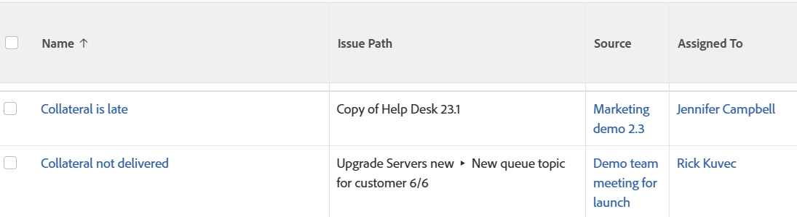

# View: submission path for issues

<!--Audited: 11/2024-->

You can display the path through which an issue has been submitted in the view of an issue report. The path indicates the Queue, Topic Group, and Queue Topic where the issue was submitted originally.



## Access requirements

+++ Expand to view access requirements for the functionality in this article.

You must have the following access to perform the steps in this article:

<table style="table-layout:auto"> 
 <col> 
 <col> 
 <tbody> 
  <tr> 
   <td role="rowheader">Adobe Workfront plan</td> 
   <td> <p>Any</p> </td> 
  </tr> 
  <tr> 
   <td role="rowheader">Adobe Workfront license</td> 
   <td> <p> Current: 
   <ul>
   <li>Request to modify a view</li> 
   <li>Plan to modify a report</li>
   </ul>
     </p>
     <p> New: 
   <ul>
   <li>Contributor to modify a view</li> 
   <li>Standard to modify a report</li>
   </ul>
     </p>
    </td> 
  </tr> 
  <tr> 
   <td role="rowheader">Access level configurations*</td> 
   <td> <p>Edit access to Reports, Dashboards, Calendars to modify a report</p> <p>Edit access to Filters, Views, Groupings to modify a view</p> </td> 
  </tr> 
  <tr> 
   <td role="rowheader">Object permissions</td> 
   <td> <p>Manage permissions to a report</p> </td> 
  </tr> 
 </tbody> 
</table>

For more detail about the information in this table, see [Access requirements in Workfront documentation](/help/quicksilver/administration-and-setup/add-users/access-levels-and-object-permissions/access-level-requirements-in-documentation.md).

+++

## View the submission path for issues

1. Go to a list of issues.
1. From the  **View** drop-down menu, select **New View**.

1. In the **Column Preview** area, click **Add Column**.
1. Click the header of the new column, then click **Switch to Text Mode** > **Edit Text Mode**.
1. Remove the text you find in the **Edit Text Mode** box, and replace it with the following code:

   ```
   displayname= Issue Path
   linkedname=direct
   namekey=displayQueueBreadcrumb
   valuefield=displayQueueBreadcrumb
   valueformat=HTML
   ```

1. Click **Done** > **Save View**.
