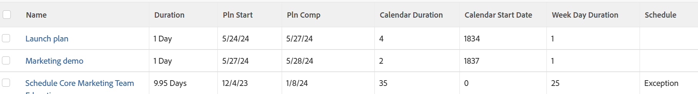

# View: tasks impacted by schedule exceptions

This task view identifies tasks that will have to complete late because of weekends, Personal Time Off, or other schedule exceptions.

This view displays the following:

* The Duration of tasks
* The Planned Start and Planned Completion Dates of the tasks
* The duration of the tasks according to the number of days between the Planned Start and Planned Completion Dates of the tasks (Calendar Duration)
* The number of the day in the project's schedule when the task starts (Calendar Start Date)
* The Week Day Duration of the tasks according to the number of weekdays between the Planned Start and Planned Completion Dates of the tasks (Week Day Duration)
* If the Week Day&nbsp;Duration is greater than the duration of the tasks, which suggests that there are exception days in the duration of the tasks, the tasks are marked as an "Exception".  
  

## Access requirements

You must have the following access to perform the steps in this article:

<table style="table-layout:auto"> 
 <col> 
 <col> 
 <tbody> 
  <tr> 
   <td role="rowheader">Adobe Workfront plan*</td> 
   <td> 
Any
 </td> 
  </tr> 
  <tr> 
   <td role="rowheader">Adobe Workfront license*</td> 
   <td> 
Request to modify a view 

   
Plan to modify a report
 </td> 
  </tr> 
  <tr> 
   <td role="rowheader">Access level configurations*</td> 
   <td> 
Edit access to Reports, Dashboards, Calendars to modify a report
 
Edit access to Filters, Views, Groupings to modify a view
 
<b>NOTE</b>
   
   If you still don't have access, ask your Workfront administrator if they set additional restrictions in your access level. For information on how a Workfront administrator can modify your access level, see <a href="../../../administration-and-setup/add-users/configure-and-grant-access/create-modify-access-levels.md" class="MCXref xref">Create or modify custom access levels</a>.
 </td> 
  </tr>   
  <tr> 
   <td role="rowheader">Object permissions</td> 
   <td> 
Manage permissions to a report
 
For information on requesting additional access, see <a href="../../../workfront-basics/grant-and-request-access-to-objects/request-access.md" class="MCXref xref">Request access to objects </a>.
 </td> 
  </tr> 
 </tbody> 
</table>

&#42;To find out what plan, license type, or access you have, contact your Workfront administrator.

## View tasks impacted by schedule exceptions

1. Go to a list of tasks.
1. From the **View** drop-down menu, select **New View**.

1. In the**Column Preview** area, eliminate all columns except for one.
1. Click the header of the remaining column, then click **Switch to Text Mode**.
1. Mouse over the text mode area and click **Click to edit text**.
1. Remove the text you find in the **Text Mode** box, and replace it with the following code:  
   <pre>column.0.descriptionkey=name column.0.link.linkproperty.0.name=ID column.0.link.linkproperty.0.valuefield=ID column.0.link.linkproperty.0.valueformat=int column.0.link.lookup=link.view column.0.link.valuefield=objCode column.0.link.valueformat=val column.0.linkedname=direct column.0.listsort=string(name) column.0.namekey=name.abbr column.0.querysort=name column.0.shortview=false column.0.stretch=100 column.0.valuefield=name column.0.valueformat=HTML column.0.width=150 column.1.descriptionkey=duration column.1.linkedname=direct column.1.listsort=intAsInt(durationMinutes) column.1.namekey=duration.abbr column.1.querysort=durationMinutes column.1.shortview=false column.1.stretch=0 column.1.valuefield=durationFieldLong column.1.valueformat=compound column.1.viewalias=duration column.1.width=80 column.2.descriptionkey=plannedstartdate column.2.linkedname=direct column.2.listsort=atDateAsAtDate(plannedStartDate) column.2.namekey=plannedstartdate.abbr column.2.querysort=plannedStartDate column.2.shortview=false column.2.stretch=0 column.2.valuefield=plannedStartDate column.2.valueformat=atDate column.2.width=80 column.3.descriptionkey=plannedcompletiondate column.3.linkedname=direct column.3.listsort=atDateAsAtDate(plannedCompletionDate) column.3.namekey=plannedcompletiondate.abbr column.3.querysort=plannedCompletionDate column.3.shortview=false column.3.stretch=0 column.3.valuefield=plannedCompletionDate column.3.valueformat=atDate column.3.width=80 column.4.aggregator.displayformat=int column.4.aggregator.function=SUM column.4.aggregator.namekey=id column.4.aggregator.valueexpression=DATEDIFF({plannedCompletionDate}, {plannedStartDate})+1 column.4.aggregator.valueformat=intAsInt column.4.descriptionkey=id column.4.linkedname=direct column.4.listsort=intAsInt(ID) column.4.name=Calendar Duration column.4.querysort=ID column.4.shortview=false column.4.stretch=0 column.4.valueexpression=DATEDIFF({plannedCompletionDate},{plannedStartDate})+1 column.4.valueformat=int column.4.width=80 column.5.aggregator.displayformat=int column.5.aggregator.function=SUM column.5.aggregator.namekey=id column.5.aggregator.valueexpression=DATEDIFF({plannedStartDate},{project}. {plannedStartDate})+0 column.5.aggregator.valueformat=intAsInt column.5.descriptionkey=id column.5.linkedname=direct column.5.listsort=intAsInt(ID) column.5.name=Calendar Start Date column.5.querysort=ID column.5.shortview=false column.5.stretch=0 column.5.valueexpression=DATEDIFF({plannedStartDate},{project}.{plannedStartDate})+0 column.5.valueformat=int column.5.width=80 column.6.aggregator.displayformat=int column.6.aggregator.function=SUM column.6.aggregator.namekey=id column.6.aggregator.valueexpression=WEEKDAYDIFF({plannedStartDate}, {plannedCompletionDate})+0 column.6.aggregator.valueformat=HTML column.6.descriptionkey=id column.6.linkedname=direct column.6.listsort=intAsInt(ID) column.6.name=Week Day Duration column.6.querysort=ID column.6.shortview=false column.6.stretch=0 column.6.valueexpression=WEEKDAYDIFF({plannedStartDate},{plannedCompletionDate})+0 column.6.valueformat=int column.6.width=80 column.7.aggregator.displayformat=int column.7.aggregator.expression=IF((WEEKDAYDIFF({plannedStartDate},{plannedCompletionDate}))>({duration}/480),"Exception","") column.7.aggregator.function=SUM column.7.aggregator.namekey=id column.7.aggregator.valueformat=HTML column.7.linkedname=direct column.7.listsort=intAsInt(ID) column.7.name=Schedule column.7.querysort=ID column.7.shortview=false column.7.stretch=0 column.7.valueexpression=IF((WEEKDAYDIFF({plannedStartDate},{plannedCompletionDate}))>({duration}/480),"Exception","") column.7.valueformat=HTML column.7.width=80</pre>

1. Click **Save View**.
