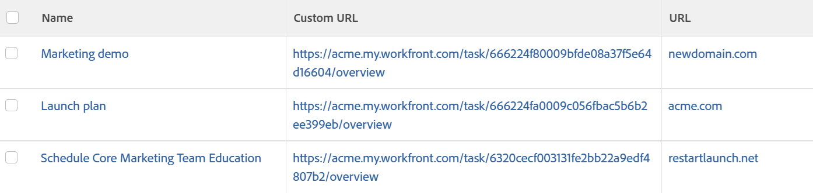

# View: external URL using custom data field

You can display a link to an internal custom URL by using a **Calculated Custom Field** named "Custom URL" in a **Task View**.

This helps you quickly link from certain objects in a view to certain areas of the application directly from your reports.

When creating a calculated custom field, you must first create the field, then create the View.

The following sections are an example of a calculated custom field for tasks. The custom field is called Custom URL. The custom view displays the field's value as well as the **URL** field for tasks.

Using the same steps, you can create similar calculated custom fields and custom views for all the objects in the system that have a Custom Form.

## Access requirements

You must have the following access to perform the steps in this article:

<table style="table-layout:auto"> 
 <col> 
 <col> 
 <tbody> 
  <tr> 
   <td role="rowheader">Adobe Workfront plan*</td> 
   <td> <p>Any</p> </td> 
  </tr> 
  <tr> 
   <td role="rowheader">Adobe Workfront license*</td> 
   <td> <p>Request to modify a view </p>
   <p>Plan to modify a report</p> </td> 
  </tr> 
  <tr> 
   <td role="rowheader">Access level configurations*</td> 
   <td> <p>Edit access to Reports, Dashboards, Calendars to modify a report</p> <p>Edit access to Filters, Views, Groupings to modify a view</p> <p><b>NOTE</b>
   
   If you still don't have access, ask your Workfront administrator if they set additional restrictions in your access level. For information on how a Workfront administrator can modify your access level, see <a href="../../../administration-and-setup/add-users/configure-and-grant-access/create-modify-access-levels.md" class="MCXref xref">Create or modify custom access levels</a>.</p> </td> 
  </tr>  
  <tr> 
   <td role="rowheader">Object permissions</td> 
   <td> <p>Manage permissions to a report</p> <p>For information on requesting additional access, see <a href="../../../workfront-basics/grant-and-request-access-to-objects/request-access.md" class="MCXref xref">Request access to objects </a>.</p> </td> 
  </tr> 
 </tbody> 
</table>

&#42;To find out what plan, license type, or access you have, contact your Workfront administrator.

## Create the "Custom URL" calculated custom field

For information about creating a calculated custom field, see the article [Add calculated data to a custom form](../../../administration-and-setup/customize-workfront/create-manage-custom-forms/add-calculated-data-to-custom-form.md).

If you have access to create a custom form, you can create a calculated custom field for tasks called "Custom URL." This field links directly to the **Overview** subtab within the **Task Details** tab.

1. Create a calculated custom field.
1. In the Calculation field, enter the following code:

   CONCAT(''https://`<domain>`.my.workfront.com","/","task/",ID,"/overview'')

1. Replace "`<domain>`" with your actual domain name, without the brackets.

   The 

   ```
   /overview
   ```

   portion of this URL directs the link to the **Overview** section in the left panel of the task.

1. After creating your **Calculated Custom Field**, attach the **Custom Form** with this field to several tasks in Adobe Workfront that you want display in your new view.

## Create the view which displays the "Custom URL" and "URL" fields of the task

The task **View** in the example below displays the **Calculated Custom Field** called "Custom URL" as a direct link to the **Overview** subtab within the task**Details** tab, as well as the **URL** field of the task.



To customize this view:

1. Go to a list of tasks.
1. Expand the **View** drop-down at the top of your task list.
1. Click **Customize View**.
1. Remove all the columns inside the view, except for the first column.
1. Click the header of the first column.
1. Click **Switch to Text Mode** in the upper-right corner of the interface.
1. Click **Click to edit text**.
1. Paste the text mode below into your one column.  
   In this example the 'column.1.' displays the value in the 'Custom URL' field as a link into the task's **Overview**. 'Column.2.' displays the value stored in the **URL Field** of the task.  
   <pre>column.0.descriptionkey=name<br>column.0.link.linkproperty.0.name=ID<br>column.0.link.linkproperty.0.valuefield=ID<br>column.0.link.linkproperty.0.valueformat= int<br>column.0.link.lookup=link.view<br>column.0.link.valuefield= objCode<br>column.0.link.valueformat= val<br>column.0.linkedname=direct<br>column.0.listsort=string(name)<br>column.0.namekey=name.abbr<br>column.0.querysort=name<br>column.0.shortview=false<br>column.0.stretch=100<br>column.0.valuefield=name<br>column.0.valueformat=HTML<br>column.0.width=150<br>column.1.description=Custom URL<br>column.1.link.isnewwindow=true<br>column.1.link.url=customDataLabelsAsString(Custom URL)<br>column.1.linkedname=direct<br>column.1.listsort=customDataLabelsAsString(Custom URL)<br>column.1.name=Custom URL<br>column.1.querysort=URL<br>column.1.shortview=false<br>column.1.stretch=0<br>column.1.valuefield=Custom URL<br>column.1.valueformat=customDataLabelsAsString<br>column.1.width=150<br>column.2.descriptionkey=url<br>column.2.linkedname=direct<br>column.2.listsort=string(URL)<br>column.2.namekey=url.abbr<br>column.2.querysort=URL<br>column.2.shortview=false<br>column.2.stretch=0<br>column.2.valuefield=URL<br>column.2.valueformat=HTML<br>column.2.width=150</pre>

1. Click **Save View**.
