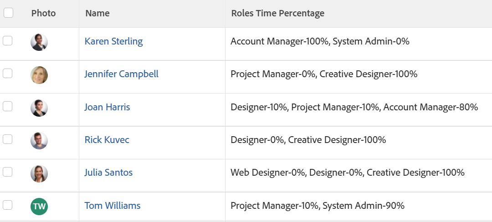

# View: user Job Role percentage of FTE availability

You can add a column to the view of a user list to display a list of the Job Roles the user is associated with as well as the percentage of FTE availability for each job role, as defined in the user profile.

For information about defining the percentage of FTE availability for users, see [Edit a user's profile](../../../administration-and-setup/add-users/create-and-manage-users/edit-a-users-profile.md).

## Access requirements

You must have the following access to perform the steps in this article:

<table style="table-layout:auto"> 
 <col> 
 <col> 
 <tbody> 
  <tr> 
   <td role="rowheader">Adobe Workfront plan*</td> 
   <td> 
Any
 </td> 
  </tr> 
  <tr> 
   <td role="rowheader">Adobe Workfront license*</td> 
   <td> 
Request to modify a view 

   
Plan to modify a report
 </td> 
  </tr> 
  <tr> 
   <td role="rowheader">Access level configurations*</td> 
   <td> 
Edit access to Reports, Dashboards, Calendars to modify a report
 
Edit access to Filters, Views, Groupings to modify a view
 
<b>NOTE</b>
   
   If you still don't have access, ask your Workfront administrator if they set additional restrictions in your access level. For information on how a Workfront administrator can modify your access level, see <a href="../../../administration-and-setup/add-users/configure-and-grant-access/create-modify-access-levels.md" class="MCXref xref">Create or modify custom access levels</a>.
 </td> 
  </tr>   
  <tr> 
   <td role="rowheader">Object permissions</td> 
   <td> 
Manage permissions to a report
 
For information on requesting additional access, see <a href="../../../workfront-basics/grant-and-request-access-to-objects/request-access.md" class="MCXref xref">Request access to objects </a>.
 </td> 
  </tr> 
 </tbody> 
</table>

&#42;To find out what plan, license type, or access you have, contact your Workfront administrator.

## View user Job Role percentage of FTE availability

1. Go to a list of users.
1. From the&nbsp;**View**&nbsp;drop-down menu, select&nbsp;**New View**.

1. In the**Column Preview**&nbsp;area, click **Add Column**.

1. Click the header of the new column, then click **Switch to Text Mode**.
1. Mouse over the text mode area, and click&nbsp;**Click to edit text**.
1. Remove the text you find in the&nbsp;**Text Mode**&nbsp;box, and replace it with the following code:  
   <pre>displayname=Roles Time Percentage listdelimiter=
 listmethod=nested(userRoles).lists textmode=true type=iterate valueexpression=CONCAT({role},'-',{timePercentage},'%') valueformat=HTML</pre>

1. Click **Save**, then **Save View**.

1. (Optional) Specify a name for your view, then click **Save View**.
