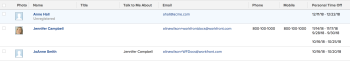

# View: user personal time off

<!--

(NOTE: consider hiding this article because this is not a custom view anymore.)

-->

You can build a Time Off report to capture users' time off information.

## Access requirements

You must have the following access to perform the steps in this article:

<table style="table-layout:auto"> 
 <col> 
 <col> 
 <tbody> 
  <tr> 
   <td role="rowheader">Adobe Workfront plan*</td> 
   <td> 
Any
 </td> 
  </tr> 
  <tr> 
   <td role="rowheader">Adobe Workfront license*</td> 
   <td> 
Request to modify a view 

   
Plan to modify a report
 </td> 
  </tr> 
  <tr> 
   <td role="rowheader">Access level configurations*</td> 
   <td> 
Edit access to Reports, Dashboards, Calendars to modify a report
 
Edit access to Filters, Views, Groupings to modify a view
 
<b>NOTE</b>
   
   If you still don't have access, ask your Workfront administrator if they set additional restrictions in your access level. For information on how a Workfront administrator can modify your access level, see <a href="../../../administration-and-setup/add-users/configure-and-grant-access/create-modify-access-levels.md" class="MCXref xref">Create or modify custom access levels</a>.
 </td> 
  </tr>  
  <tr> 
   <td role="rowheader">Object permissions</td> 
   <td> 
Manage permissions to a report
 
For information on requesting additional access, see <a href="../../../workfront-basics/grant-and-request-access-to-objects/request-access.md" class="MCXref xref">Request access to objects </a>.
 </td> 
  </tr> 
 </tbody> 
</table>

&#42;To find out what plan, license type, or access you have, contact your Workfront administrator.

## View user personal time off

1. Click the **Main Menu** icon  in the upper-right corner, then click&nbsp;**Reports > New Report**. 

1. From the drop-down menu, select **Time Off**.
1. Click **Save + Close**.

   The report displays the following fields in the view by default:

   | User |The name of the user who indicated the time off in their profile. |
   |---|---|
   | Start Date |The Start&nbsp;Date of the period of time off that the user indicated. |
   | End Date |The End Date of the period of time off that the user indicated. |

   {style="table-layout:auto"}

1. (Optional) Finish creating the report by editing any of the following tabs:

   * Columns (View)
   * Groupings
   * Filters
   * Chart

   For information about creating reports, see the article [Create a custom report](../../../reports-and-dashboards/reports/creating-and-managing-reports/create-custom-report.md).

   >[!TIP]
   >
   >We recommend adding a grouping for the User object, to make the report easier to read.

<!--
<h2 data-mc-conditions="QuicksilverOrClassic.Draft mode">Add Time Off information to a user report</h2>
-->

<!--

(NOTE: old way of doing this, not working anymore)

-->

<!--

To add a column to a user view or report to display a list of future days which have been marked for time off by users:

-->

<!--

  

-->

   <!--
   <li value="1" data-mc-conditions="QuicksilverOrClassic.Draft mode">  Click the <strong>Main Menu</strong> icon  in the upper-right corner, then click&nbsp;<strong>Reports > New Report.</strong> </li>
   -->

   <!--
   <li value="2" data-mc-conditions="QuicksilverOrClassic.Draft mode">From the&nbsp;<strong>New Report</strong> drop-down menu, select&nbsp;<strong>User Report</strong>.</li>
   -->

   <!--
   <li value="3" data-mc-conditions="QuicksilverOrClassic.Draft mode">Click <strong>Add Column</strong>.</li>
   -->

   <!--
   <li value="4" data-mc-conditions="QuicksilverOrClassic.Draft mode">From the <strong>View</strong> drop-down menu, select <strong>New View</strong>.</li>
   -->

   <!--
   <li value="5" data-mc-conditions="QuicksilverOrClassic.Draft mode">Click the header of the new column, then click<strong>Switch to Text Mode</strong>.</li>
   -->

   <!--
   <li value="6" data-mc-conditions="QuicksilverOrClassic.Draft mode">Mouse over the text mode area, and click <strong>Click to edit text</strong>.</li>
   -->

   <!--
   <li value="7" data-mc-conditions="QuicksilverOrClassic.Draft mode">Remove the text you find in the <strong>Text Mode</strong> box, and replace it with the following code: <!--
   <pre data-mc-conditions="QuicksilverOrClassic.Draft mode">displayname=Personal Time Off listdelimiter= listmethod=nested(reservedTimes).lists name=Upcoming Time Off stretch=0 textmode=true type=iterate valueexpression=IF({startDate}>$$TODAY,CONCAT({startDate}," - ",{endDate}),'') valueformat=HTML width=150</pre>
   </li>
   -->

   <!--
   <li value="8" data-mc-conditions="QuicksilverOrClassic.Draft mode"> Click <strong>Save</strong>+<strong>Close</strong>.</li>
   -->
