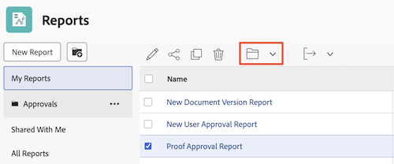

# Access and organize reports

You can use reports in Adobe Workfront to review or edit information about objects in the system. You can create your own reports, organize the reports that you create, and view reports that have been shared with you or shared publicly.

## Access requirements

+++ Expand to view access requirements for the functionality in this article. 

<table style="table-layout:auto"> 
 <col> 
 <col> 
 <tbody> 
  <tr> 
   <td role="rowheader">Adobe Workfront package</td> 
   <td> 
Any
 </td> 
  </tr> 
  <tr> 
   <td role="rowheader">Adobe Workfront license</td> 
   <td> 
   
Standard

   
Plan 
 </td> 
  </tr> 
  <tr> 
   <td role="rowheader">Access level configurations</td> 
   <td> 
Edit access to Reports, Dashboards, Calendars
 
Edit access to Filters, Views, Groupings
</td> 
  </tr> 
  <tr> 
   <td role="rowheader">Object permissions</td> 
   <td> 
Manage permissions to a report
</td> 
  </tr> 
 </tbody> 
</table>

For more detail about the information in this table, see [Access requirements in Workfront documentation](/help/quicksilver/administration-and-setup/add-users/access-levels-and-object-permissions/access-level-requirements-in-documentation.md).

+++

## View reports

To access reports that you have created or that have been shared with you or shared publicly:

1. From the **Main Menu** , click **Reports**. 

1. Click one of the following options, depending on the report that you want to view:

   * Click **My Reports** to view reports that you have created.
   * Click **Shared with Me** to view reports that others have shared with you.
   * Click **All Reports** to view both reports that you have created and those that have been shared with you or shared publicly.

## Organize reports that you create

You can use folders to organize the reports that you create. You cannot organize reports that have been shared with you, shared publicly, or system reports.

* [Create a new folder for reports](#create-a-new-folder-for-reports) 
* [Add reports to a folder](#add-reports-to-a-folder)

### Create a new folder for reports {#create-a-new-folder-for-reports}

1. From the **Main Menu** , click **Reports**. 

1. Click the **New Folder** icon.  
   

1. Specify a name for the new folder, then press Enter.
1. From the **My Reports** folder, add reports to the new folder.  
   For information about adding a report to a new folder, see the [Add reports to a folder](#add-reports-to-a-folder) section in this article.

   >[!NOTE]
   >
   >You can only add new folders to the **My Reports** folder. You cannot add new folders or reports to the **Shared with Me** or **All Reports** folders.

### Add reports to a folder {#add-reports-to-a-folder}

1. From the **Main Menu** , click **Reports**. 

1. Click **My Reports**.  
   Or  
   Click any folder nested under the **My Reports** folder.

1. Select the report, then click the folder icon  at the top of the list. 

1. Choose the folder you want to add the report to. 

   

   >[!NOTE]
   >
   >You can only move reports from the **My Reports** folder to other folders nested under **My Reports**. You cannot move reports from or to the **Shared with Me** or **All Reports** folder to or from other folders.

   
 
