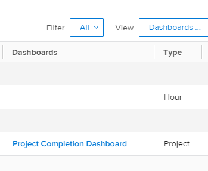

# Understand how&nbsp;to organize reports on a dashboard

## Access dashboard information in a report list

You can see whether a report is added to a dashboard in Adobe Workfront. This might be useful when deciding which reports you can keep and which can be deleted from the system. If reports are on dashboards, users might still be relying on them. We recommend not deleting reports that are listed on dashboards that users are using.  
For more information about adding reports to dashboards, see the article [Add a report to a dashboard](../../../reports-and-dashboards/dashboards/creating-and-managing-dashboards/add-report-dashboard.md).

You can see whether a report is added to a dashboard by doing one of the following:

* Building a view for a list of reports and including dashboard information in the columns
* Filtering a list of reports by one or several specific dashboards that you know are being actively used
* Building a report for the report object and using a view or a filter which include dashboard information

Anyone can build a view or a filter, but you must have Edit access to Reports in your access level to build a report.  
For more information about access to reports, see the article [Grant access to reports, dashboards, and calendars](../../../administration-and-setup/add-users/configure-and-grant-access/grant-access-reports-dashboards-calendars.md).  
For more information about building a report, see the article [Create a custom report](../../../reports-and-dashboards/reports/creating-and-managing-reports/create-custom-report.md).

## Access requirements

You must have the following access to perform the steps in this article:

<table style="table-layout:auto"> 
 <col> 
 <col> 
 <tbody> 
  <tr> 
   <td role="rowheader">Adobe Workfront plan*</td> 
   <td> 
Any
 </td> 
  </tr> 
  <tr> 
   <td role="rowheader">Adobe Workfront license*</td> 
   <td> 
Plan 
 </td> 
  </tr> 
  <tr> 
   <td role="rowheader">Access level configurations*</td> 
   <td> 
Edit access to&nbsp;Reports,&nbsp;Dashboards,&nbsp;Calendars
 
Edit access to Filters, Views, Groupings
 
Note: If you still don't have access, ask your Workfront administrator if they set additional restrictions in your access level. For information on how a Workfront administrator can modify your access level, see <a href="../../../administration-and-setup/add-users/configure-and-grant-access/create-modify-access-levels.md" class="MCXref xref">Create or modify custom access levels</a>.
 </td> 
  </tr> 
  <tr> 
   <td role="rowheader">Object permissions</td> 
   <td> 
Manage permissions to a report
 
For information on requesting additional access, see <a href="../../../workfront-basics/grant-and-request-access-to-objects/request-access.md" class="MCXref xref">Request access to objects </a>.
 </td> 
  </tr> 
 </tbody> 
</table>

&#42;To find out what plan, license type, or access you have, contact your Workfront administrator.

## Display dashboard information in the View of a report list

>[!WARNING]
>
>Including the Dashboards column in a report list can significantly increase load times, especially for long report lists.

To build a view with dashboard information for a report list:

1. Click the **Main Menu** icon  in the upper-right corner of Workfront, then click **Reports**.  
1. On the list of reports, click the **View** drop-down menu.
1. Click **New View**.
1. Click **Add Column**.
1. Start typing "Dashboards" in the **Start typing field name** field.
1. Under the **Report** object, select **Dashboards**.

1. Click **Save View**.  
   The dashboards that a report appears on display in the Dashboards column of the report list.  
   

## Filter a report list by dashboard information

To filter a list of reports by dashboard information:

1. Click the **Main Menu** icon  in the upper-right corner of Workfront, then click **Reports**.  

1. On the list of reports, click the **Filter** drop-down menu.
1. Click **New Filter**, then click **Add a Filter Rule**.

1. Start typing "Dashboards" in the **Start typing field name** field.  

1. Under the **Dashboards** object, select **Name**.

1. Select **Equal** in the modifier drop-down menu, then start typing the name of the dashboard you want to filter by. You can select multiple dashboards for your filter.  
   

1. Click **Save + Close**.  
   This displays a list of reports that are listed only on the specified dashboards.  
   You can also build a report for the report object and use this filter in the report.
