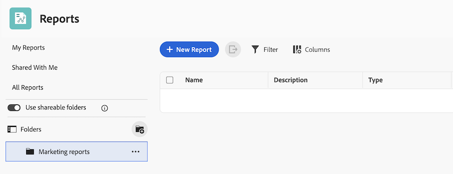
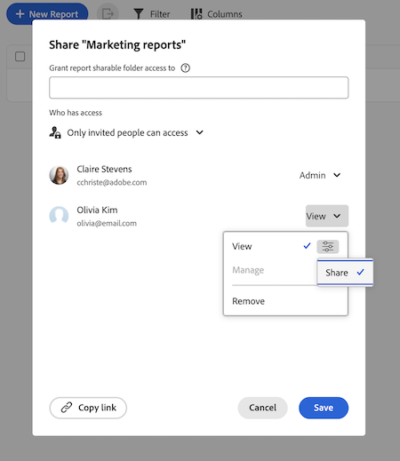
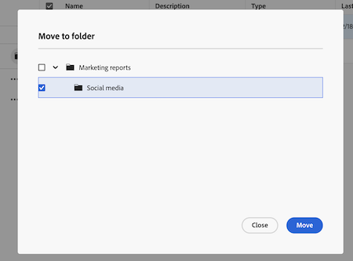

# Use shareable report folders

<!-- This article is linked in the UI -->

You can use shareable report folders to organize reports and share those folders with other users. This feature is designed for teams that manage large volumes of reports and need scalable, consistent access control.

## Access requirements

+++ Expand to view access requirements for the functionality in this article. 

<table style="table-layout:auto"> 
 <col> 
 <col> 
 <tbody> 
  <tr> 
   <td role="rowheader">Adobe Workfront package</td> 
   <td> 
Any
 </td> 
  </tr> 
  <tr> 
   <td role="rowheader">Adobe Workfront license</td> 
   <td> 
   
any
 </td> 
  </tr> 
  <tr> 
   <td role="rowheader">Access level configurations</td> 
   <td> 
Edit access to Reports, Dashboards, Calendars
 
Edit access to Filters, Views, Groupings
</td> 
  </tr> 
  <tr> 
   <td role="rowheader">Object permissions</td> 
   <td> 
Manage permissions to a report
</td> 
  </tr> 
 </tbody> 
</table>

For more detail about the information in this table, see [Access requirements in Workfront documentation](/help/quicksilver/administration-and-setup/add-users/access-levels-and-object-permissions/access-level-requirements-in-documentation.md).

+++

## Understand folder permissions

Shareable report folders use two permission levels:

* **View**: Users can open reports in the folder and share the folder with other users, but they can't edit folder details, add or remove items, or delete the folder.
* **Manage**: Users can edit folder details, add or remove items, and share the folder with others. Additionally, users are granted manage access to all reports within the folder.

Additional behavior:

* System administrators can see all folders.
* Other users see only folders they have access to.
* Permissions granted to a parent folder apply to all subfolders and reports within that folder tree.
* Users with access to a subfolder can see its parent folders for navigation, but not sibling folders unless access is granted.

## Create a shareable report folder

Only system administrators can create folders at the top-level folders. Once a shareable folder is created, users with manage access can create subfolders within it.

{{step1-to-reports}}

1. Turn on the **Shareable report folders** toggle.
1. Click **Create folder**.
1. Enter a name for the folder.
1. Click **Create**.

## Create a subfolder in a shareable report folder

You can create up to 4 levels of subfolders within a shareable report folder. Subfolders inherit permissions from the parent folder, but you can also set unique permissions for each subfolder.

{{step1-to-reports}}

1. Find the folder you want to create a sub-folder in.
1. Click **More** > **Add sub-folder**.
1. Enter a name for the sub-folder.
1. Click **Create**.

## Share a report folder with other users

When a folder is shared with users, they inherit access to all subfolders within that folder tree. They must have access to the reports to view and open the reports. 

{{step1-to-reports}}

1. Find the folder you want to share.
1. Click **More** > **Share**.
1. Add users, teams, roles, groups or companies. 
1. Choose **View** or **Manage** access:
    * View access allows users to open reports in the folder. You can also allow users with view access to reshare the folder by selecting **Share** in the additional settings. 
    * Manage access allows users to open reports in the folder. You can also allow users with manage access to delete folders or share the folder by selecting **Delete** and **Share** in the additional settings.
1. Click **Save**.

    

## Move a report to a shareable folder

To move a report into a folder, you must have **Manage** rights to both the report and the shareable folder.

{{step1-to-reports}}

1. Select the checkbox next to the report you want to move.
1. Click Move to folder in the action bar at the bottom of the screen.
1. Find the folder you want to move the report to, then click **Move**. The report tree is collapsed by default, so you may need to expand the folders to find the destination folder.

    

<!--
## Delete a shareable report folder

what happens with reports in the folder when it's deleted?

{{step1-to-reports}}

-->

## New list experience for sharable folders

When you access shareable folders in the Reports area, you will see a new list experience that allows you to easily view and manage your folders and reports. For more information about the new list experience, see [Use enhanced lists](/help/quicksilver/workfront-basics/navigate-workfront/use-lists/enhanced-lists.md).