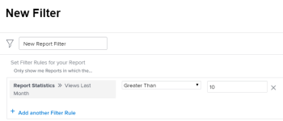

# View report usage

<!--

(NOTE: : *** DO NOT CHANGE, REMOVE, CHANGE LINK, RENAME THIS ARTICLE- IT IS LINKED TO THE PENDO GUIDE FOR THE MAIN REPORTS AREA***)

-->

In order to understand how extensively reports are used in your system you can view the following information in a list of reports:

* Last 10 users who viewed the report
* View count within a specified time frame

  >[!NOTE]
  >
  >Adobe Workfront counts one view per user per day. If you access the same report several times a day Workfront counts this as one view for that report for you. If the same report is accessed by another user in the same day, Workfront counts this as a new view for the second user.

* Last Viewed Date
* Last Viewed By User
* A list of dashboards which contain the report  
  For more information about displaying the name of the dashboards that reports might be added on in a list of reports, see the article [Understand how to organize reports on a dashboard](../../../reports-and-dashboards/reports/report-usage/understand-how-organize-reports-dashboard.md).

You can build a view for a list of reports where you can display this information.  
You can filter a list of reports by some of these fields.  
For more information about what fields you can filter a report by, see the article [Filter a report list by usage information](#filter-a-report-list-by-usage-information).

## Access requirements

+++ Expand to view access requirements for the functionality in this article. 

<table style="table-layout:auto"> 
 <col> 
 <col> 
 <tbody> 
  <tr> 
   <td role="rowheader">Adobe Workfront package</td> 
   <td> 
Any
 </td> 
  </tr> 
  <tr> 
   <td role="rowheader">Adobe Workfront license</td> 
   <td> 
   
Standard

   
Plan 
 </td> 
  </tr> 
  <tr> 
   <td role="rowheader">Access level configurations</td> 
   <td> 
Edit access to Reports, Dashboards, Calendars
 
Edit access to Filters, Views, Groupings
</td> 
  </tr> 
  <tr> 
   <td role="rowheader">Object permissions</td> 
   <td> 
Manage permissions to a report
</td> 
  </tr> 
 </tbody> 
</table>

For more detail about the information in this table, see [Access requirements in Workfront documentation](/help/quicksilver/administration-and-setup/add-users/access-levels-and-object-permissions/access-level-requirements-in-documentation.md).

+++

## Display report usage information in the View of a report list

1. Click the **Main Menu** icon  in the upper-right corner of Workfront, then click **Reports**. 

1. On the list of reports, click the **View** drop-down menu.
1. (Optional) Select the **Report Usage** view to display the most common report usage information.  
   Or

1. Click **New View** to create a custom view.
1. Click **Add Column**.
1. Start typing any of the following fields, and select them when they appear in the list under the **Report** object to add them to a new column:

   * **Last 10 users**: Displays the names of the last 10 users who viewed the report.
   * **Views**: Displays the number of views within any of the following time frames:

      * **This Month, Quarter, Year**
      * **Last Month, Quarter, Year**
      * **All Views**: Displays an overall count for all views on the report

   * **Last Viewed By**: Displays information about the user who viewed the report last
   * **Last Viewed Date**: Displays the date when the report was viewed last

1. Click **Save View**.  
   The usage information about the report is displayed in the columns you added to the view.  
   You can also build a report for the report object and use this view in the report.  
   For more information about building a report, see the article [Create a custom report](../../../reports-and-dashboards/reports/creating-and-managing-reports/create-custom-report.md).  
   You must have Edit access to Reports in your access level to build a report.  
   For more information about access to reports, see the article [Grant access to reports, dashboards, and calendars](../../../administration-and-setup/add-users/configure-and-grant-access/grant-access-reports-dashboards-calendars.md).

## Filter a report list by usage information {#filter-a-report-list-by-usage-information}

1. Click the **Main Menu** icon  in the upper-right corner of Workfront, then click **Reports**. 
1. On the list of reports, click the **Filter** drop-down menu.
1. Click **New Filter**, then click **Add a Filter Rule**.
1. Start typing any of the following fields, and select them when they appear in the list under the **Report** object to add them as a new filter rule:

   * **Views**: Displays the number of views within any of the following time frames:

      * **This Month, Quarter, Year**
      * **Last Month, Quarter, Year**
      * **All Views**

   * **Last Viewed By**: Displays information about the user who viewed the report last
   * **Last Viewed Date**: Displays the date when the report was viewed last

1. Select a modifier for your field, then specify a value, when prompted.  
   

1. Click **Save Filter**.  
   This displays a list of reports that meet the usage information you have defined.  
   You can also build a report for the report object and use this filter in the report.  
   For more information about building a report, see the article [Create a custom report](../../../reports-and-dashboards/reports/creating-and-managing-reports/create-custom-report.md). You must have Edit access to Reports in your access level to build a report.  
   For more information about access to reports, see the article [Grant access to reports, dashboards, and calendars](../../../administration-and-setup/add-users/configure-and-grant-access/grant-access-reports-dashboards-calendars.md).

## Exceptions when viewing report usage information

>[!IMPORTANT]
>
>The report usage information has been collected since March 2018. Any information prior to this date is not available.

The following are some exceptions to be aware of when working with report usage information:

* Every time a report is displayed on a dashboard or a custom tab, it is counted as one view. The user who is displaying that report on their dashboard is displayed as the Last View By: Name user, and the date on which the dashboard was displayed is displayed as the Last Viewed On date.
* Workfront does not collect usage information for built-in reports.  
  For more information about Workfront built-in reports, see the article [Use Adobe Workfront built-in reports](../../../reports-and-dashboards/reports/using-built-in-reports/use-workfront-built-in-reports.md).

* Workfront does not collect usage information on delivered reports. A delivered report does not count as one view.  
  For more information about delivered reports, see the article [Report delivery overview](../../../reports-and-dashboards/reports/creating-and-managing-reports/set-up-report-deliveries.md).

* When a system or group administrator logs in as another user, the views are counted for and associated with the system or group administrator.
* Workfront does not collect usage information for reports by custom quarters. Only the standard built-in quarters are referenced in the report usage fields.
* Workfront does not collect usage information for reports that are shared and viewed publicly. When a public report is viewed by someone without logging into Workfront, the report views are not counted.  
  For more information about sharing reports, see the article [Share a report in Adobe Workfront](../../../reports-and-dashboards/reports/creating-and-managing-reports/share-report.md).
