# Create or edit filters in Adobe Workfront

<!--Audited: 12/2023-->

You can limit the amount of information you display on the screen in a list of items with a filter. You can define certain criteria based on particular pieces of information about an object and only display the objects that meet those criteria.

You can apply the following types of filters in Adobe Workfront:

* Quick filters in a list of objects to find an item using a keyword. These are temporary filters that you cannot save for future use.

  For information about quick filters, see [Apply the quick filter to a list](../../../workfront-basics/navigate-workfront/use-lists/apply-quick-filter-list.md).

* Permanent filters that you can save and use numerous time on multiple lists and reports. This article describes how to create a permanent filter or edit an existing one in a list or report.

* Filters in other areas of Workfront, outside of lists and reports.

  For a list of all filters in Workfront and the areas where you can apply them, see [Filters overview](../../../reports-and-dashboards/reports/reporting-elements/filters-overview.md).

## Access requirements

You must have the following access to perform the steps in this article:

<table style="table-layout:auto"> 
 <col> 
 <col> 
 <tbody> 
  <tr> 
   <td role="rowheader"><strong>Adobe Workfront plan*</strong></td> 
   <td> 
Any
 </td> 
  </tr> 
  <tr> 
   <td role="rowheader"><strong>Adobe Workfront license*</strong></td> 
   <td> 
New: Contributor or higher
 
   
   Or

   
Current: Request or higher

   
<b>NOTE:</b>

   To edit a filter in a report, you must have the following license:

   
New: Plan
 
   
   Or
   
   
Current: Standard

   </td> 
  </tr> 
  <tr> 
   <td role="rowheader"><strong>Access level configurations*</strong></td> 
   <td> <ul><li>
Edit access to Filters, Views, and Groupings
</li></ul>
    
<b>NOTE:</b>

   To edit a filter in a report, you must have the following access level configuration, in addition to Edit access to Filters, Views, and Groupings:

   <ul><li>
Edit access to Reports, Dashboards, and Calendars
</li></ul>   
   
   
<b>NOTE:</b>
 
 If you don't have access, ask your Workfront administrator if they set additional restrictions in your access level. For information on how a Workfront administrator can modify your access level, see <a href="../../../administration-and-setup/add-users/configure-and-grant-access/create-modify-access-levels.md" class="MCXref xref">Create or modify custom access levels</a>.
 </td> 
  </tr> 
  <tr> 
   <td role="rowheader"><strong>Object permissions</strong></td> 
   <td> 
Manage permissions to a filter
 
For information on requesting additional access, see <a href="../../../workfront-basics/grant-and-request-access-to-objects/request-access.md" class="MCXref xref">Request access to objects </a>.
 </td> 
  </tr> 
 </tbody> 
</table>

&#42;To find out what plan, license type, or access you have, contact your Workfront administrator.

## Types of filter-building interfaces

You can create filters using the types of filter builders described in the table below:

<table style="table-layout:auto">
<col>
<col>
<col>
<tbody>
<tr>
<td><strong>Builder type</strong></td>
<td><strong>Filter object</strong></td>
<td><strong>Where available</strong></td>
</tr>
<tr>
<td>Standard builder</td>
<td>
<ul>
<li> 
Projects
 </li>
<li> 
Tasks 
 </li>
<li> 
Issues
 </li>
<li> 
Portfolios
 </li>
<li> 
Programs
 </li>
<li> 
Users
 </li>
<li> 
Templates
 </li>
<li> 
Groups
 </li>
</ul>
</td>
<td>
<ul>
<li> 
Lists 
 </li>
</ul>
<ul>
<li> 
The Projects list in the Scenario Planner
 
The Scenario Planner requires an additional license. For information about the Workfront Scenario Planner, see <a href="../../../scenario-planner/scenario-planner-overview.md">The Scenario Planner overview</a>. 
 </li>
</ul>

<b>NOTE:</b>
 
Standard builders for filters are not available in reports.
</td>
</tr>
<tr>
<td>Legacy builder</td>
<td>All objects </td>
<td>Lists and reports</td>
</tr>
</tbody>
</table>

For information about Workfront objects, see [Understand objects in Adobe Workfront](/help/quicksilver/workfront-basics/navigate-workfront/workfront-navigation/understand-objects.md).

Consider the following when creating filters using the different interfaces:

* You can find the standard builder in the same places you find the legacy filter interface for the areas listed in the table above.
* The standard builder is the default experience for all areas where it is available. To switch to the legacy filter builder, click the **More** menu next to [!UICONTROL **Filters**] and select [!UICONTROL **Go back to Legacy Filters**].
   
  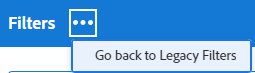

* Saved filters are available in both builders, regardless of which experience you used to originally build them. For example, if you created a filter using the legacy builder, you can find and modify it in the standard builder interface as well.

  >[!TIP]
  >
  >An "All" filter is not included with the standard builder because all list items are displayed when no filters are applied. Click [!UICONTROL **Clear all**] on the top right of the builder to clear any active filters and display all items. If [!UICONTROL **Clear all**] is dimmed, then no filters are applied.

* The standard and legacy builders have a slightly different syntax when building multiple-statement filters that combine the AND and OR operators. As a result, these filters may display differently when you switch from one builder to another.

  >[!INFO]
  >
  >The following scenario exists:
  >
  >1. Use the standard builder to create a filter that has the following syntax:
  >
  >      `(A OR B) AND C`
  >
  >1. Switch to the legacy builder and edit the filter using the syntax of the legacy builder as described in the section [Create or edit a filter in the legacy builder](#create-filter-in-legacy-builder) in this article. The syntax for the legacy builder displays the filter statements as follows:
  >
  >      `A AND C`
  >      `OR`
  >      `B AND C`
  >
  >1. Make a change to the filter in the legacy interface.
  >1. Switch back to the standard builder. The filter statement displays according to the logic supported in the legacy builder, as described above.
  >
  >      The filter displays in the standard builder interface as follows:
  >  
  >      `A AND C`
  >      `OR`
  >      `B AND C`
  > 
  >      This happens because the filter was modified in the legacy interface.

## Create or edit a filter in the standard builder

You can create filters using the standard builder interface in the following ways:

* From scratch
* Edit an existing filter
* Duplicate an existing filter
* Duplicate an existing filter, edit it, and save it as a new filter

Create a filter using the standard builder interface:

1. Go to a list where you want to create a filter or that contains the filter you want to customize.
1. Click the **Filter** icon  to open the builder interface.

   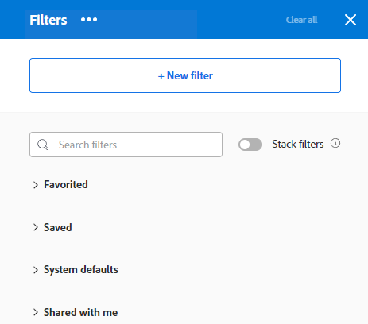

1. Review the following lists of filters:

   <table style="table-layout:auto">
   <col>
   <col>
   <tbody>
   <tr>
   <td role="rowheader"><strong>Favorited</strong></td>
   <td>Filters that you marked as favorites. When you favorite a filter, its original location is shown below the filter name, and it is hidden from the original list unless you remove it as a favorite.</td>
   </tr>
   <tr>
   <td role="rowheader"><strong>Saved</strong></td>
   <td>Filters that you built and saved yourself. By default this list displays saved filters in order of most recently saved, but the filter names can be dragged to manually reorder the list.</td>
   </tr>
   <tr>
   <td role="rowheader"><strong>System defaults</strong></td>
   <td>Workfront system default filters, as well as filters that the Workfront administrator added to your list of filters, either at the system level or in your layout template.</td>
   </tr>
   <tr>
   <td role="rowheader"><strong>Shared with me</strong></td>
   <td>Filters that others created and shared with you or that are shared system-wide.</td>
   </tr>
   </tbody>
   </table>

1. Do one of the following:
   
   * Click **New filter** to create a filter from scratch.
   * Hover over an existing filter that you have permissions to manage and click the **Edit** icon  to edit it.
     
     Or

     Hover over an existing filter that you have permissions to view, click the **More** menu , and click **Duplicate** to copy the existing filter and edit a copy.

   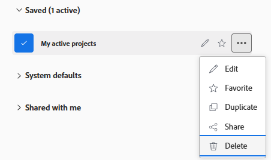

1. (Conditional) Depending on whether you want to find objects that match all or any of the statements in a filter group, select from the following options:

   <table style="table-layout:auto">
   <col>
   <col>
   <tbody>
   <tr>
   <td role="rowheader"><strong>Include if all are true</strong></td>
   <td>The objects found by the filter must match all filter criteria in a filter group. In this case, the filter statements are connected by the AND operator. This is the default selection.</td>
   </tr>
   <tr>
   <td role="rowheader"><strong>Include if any are true</strong></td>
   <td>The objects found by the filter must match any filter criteria in a filter group. In this case, the filter statements are connected by the OR operator.</td>
   </tr>
   </tbody>
   </table>

   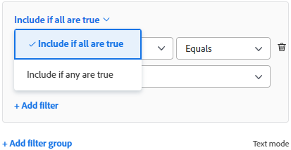

   For more information about filter operators, see [Filters overview](/help/quicksilver/reports-and-dashboards/reports/reporting-elements/filters-overview.md).

1. Click the field drop-down menu to view a list of recently used fields, and suggested fields to filter by. The suggested fields are currently displayed in the list you are filtering.

   You can also select **Browse fields** to view a list of all fields you can filter by. The fields in the advanced search are grouped by object category.

   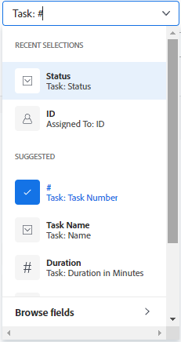

1. Click the modifier drop-down menu to select a modifier. The default modifier is "Equals." 

   For more information, see [Filter and condition modifiers](/help/quicksilver/reports-and-dashboards/reports/reporting-elements/filter-condition-modifiers.md).

   >[!TIP]
   >
   >As you build the filter, the results appear immediately in the list. If the filter panel covers the list, you can close it to see the display. The information you entered remains in the builder when you open the panel again.

1. Start typing the value of a field you want to filter by. For example, start typing the name of an issue, if you want to filter by `Issue:Name`. Select the value when it displays in the list.

   >[!TIP]
   >
   >Depending on what modifier you selected, you can select multiple values.

1. Click **Add filter** to select another field and add a new filtering criteria to the filter statement.
1. (Optional) Click the **Delete** icon  to remove existing filter statements.

   Or
   
   Click **Clear all** to clear all filtering criteria.

1. (Optional) Click **Add filter group** to add another set of filtering criteria. The default operator between the sets is AND. Click the operator to change it to OR.

   >[!TIP]
   >
   >You might want to user another filter group when you want the groups to be connected by a different operator than the operator in a filter statement.

   >[!INFO]
   >
   >When you filter for projects that contain "marketing" in the name that are either not complete and are not On Hold, you can use the following multiple filter groups:
   >`(Project: Name Contains Marketing AND Project: Percent Complete Does not equal 100)`
   >`OR`
   >`(Project: Name Contains Marketing AND Project: Status Does not equal On Hold)`
   >In this case, each filter statement is connected by an AND, and the filter groups are connected by an OR.

1. (Optional) Click **Text mode** to continue building the filter using text mode.

   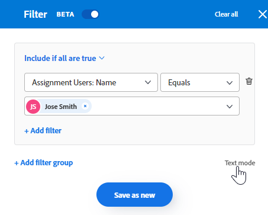

   The text mode interface opens.

   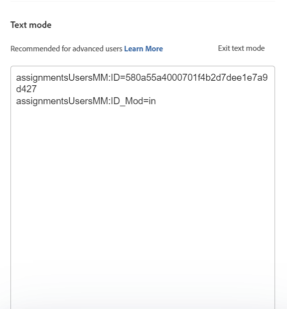

   >[!TIP]
   >
   >We recommend building as much of the filter as possible using the standard builder interface and only using text mode when you must make modifications to the filter that are only supported in text mode.

   For more information about creating a filter using the text mode interface, see [Edit a filter using text mode](/help/quicksilver/reports-and-dashboards/reports/text-mode/edit-text-mode-in-filter.md).

1. Click **Exit text mode** to return to the standard builder interface.

   >[!WARNING]
   >
   >Some text mode statements are not supported in the standard builder or the legacy interface. Exiting text mode when you have created these types of statements might generate a warning message.

1. (Optional) Click **Apply** to apply the filter to the list and see the results.

   If the filter produces no results, the list will be empty.

1. Click **Save as new** to save the filter for future use.

   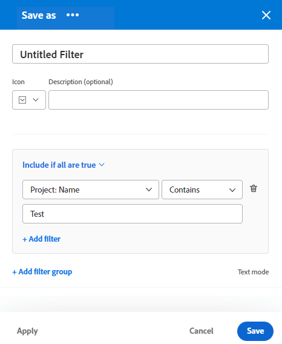

1. Select **Untitled Filter** and type the name of the new filter instead.   

   >[!TIP]
   >
   >Be sure to name the filter so that you can find it later. If you do not name the filter, it will be called Untitled Filter in the system.

1. Select an icon for the new filter from the **Icon** drop-down menu.

   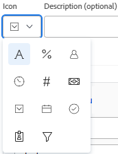

1. (Optional) Add a description for the filter to indicate what is unique about it. The description displays under the filter name in the list of filters.

   >[!TIP]
   >
   >Clicking **Cancel** at any time takes you back to the filter building area.

1. Click **Save**. The filter is saved in the Saved list and is applied to the list of items.
1. (Optional) To move a filter to the Favorited list, hover over any filter in the filter drawer and click the Favorite icon .

   Or
   
   Hover over any filter in the filter drawer, click the More menu , and click **Favorite**.

1. (Optional) Click the **Stack filters** button to activate stacked filters. This option allows you to apply more than one saved filter. The filter rules are applied in the order you select them.

   >[!TIP]
   >
   >There is no limit to the number of filters you can select.
   >
   >When you select multiple filters, all of their conditions must be met simultaneously to display matching results.

   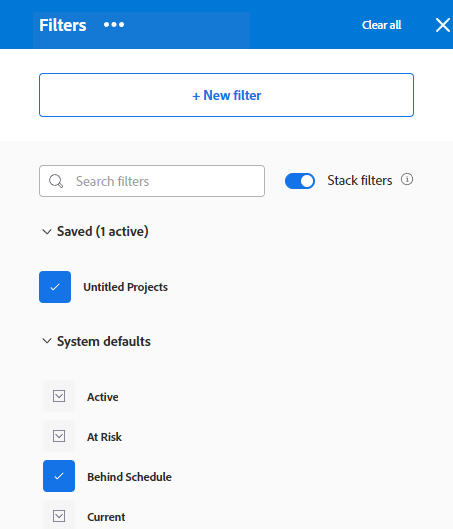

   The number of filters you selected displays next to the filter icon at the top of the list of items.

   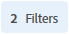

1. (Optional) Do one of the following:
   
   * Share the filter with others, or make it available system-wide. For more information, see [Share a filter, view, or grouping](/help/quicksilver/reports-and-dashboards/reports/reporting-elements/share-filter-view-grouping.md).

   * Delete the filter if it is no longer valid or a duplicate. You can only delete filters that you own. You can remove filters that were shared with you. For information, see [Remove filters, views, and groupings](/help/quicksilver/reports-and-dashboards/reports/reporting-elements/remove-filters-views-groupings.md).

## Create or edit a filter in the legacy builder {#create-filter-in-legacy-builder}

You can create legacy filters in lists and reports in the following ways:

* From scratch
* Edit an existing filter and save it as a new filter

Regardless of the method you use to create filters, creating a filter from scratch or from an existing filter is similar.

1. Go to a list or a report that contains the filter that you want to customize.
1. Click the **Filter** icon .

   >[!TIP]
   >
   >The report creator must allow for filters to be edited in order to view the Filter drop-down list on a report. The Report Default filter is applied to a report by default. The Report Default filter can be customized only when you edit the report.

   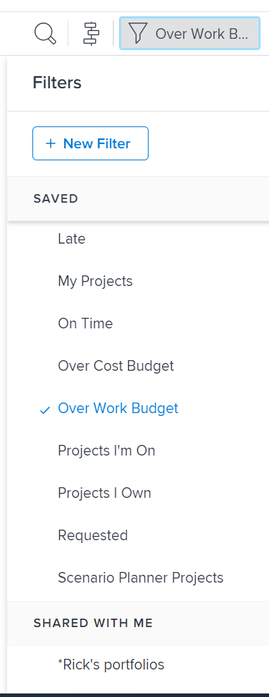

1. Click **New Filter** at the top of the list of filters.

   Or

   Hover over the filter you want to modify and click the **Edit** icon . 
   
   The builder for customizing the filter launches.

1. Do any of the following:

   * Modify existing filter rules by clicking the existing rule and selecting a new option.
   * Add a filter rule by clicking **Add another Filter Rule**, begin typing the name of the option for which you want to add a rule in the **Start typing field name** box, then click it when it appears in the drop-down list.

     Fields associated with the object of your filter are listed in the **Start typing field name** box. 
   
   * Click **AND** or **OR** when adding a new filter rule.  
     When adding filter rules, use the filter modifiers to establish the condition of your filter. For more information about filter modifiers, see [Filter and condition modifiers](../../../reports-and-dashboards/reports/reporting-elements/filter-condition-modifiers.md).

     >[!NOTE]
     >
     >When you connect a group of AND statements by multiple OR statements, you must repeat the fields that are not changing between the OR statements for each group of statements. 
     >
     >
     >
     >When you build a filter for tasks that contain the word "marketing" and are in projects with a status of Current or Planning, you must have the following filter rules:
     >
     >`Task: Name Contains Marketing`
     >`AND`
     >`Project: Status Equals Current`
     >`OR`
     >`Task: Name Contains Marketing`
     >`AND`
     >`Project: Status Equals Planning` 
     >
     >Although Task: Name Contains "marketing" does not change between the two AND filter groups, it must be repeated in the second group.

   * Delete an existing filter rule by clicking the "X" icon.

1. (Optional) Click **Switch to Text Mode** to add a filter using the Text Mode interface.

   For more information about creating a filter using the text mode interface, see [Edit a filter using text mode](../../../reports-and-dashboards/reports/text-mode/edit-text-mode-in-filter.md). 

1. Click **Save Filter** to create a new filter or replace the selected one with your changes.
   
   Or
   
   Click **Save as New Filter** to create a new filter from the selected one. 
   
   The new filter displays in the list of filters and it is automatically applied to the list or report you selected.

1. (Optional) Do one of the following:

   * Share filters you create with other users, or make them available system-wide. For information, see [Share a filter, view, or grouping](/help/quicksilver/reports-and-dashboards/reports/reporting-elements/share-filter-view-grouping.md).
   * Remove filters you no longer want to display in the list. For information, see [Remove filters, views, and groupings](/help/quicksilver/reports-and-dashboards/reports/reporting-elements/remove-filters-views-groupings.md).

