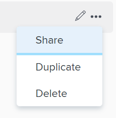
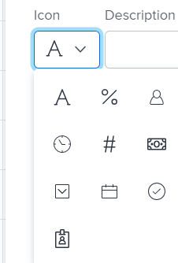

# Create or edit filters in Adobe Workfront

<!--

(NOTE: ***IMPORTANT: this DIV will need to be drafted/ hidden when the following DIV (that includes new filters) will be live)

-->

<!--

(NOTE: all screen shots and steps will have to be reviewed for the new filters because this was updates in 2021 and filters have had additional changes in functionality and UI since then)

-->

You can use filters to reduce the amount of information you display on the screen. Filters display in various areas of Adobe Workfront. The information in this article refers to filters in lists of objects. For more information about filters, see [Filters overview in Adobe Workfront](../../../reports-and-dashboards/reports/reporting-elements/filters-overview.md).

<!--

(NOTE: add information here about modifying and copying existing filters as a way of creating new filters!) 

-->

You can apply the following types of filters in&nbsp;a list of objects:

* A quick filter to a list of objects to find an item in a list using a keyword.

  For information about quick filters, see [Apply the quick filter to a list](../../../workfront-basics/navigate-workfront/use-lists/apply-quick-filter-list.md).

* A permanent filter that you can use numerous time on multiple lists and reports. This article describes how to create a permanent filter or edit an existing one.

## Access requirements

You must have the following access to perform the steps in this article:

<table cellspacing="0"> 
 <col> 
 <col> 
 <tbody> 
  <tr> 
   <td role="rowheader">Adobe Workfront plan*</td> 
   <td> 
Any
 </td> 
  </tr> 
  <tr> 
   <td role="rowheader">Adobe Workfront license*</td> 
   <td> 
Plan 
 </td> 
  </tr> 
  <tr> 
   <td role="rowheader">Access level configurations*</td> 
   <td> 
Edit access to Filters, Views, Groupings
 
Edit access to&nbsp;Reports,&nbsp;Dashboards,&nbsp;Calendars to create a filter in a report
 
Note: If you still don't have access, ask your Workfront administrator if they set additional restrictions in your access level. For information on how a Workfront administrator can modify your access level, see <a href="../../../administration-and-setup/add-users/configure-and-grant-access/create-modify-access-levels.md" class="MCXref xref">Create or modify custom access levels</a>.
 </td> 
  </tr> 
  <tr> 
   <td role="rowheader">Object permissions</td> 
   <td> 
Manage permissions to a report to create or edit a filter in a report
 
Manage permissions to a filter to edit it
 
For information on requesting additional access, see <a href="../../../workfront-basics/grant-and-request-access-to-objects/request-access.md" class="MCXref xref">Request access to objects </a>.
 </td> 
  </tr> 
 </tbody> 
</table>

&#42;To find out what plan, license type, or access you have, contact your Workfront administrator.

## Walk-through

View the following video to learn how to create a filter.

This video was recorded in Adobe Workfront Classic. However, the content also applies to the new Workfront experience.

## How-to steps

1. Go to a list or a report that contains the filter that you want to customize.
1. Click the **Filter** icon . 
1. 
   Click **New Filter** at the top of the list of filters

   Or

   Hover over the filter you want to modify and click the **Edit** icon . 
   The interface builder for customizing the Filter launches.

1. Do any of the following:

   * Modify existing filter rules by clicking the existing rule and selecting a new option.
   * Add a filter rule by clicking **Add another Filter Rule**, begin typing the name of the option for which you want to add a rule in the **Start typing field name** box, then click it when it appears in the drop-down list.

     Fields associated with the object of your filter are listed in the **Start typing field name** box. 
   
   * Click **AND** or **OR** when adding a new filter rule.  
     When adding filter rules, use the filter modifiers to establish the condition of your filter. For more information about filter modifiers, see [Filter and condition modifiers](../../../reports-and-dashboards/reports/reporting-elements/filter-condition-modifiers.md).

     >[!NOTE]
     >
     >When you connect a group of AND&nbsp;statements by multiple OR statements, you must repeat the fields that are not changing between the OR statements for each group of statements. 
     >
     >
     >     >
     >

     >
     >When you build a filter for tasks that contain the word "marketing" and are in projects with a status of Current or Planning, you must have the following filter rules:
     ><pre>Task: Name Contains Marketing</pre><pre>AND</pre><pre>Project: Status Equals Current</pre><pre>OR</pre><pre>Task: Name Contains Marketing</pre><pre>AND</pre><pre>Project:&nbsp;Status Equal Planning</pre>Although Task: Name Contains "marketing" does not change between the two AND filter groups, it must be repeated in the second group.

   * Delete an existing filter rule by clicking the 'X' icon.

1. (Optional) Click **Switch to Text Mode** to add a filter using the Text Mode interface.

   For more information about creating a filter using the text mode interface, see [Edit a filter using text mode](../../../reports-and-dashboards/reports/text-mode/edit-text-mode-in-filter.md). 

1. Click **Save Filter** to replace the current Filter with your changes.
1. (Optional) If you no longer want to display a filter in the **Filter** drop-down menu, click **Remove Filter**.

   The My Filters dialog box is displayed.

   All filters that you have rights to remove are available to remove. Other filters are displayed as dimmed.

1. Click the (**x**) next to any filters you want to remove, then click **Done**.

## Additional information

See also:

* [Basic Report Creation Program for the new Workfront experience](https://one.workfront.com/s/basic-report-creation-program) 
* [Reporting elements: filters, views, and groupings](../../../reports-and-dashboards/reports/reporting-elements/reporting-elements-filters-views-groupings.md) 
* [Filters overview in Adobe Workfront](../../../reports-and-dashboards/reports/reporting-elements/filters-overview.md) 
* [Text Mode overview](../../../reports-and-dashboards/reports/text-mode/understand-text-mode.md) 
* [Text mode syntax overview](../../../reports-and-dashboards/reports/text-mode/text-mode-syntax-overview.md) 
* [Edit a filter using text mode](../../../reports-and-dashboards/reports/text-mode/edit-text-mode-in-filter.md) 
* [Overview of common uses for Text Mode](../../../reports-and-dashboards/reports/text-mode/understand-common-uses-text-mode.md)

&nbsp;

<!--

 <!--

(NOTE: when the beta filters will be replaced, this will replace the content at the top; both the top content and everything starting here are in separate DIV sections to make it easier to condition and undrafte, etc.) 

-->

You can limit the amount of information you display on the screen in a list of items with a filter. You can define certain criteria based on particular pieces of information about an object and only display those objects that meet those criteria.

You can apply the following types of filters in&nbsp;Adobe Workfront: 

<ul>
<li> 
Quick filters in a list of objects to find an item using a keyword. These are temporary filters that you cannot save for future use. 
 
For information about quick filters, see <a href="../../../workfront-basics/navigate-workfront/use-lists/apply-quick-filter-list.md" class="MCXref xref">Apply the quick filter to a list</a>. 
 </li>
<li> 
Permanent filters that you can save and use numerous time on multiple lists and reports. This article describes how to create a permanent filter or edit an existing one in a list or report. 
 </li>
<li> 
Filters in other areas of Workfront, outside of lists and reports. 
 
For a list of all filters in&nbsp;Workfront and the areas where you can apply them, see <a href="../../../reports-and-dashboards/reports/reporting-elements/filters-overview.md" class="MCXref xref">Filters overview in Adobe Workfront</a>. 
 </li>
</ul>
<h2>Access requirements</h2>

You must have the following access to perform the steps in this article:

<table cellspacing="0">
<col>
<col>
<tbody>
<tr>
<td role="rowheader">Adobe Workfront plan*</td>
<td> 
Any
 </td>
</tr>
<tr>
<td role="rowheader">Adobe Workfront license*</td>
<td> 
Request or higher
 </td>
</tr>
<tr>
<td role="rowheader">Access level configurations*</td>
<td> 
Edit access to&nbsp;Filters, Views, and Groupings
 <note type="note">
If you still don't have access, ask your Workfront administrator if they set additional restrictions in your access level. For information on how a Workfront administrator can modify your access level, see
<a href="../../../administration-and-setup/add-users/configure-and-grant-access/create-modify-access-levels.md" class="MCXref xref">Create or modify custom access levels</a>.
</note> </td>
</tr>
<tr>
<td role="rowheader">Object permissions</td>
<td> 
Manage permissions to a filter
 
For information on requesting additional access, see <a href="../../../workfront-basics/grant-and-request-access-to-objects/request-access.md" class="MCXref xref">Request access to objects </a>.
 </td>
</tr>
</tbody>
</table>

*To find out what plan, license type, or access you have, contact your Workfront administrator.

<h2>Types of filter-building interfaces</h2>

You can create filters using the types of filter builders described in the table below: 

<table cellspacing="15">
<col>
<col>
<col>
<tbody>
<tr>
<td>Builder type</td>
<td> 
Filter object
 
&nbsp;
 </td>
<td>Where available</td>
</tr>
<tr>
<td><b>Standard builder</b> </td>
<td>All objects </td>
<td>Lists and reports</td>
</tr>
<tr data-mc-conditions="">
<td>Beta builder <!--

(NOTE: the Beta builder text is also in yellow)

--> </td>
<td>

<ul>
<li> 
Projects
 </li>
<li> 
Tasks 
 </li>
<li> 
Issues
 </li>
</ul>

 </td>
<td>

<ul>
<li> 
Lists 
 </li>
</ul>
<ul>
<li> 
The Projects list in the Scenario Planner
 
The Scenario Planner is available only in the new Adobe Workfront experience and requires an additional license. For information about the Workfront Scenario Planner, see <a href="../../../scenario-planner/scenario-planner-overview.md" class="MCXref xref">The Scenario Planner overview</a>. 
 </li>
</ul> <!--

Requests area (NOTE: verify this with Vazgen - not sure if this will come out now???)

-->

 </td>
</tr>
<tr data-mc-conditions="QuicksilverOrClassic.Quicksilver">
<td colspan="2"> <note type="note">
Beta builders for filters are not available in reports.
</note> </td>
</tr>
</tbody>
</table>

For information about Workfront objects, see <a href="../../../workfront-basics/navigate-workfront/workfront-navigation/understand-objects.md" class="MCXref xref">Understand objects in Adobe Workfront</a>. 

<strong>Create or edit a filter  in the standard builder </strong>
 <!--

(NOTE: second part of the title, NWE only)

-->

You can create filters in lists and reports in the following ways:
 <!--

(NOTE: keep this?? this sort of applies to both this UI and the beta!)

-->
<ul>
<li> 
From scratch
 </li>
<li> 
Edit an existing filter and save it as a new filter
 </li>
</ul>

Regardless of the method you use to create filters, creating a filter from scratch or from an existing filter is similar. 

<ol>
<li value="1"> 
Go to a list or a report where you want to create a filter or that contains the filter that you want to customize.
 </li>
<li value="2"> 
Click the <strong>Filter</strong> icon . 
 <note type="tip">
The report creator must allow for filters to be edited in order to view the&nbsp;Filter drop-down list on a report. The Report Default filter is applied to a report by default. The Report Default filter can be customized only when you edit the report.
</note> 
  
 </li>
<li value="3">

Click <strong>New Filter</strong> at the top of the list of filters

Or

Hover over the filter you want to modify and click the <strong>Edit</strong> icon . 

 
The builder for customizing the filter opens. 
 </li>
<li value="4">Do any of the following: 
<ul>
<li>
Modify existing filter rules by clicking the existing rule and selecting a new option.
</li>
<li>
Add a filter rule by clicking <strong>Add another Filter Rule</strong>, begin typing the name of the option for which you want to add a rule in the <strong>Start typing field name</strong> box, then click it when it appears in the drop-down list. 

Fields associated with the object of your filter are listed in the <strong>Start typing field name</strong> box. 
</li>
<li>
Click <strong>AND</strong> or <strong>OR</strong> when adding a new filter rule. When adding filter rules, use the filter modifiers to establish the condition of your filter. For more information about filter modifiers, see <a href="../../../reports-and-dashboards/reports/reporting-elements/filter-condition-modifiers.md" class="MCXref xref">Filter and condition modifiers</a>.
 <note type="note">  

When you connect a group of AND&nbsp;statements by multiple OR statements, you must repeat the fields that are not changing between the OR statements for each group of statements. 

Example: </b>">  

When you build a filter for tasks that contain the word "marketing" and are in projects with a status of Current or Planning, you must have the following filter rules:

<pre>Task: Name Contains Marketing</pre>
<pre>AND</pre>
<pre>Project: Status Equals Current</pre>
<pre>OR</pre>
<pre>Task: Name Contains Marketing</pre>
<pre>AND</pre>
<pre>Project:&nbsp;Status Equal Planning</pre>

Although Task: Name Contains "marketing" does not change between the two AND filter groups, it must be repeated in the second group. 

</note></li>
<li>Delete an existing filter rule by clicking the 'X' icon.</li>
</ul></li>
<li value="5"> 
(Optional) Click <strong>Switch to Text Mode</strong> to add a filter using the Text Mode interface.
 
For more information about creating a filter using the text mode interface, see <a href="../../../reports-and-dashboards/reports/text-mode/edit-text-mode-in-filter.md" class="MCXref xref">Edit a filter using text mode</a>. 
 </li>
<li value="6"> 
Click <strong>Save Filter</strong> to create a new filter or replace the selected one with your changes.
 
Or
 
Click <strong>Save as New Filter</strong> to create a new filter from the selected one. 
 
The new filter displays in the list of filters and it is automatically applied to the list or report you selected.
 </li>
<li value="7"> 
(Optional) Do one of the following:

<ul>
<li> 
Share filters you create with other users, or make them available system-wide. For information, see <a href="../../../reports-and-dashboards/reports/reporting-elements/share-filter-view-grouping.md" class="MCXref xref">Share a filter, view, or grouping </a>. 
 </li>
<li> 
Remove filters you no longer want to display in the list. For information, see <a href="../../../reports-and-dashboards/reports/reporting-elements/remove-filters-views-groupings.md" class="MCXref xref">Remove filters, views, and groupings</a>. 
 </li>
</ul> </li>
</ol>

<h2>Create or edit a filter in the beta builder</h2> <!--

(NOTE: yellow div and it stays NWE only)

-->

Consider the following when creating filters using the different interfaces:

<ul>
<li> 
You can find the beta builder in the same places you find the standard filter interface for the areas listed in the table above. 
 </li>
<li> 
You can switch back and forth between the standard and the beta builder interface, where the beta option is available. 
 </li>
<li> 
After you have enabled the beta builder in one area, it is the default experience for all areas where it is available. For example, if you enable the beta builder in a project list, it is the default experience for building task and issue filters in lists as well. 
 </li>
<li> 
You can create filters using the beta builder interface in project, task, and issue lists in the following ways:

<ul>
<li> 
From scratch
 </li>
<li> 
Edit an existing filter 
 </li>
<li> 
Duplicate an existing filter
 </li>
<li> 
Duplicate an existing filter, edit it, and save it as a new filter 
 </li>
</ul> </li>
<li> 
Saved filters are available in both builders, regardless of which experience you used to originally build them. For example, if you created a filter using the standard builder, you can find and modify it in the beta builder interface as well.
 </li>
<li> 
The standard and beta builders have a slightly different syntax when building multiple-statement filters that combine the AND and OR operators. As a result, these filters may display differently when you switch from one builder to another. 

Example: </b>"> <b>Example: </b>

The following scenario exists: 

<ol>
<li value="1"> 
Use the beta builder to create a filter that has the following syntax:
 
<code>(A OR&nbsp;B) AND&nbsp;C</code> 
 </li>
<li value="2"> 
Switch back to the standard builder and edit the filter using the syntax of the standard builder as described in the <a href="#create-or-edit-a-filter-in-the-standard-builder" class="MCXref xref">Create or edit a filter in the standard builder</a> section in this article. The syntax for the standard builder displays the filter statements as follows:

<pre>A AND C</pre>
<pre>OR</pre>
<pre>B AND C</pre>

 </li>
<li value="3"> 
Make a change to the filter in the standard interface. 
 </li>
<li value="4"> 
Switch back to the beta builder. The filter statement displays according to the logic supported in the standard builder, as described in Step b. <!--
<MadCap:conditionalText data-mc-conditions="QuicksilverOrClassic.Draft mode">
(NOTE: ensures this stays correct over time)
</MadCap:conditionalText>
-->
 
The filter displays in the beta builder interface as follows: 

<pre>A AND C</pre>
<pre>OR</pre>
<pre>B AND C</pre>

 
This happens because the filter was modified in the standard interface. 
 </li>
</ol>

 </li>
</ul>

<ol>

Create a filter using the beta builder interface: 

<li value="1">Go to a project, task, or issue list where you want to create a filter or that contains the filter that you want to customize.</li>
<li value="2"> 
Click the <strong>Filter</strong> icon , then enable the <strong>Beta setting</strong>  to access the beta builder. It is disabled by default. 
 
This opens the beta filter builder interface. 
 <note type="tip">
The header of the filter builder interface changes to blue when you enable the beta builder. After you enabled the beta builder interface, Workfront keeps it enabled for all areas where it is available.
</note> 
  
 </li>
<li value="3"> 
Review the following lists of filters:

<table cellspacing="0">
<col>
<col>
<tbody>
<tr>
<td role="rowheader">My filters</td>
<td>Filters that you build and saved yourself.</td>
</tr>
<tr>
<td role="rowheader">Suggested</td>
<td>Filters that the Workfront administrator adds to your list of filters, either at the system level, or in your Layout Template. </td>
</tr>
<tr>
<td role="rowheader">Shared with me</td>
<td>Filters that others create and share with you or that are shared system-wide.</td>
</tr>
</tbody>
</table> </li>
<li value="4"> 
Do one of the following:

<ul>
<li> 
Click <strong>New filter</strong> to create a filter from scratch
 </li>
</ul>
<ul>
<li> 
Hover over an existing filter that you have permissions to manage and click the <strong>Edit</strong> icon  to edit an existing filter. 
 
Or
 
Hover over an existing filter that you have permissions to manage and click&nbsp;<strong>Duplicate</strong> to copy the existing filter and edit a copy. 
 </li>
</ul> 
  
 </li>
<li value="5"> 
(Conditional) Depending on whether you want to find objects that match all or any of the statements in a filter group select from the following options: 

<table cellspacing="0">
<col>
<col>
<tbody>
<tr>
<td role="rowheader">Include if all are true</td>
<td>The objects found by the filter must match all filter criteria in a filter group. In this case, the filter statements are connected by the AND&nbsp;operator. This is the default selection. </td>
</tr>
<tr>
<td role="rowheader">Include if any are true</td>
<td>The objects found by the filter must match any filter criteria in a filter group. In this case, the filter statements are connected by the OR&nbsp;operator.</td>
</tr>
</tbody>
</table> 
  
 
For more information about filter operators, see <a href="../../../reports-and-dashboards/reports/reporting-elements/filters-overview.md" class="MCXref xref">Filters overview in Adobe Workfront</a>. 
 </li>
<li value="6"> 
Start typing the name of a field, then select it when it displays in the list. You can also select <strong>Search all fields</strong> to view a list of all fields to filter by. The fields in the advanced search are grouped by object category.
 </li>
<li value="7"> 
Click the modifier drop-down menu to select a modifier. The default modifier is "Equals." 
 
For more information, see <a href="../../../reports-and-dashboards/reports/reporting-elements/filter-condition-modifiers.md" class="MCXref xref">Filter and condition modifiers</a>. 
 <note type="tip">
As you build the filter, the results appear immediately in the list.
</note> </li>
<li value="8"> 
Start typing the value of a field you want to filter by. For example, start typing the name of an issue, if you want to filter by<code> Issue:Name</code>. Select the value when it displays in the list. 
 <note type="tip">
Depending on what modifier you selected, you can select multiple values.
</note> </li>
<li value="9"> 
Click&nbsp;<strong>Add filter</strong> to select another field and add a new filtering criteria to the filter statement. 
 </li>
<li value="10"> 
(Optional)&nbsp;Click the <strong>Delete</strong> icon  to remove existing filter statements.
 
Or
 
Click <strong>Clear all</strong> to clear all filtering criteria. 
 </li>
<li value="11"> 
(Optional)&nbsp;Click <strong>Add filter group</strong> to add another set of filtering criteria.
 <note type="tip">  

You might want to user another filter group when you want the groups to be connected by a different operator than the operator in a filter statement. 

Example: </b>">  

When you filter for project that contain "marketing" in the name that are either not complete and are not On Hold, you can use the following multiple filter groups: 

<code>(Project: Name Contains Marketing AND&nbsp;Project:&nbsp;Percent Complete Does not equal 100) </code> 

<code>OR&nbsp;</code> 

<code>(Project: Name Contains Marketing AND&nbsp;Project: Status Does not equal On&nbsp;Hold)</code> 

In this case, each filter statement is connected by an AND and the filter groups are connected by an OR. 

</note> </li>
<li value="12"> 
(Optional)&nbsp;Click <strong>Text mode</strong> to continue building the filter using text mode. 
 <!--

(NOTE: update shot below!)

--> 
  
 
The text mode interface opens. 
 
  
 <note type="tip">
We recommend building as much of the filter as possible using the beta builder interface and only using text mode when you must make modifications to the filter that are only supported in text mode.
</note> 
For more information about creating a filter using the text mode interface, see <a href="../../../reports-and-dashboards/reports/text-mode/edit-text-mode-in-filter.md" class="MCXref xref">Edit a filter using text mode</a>. 
 </li>
<li value="13"> 
(Optional) Click <strong>Exit text mode</strong> to return to the beta builder interface. 
 <note type="warning">
Some text mode statements are not supported in the beta builder or the standard interface. Exiting text mode when you have created these types of statements might generate a warning message.
</note> </li>
<li value="14"> 
(Optional)&nbsp;Click <strong>Apply</strong> to apply the filter to the list and see the results.
 
The number of filter statements including filter groups that you selected displays next to the filter icon at the top of the list.
 
  
 </li>
<li value="15"> 
Click&nbsp;<strong>Save as new</strong> to save the filter for future use. 
 
  
 </li>
<li value="16"> 
Select <strong>Untitled Filter</strong> and enter the name of the new filter instead. 
 </li>
<li value="17"> 
Select an icon for the new filter from the <strong>Icon</strong> drop-down menu. 
 
  </img> 
 </li>
<li value="18"> 
(Optional) Add a description for the filter to indicate what is unique about it. The description displays under the filter name in the list of filters. 
 <note type="tip">
Clicking
<strong>Cancel</strong> at any time takes you back to the filter building area.
</note> </li>
<li value="19"> 
Click&nbsp;<strong>Save</strong>. The filter is saved in the My filters list and is applied to the list of items.
 </li>
<li value="20"> 
 (Optional) Select another filter to apply it in addition to the new filter you just created. 
 <note type="tip">  
<ul>
<li> 
There is no limit to the number of filters you can select.
 </li>
<li> 
When you select multiple filters all their conditions must be met simultaneously to display matching results.
 </li>
</ul>
</note> 
  
 
The number of filters you selected displays next to the filter icon at the top of the list of items.
 
  </img> 
 </li>
<li value="21"> 
(Optional) Do one of the following:

<ul>
<li> 
Share the filter with others, or make it available system-wide. For more information, see <a href="../../../reports-and-dashboards/reports/reporting-elements/share-filter-view-grouping.md" class="MCXref xref">Share a filter, view, or grouping </a>.
 </li>
<li> 
Delete the filter if it is no longer valid or a duplicate.&nbsp;For information, see <a href="../../../reports-and-dashboards/reports/reporting-elements/delete-filters.md" class="MCXref xref">Delete filters</a>. 
 </li>
</ul> </li>
</ol>

-->

&nbsp;
