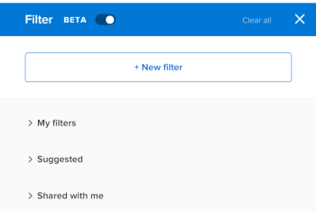
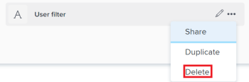

# Delete filters

<!--
<p data-mc-conditions="QuicksilverOrClassic.Draft mode">(NOTE: Should this be renamed and updated for "Delete filters, views, and groupings" and be updated to illustrate this?! I think we should keep this separate from "Remove FVG" because there are two separate functions - ?!)</p>
-->

The information on this page refers to functionality not yet generally available. It is available only in the Preview Sandbox environment.

You can delete filters when they are no longer needed.

Consider the following when deleting filters:

* Deleted filters are removed from Adobe Workfront for everyone who has access to view them.
* Deleted filters are removed from the global list of filters and those associated with a Layout Template. 
* You cannot recover deleted filters.

## Access requirements

You must have the following access to perform the steps in this article:

<table cellspacing="0"> 
 <col> 
 <col> 
 <tbody> 
  <tr> 
   <td role="rowheader">Adobe Workfront plan*</td> 
   <td> <p>Any</p> </td> 
  </tr> 
  <tr> 
   <td role="rowheader">Adobe Workfront license*</td> 
   <td> <p>Request or higher</p> </td> 
  </tr> 
  <tr> 
   <td role="rowheader">Access level configurations*</td> 
   <td> <p>Edit access to Filters, Views, Groupings. </p> <p>Note: If you still don't have access, ask your Workfront administrator if they set additional restrictions in your access level. For information on how a Workfront administrator can modify your access level, see <a href="../../../administration-and-setup/add-users/configure-and-grant-access/create-modify-access-levels.md" class="MCXref xref">Create or modify custom access levels</a>.</p> </td> 
  </tr> 
  <tr> 
   <td role="rowheader">Object permissions</td> 
   <td> <p>Manage permissions to a filter</p> <p>For information on requesting additional access, see <a href="../../../workfront-basics/grant-and-request-access-to-objects/request-access.md" class="MCXref xref">Request access to objects </a>.</p> </td> 
  </tr> 
 </tbody> 
</table>

&#42;To find out what plan, license type, or access you have, contact your Workfront administrator.

## Prerequisites

Deleting filters is possible only when the following conditions are met:

* You access filters from the following lists of objects:&nbsp;projects, tasks, or issues.

* You enable the beta builder interface to view available filters in the system. For information about the types of filter-building interfaces, see [Create or edit filters in Adobe Workfront](../../../reports-and-dashboards/reports/reporting-elements/create-filters.md).

## Delete a filter

1. Go to a list of projects, tasks, or issues.
1. Click the **Filter** icon , then enable the **Beta setting**  to access the beta builder. It is disabled by default.

   This opens the beta filter builder interface.

   >[!TIP]
   >
   >The header of the filter builder interface changes to blue when you enable the beta builder. After you enabled the beta builder interface, Workfront keeps it enabled for all areas where it is available.

   

1. Review the following lists of filters:

   | My filters |Filters that you build and saved yourself. |
   |---|---|
   | Suggested |Filters that the Workfront administrator adds to your list of filters, either at the system level, or in your Layout Template.  |
   | Shared with me |Filters that others create and share with you or that are shared system-wide. |

1. Hover over a filter that you have permissions to manage, then click the **More** menu , then click&nbsp;**Delete**.

   

1. (Optional)&nbsp;Click&nbsp;**Cancel** to avoid the deletion and return to the list of filters. 
1. ```Click **Delete** to confirm the deletion.``` 
1. The filter is deleted for you and all users who had permissions to it.

