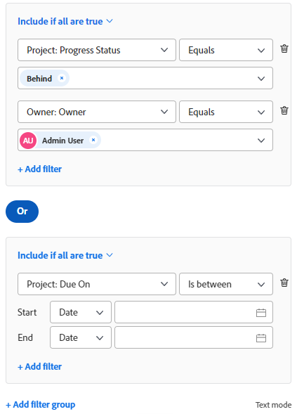
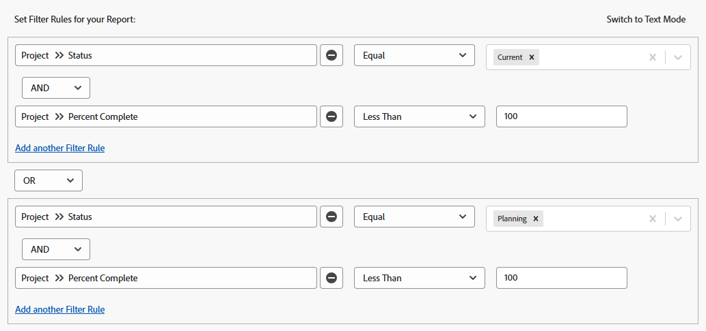

# Filters overview in Adobe Workfront

You can use filters in Adobe Workfront to reduce the amount of information you display on the screen in lists, reports, or other areas.

>[!NOTE]
>
>This article describes all areas where you can apply filters in Workfront, as well as general information about filters in lists and reports. Refer to the articles linked below to find out information about filters in specific areas other than lists and reports.

## Types of Workfront filters

There are several types of filters in Workfront. All filters fulfill the same purpose of limiting the amount of information you display on the screen.

The following are types of filters that you can use in Workfront:

<table style="table-layout:auto"> 
 <col> 
 <col> 
 <tbody> 
  <tr> 
   <td><strong>Temporary filters</strong></td> 
   <td> 
A one-time quick filter based on a keyword search to quickly find an item in a list. 
 </td> 
  </tr> 
  <tr> 
   <td><strong>Permanent filters for lists and reports</strong></td> 
   <td>Built by Workfront or customized by you or other users. You can use them more than one time. If you have the correct access and permissions, you can name, save, and reuse them in several areas. You can also share these filters with other users. They are available in lists or reports of objects. </td> 
  </tr> 
  <tr> 
   <td><strong>Temporary or permanent filters for special areas</strong></td> 
   <td>Built by Workfront or customized by you or other users. You can save permanent filters and use more than one time, or you can apply them temporarily to serve your immediate needs, without saving them. Unsaved filters cannot be shared or deleted. They are available in special areas, as described in the section <a href="#workfront-filters-for-special-areas" class="MCXref xref">Workfront filters for special areas</a> in this article. </td> 
  </tr> 
 </tbody> 
</table>

## Workfront temporary filters

Quick filters allow you to search for an item on the screen by using a keyword. After you refresh the page, the temporary quick filter is cleared. You cannot save temporary filters to reuse.

For information about quick filters, see [Apply the quick filter to a list](../../../workfront-basics/navigate-workfront/use-lists/apply-quick-filter-list.md).

## Workfront permanent filters for lists and reports

You can use permanent filters that you, others, or Workfront created in lists or reports of objects.

For information about objects in Workfront and which ones you can build reports for, see [Understand objects in Adobe Workfront](../../../workfront-basics/navigate-workfront/workfront-navigation/understand-objects.md).

For more information about filters in lists and reports, see the following articles:

* [Create or edit filters in Adobe Workfront](../../../reports-and-dashboards/reports/reporting-elements/create-filters.md) 
* [Remove filters, views, and groupings](../../../reports-and-dashboards/reports/reporting-elements/remove-filters-views-groupings.md) 
* [Share a filter, view, or grouping](../../../reports-and-dashboards/reports/reporting-elements/share-filter-view-grouping.md)

## Workfront filters for special areas {#workfront-filters-for-special-areas}

You can use either built-in filters or build custom filters in the following areas of Workfront:

* Home   
  For information, see the [Filter the Work List](../../../workfront-basics/using-home/using-the-home-area/display-items-in-home-work-list.md#filtering-by-item-type) section in the article [Display items in the Work List in the Home area](../../../workfront-basics/using-home/using-the-home-area/display-items-in-home-work-list.md).
* Requests area. You cannot customize filters in the Requests area.

  For information, see [Locate submitted requests](../../../manage-work/requests/create-requests/locate-submitted-requests.md). 

* Resource Planner  
  For information, see the article [Filter information in the Resource Planner](../../../resource-mgmt/resource-planning/filter-resource-planner.md).

* Utilization report

  For information, see the section [Filter utilization information](../../../resource-mgmt/resource-utilization/view-utilization-information.md#filtering-utilization-information) in the article [View resource utilization information](../../../resource-mgmt/resource-utilization/view-utilization-information.md). 

* Workload Balancer

  For information, see [Filter information in the Workload Balancer](../../../resource-mgmt/workload-balancer/filter-information-workload-balancer.md).

* Analytics area

  For information, see [Apply filters in Enhanced analytics](../../../enhanced-analytics/use-enhanced-analytics-filters.md). 

* Blueprints area

  For information, see [Install a blueprint](../../../administration-and-setup/blueprints/blueprints-install.md). 

* Scenario Planner

  The Scenario Planner requires an additional license. For information about the Workfront Scenario Planner, see [The Scenario Planner overview](../../../scenario-planner/scenario-planner-overview.md).

  >[!TIP]
  >
  >You cannot customize filters in the Scenario Planner.

  <!--
  
(NOTE: the tip above: this might change with the beta filters??)

  -->

  You can use built-in filters for plans, initiatives, or projects and you can customize project filters in the Scenario Planner.

  For information, see the following articles:

   * [Create and edit plans in the Scenario Planner](../../../scenario-planner/create-and-edit-plans.md) 
   * [Update or create projects by publishing initiatives in the Scenario Planner](../../../scenario-planner/publish-scenarios-update-projects.md) 
   * [Import projects to plans in the Scenario Planner](../../../scenario-planner/import-projects-to-plans.md)

* Goals

  Goals require an additional license. For information about Workfront Goals, see [Adobe Workfront Goals overview](../../../workfront-goals/goal-management/wf-goals-overview.md).

  You can use built-in filtering criteria but you cannot build custom filters to reuse for the Goals area.

  For information, see [Filter information in Adobe Workfront Goals](../../../workfront-goals/goal-management/filter-information-wf-goals.md). 

* Boards

  You can apply built-in filters but you cannot build custom filters to reuse in the Boards area.

  For information, see [Filter and search in a board](../../../agile/get-started-with-boards/filter-search-in-board.md).

## Overview of filters in lists and reports

When working with lists and reports, you can filter information on the screen by using the following types of filters:

* built-in filters
* new filters you or others create from scratch
* customized existing filters that others created and shared with you
* copied and edited filters based on existing filters

>[!IMPORTANT]
>
>When creating or editing filters in reports, you must edit the report in order for the new filter to become the default filter for the report. When you edit just the filter, outside the report builder, the default filter of the report is not updated.  
>For information about editing a report, see the article [Create a custom report](../../../reports-and-dashboards/reports/creating-and-managing-reports/create-custom-report.md).

For information about Workfront lists, see the article [Get started with lists in Adobe Workfront](../../../workfront-basics/navigate-workfront/use-lists/view-items-in-a-list.md).  
For information about Workfront reports, see the article [Get started with reports](../../../reports-and-dashboards/reports/reporting/get-started-reports-workfront.md).

Consider the following when working with filters in lists or reports:

* You can customize existing filters in lists and reports. All users who have permissions to the filters can also see your changes.

* Your Workfront administrator must grant you Edit access to filters, views, and groupings to create permanent filters.

  For information about granting access to filters, views, and groupings, see [Grant access to filters, views, and groupings](../../../administration-and-setup/add-users/configure-and-grant-access/grant-access-fvg.md).

* Your level of permissions to a filter determines how filters are saved. If you created the filter originally, you can save the changes, otherwise you are prompted to save a version of the filter that you are modifying.

  >[!TIP]
  >
  >Keep in mind if you make changes to a filter you have shared with others, the changes impact them as well.

* You can customize a filter that was shared with you only if the user who shared it granted you Manage access. For information about sharing a filter, see [Share a filter, view, or grouping](../../../reports-and-dashboards/reports/reporting-elements/share-filter-view-grouping.md).

## Elements of a filter

When you build a filter, you connect multiple elements together that make up filter statements. You can have multiple filter statements that define the criteria for your filter.

This is an example of the standard filter builder:

This is an example of the legacy filter builder:

A filter contains the following elements:

<table style="table-layout:auto"> 
 <col> 
 <col> 
 <tbody> 
  <tr> 
   <td><strong>Object</strong></td> 
   <td> 
The Workfront database object of the filter. For information about what objects are reportable in Workfront, see <a href="../../../workfront-basics/navigate-workfront/workfront-navigation/understand-objects.md" class="MCXref xref">Understand objects in Adobe Workfront</a>. 
 
For example, projects, tasks, issues, users, documents can be the object of a filter. 
 </td> 
  </tr> 
  <tr> 
   <td><strong>Field</strong></td> 
   <td> 
The attribute of the object that you are filtering by. 
 
For example, you can filter by Portfolio Name, or Project Owner. In these case, Name and Owner are fields of the Portfolio and Project objects. 
 </td> 
  </tr> 
  <tr> 
   <td> 
<strong>Value</strong>
 </td> 
   <td>The actual name of the field in Workfront. For example, Complete can be the value of a Project&nbsp;Status field. </td> 
  </tr> 
  <tr> 
   <td><strong>Operator</strong></td> 
   <td>Connects multiple filter statements. For information, see the section <a href="#filter-operators" class="MCXref xref">Filter operators</a> in this article. </td> 
  </tr> 
  <tr> 
   <td><strong>Modifier</strong></td> 
   <td>Indicates what kind of information you want your data to match. For information, see the section <a href="#filter-modifiers" class="MCXref xref">Filter modifiers</a> in this article. </td> 
  </tr> 
 </tbody> 
</table>

## Filter operators {#filter-operators}

Workfront has two filter operators that connect each filter statement:

* **AND**: When you join two filter statements by the AND operator, you indicate that you want both filter statements to be met at the same time.

  By default, the statements in a filter are joined by the AND operator.

* **OR**: When you join two filter statements by the OR operator, you indicate that you want either statement to be met.

  >[!TIP]
  >
  >When changing your AND statements to OR statements, the number of the items in your report should increase.

## Filter modifiers {#filter-modifiers}

You can use filter modifiers to indicate what kind of information you want your data to match. 

>[!INFO]
>
>**Example:**
>You can filter for projects that have a Percent Complete of 100%. In this case, you can use the "equal" modifier in the following filter statement:
>
>`Project: Percent Complete Equal(Case Sensitive) 100`

For more information about filter modifiers, see [Filter and condition modifiers](../../../reports-and-dashboards/reports/reporting-elements/filter-condition-modifiers.md).

## Create filters in the builder interface

You can create a filter using the standard or legacy builder interface in the following ways:

* From scratch
* Modify an existing filter
* Copy an existing filter

For information about creating a filter using the standard or legacy builder interface, see [Create or edit filters in Adobe Workfront](../../../reports-and-dashboards/reports/reporting-elements/create-filters.md).

## Create filters using the text mode interface

You can build filters using the text mode interface. We recommend to build most of the filter statements using the standard or beta builder interface, and to edit the code of the filter only as a final step. Building a filter from scratch using the text mode interface alone is not recommended.

For more information about creating a filter using the text mode interface, see [Edit a filter using text mode](../../../reports-and-dashboards/reports/text-mode/edit-text-mode-in-filter.md).

## Create filters for complex fields

* [Create filters for fields whose values contain commas](#create-filters-for-fields-whose-values-contain-commas) 
* [Create filters for whose values are a multi-select custom field](#create-filters-for-whose-values-are-a-multi-select-custom-field)

### Create filters for fields whose values contain commas {#create-filters-for-fields-whose-values-contain-commas}

When building a filter in text mode and filtering for field values that contain commas, you must add a slash ("/") before the commas separating the values, to ensure that the value is read as one filter option. This only applies for the following field types:

* Dropdowns
* Radio Buttons
* Checkboxes

For example, you have a radio button field on a project called "Color" and the options for it are:

* Red
* Blue
* Red, blue

If you want to build a filter that would find only projects where the third option is selected, the filter statement in the text mode interface should be:

`DE:check=red/, blue`

`DE:check_Mod=in`

This syntax ensures that the values are read together, as one option. If you omit the slash, Workfront reads the comma as an 'OR', in which case only the projects that have either the first or the second option would be selected.

This syntax also applies when building prompts. For more information about using prompts, see [Add a prompt to a report](../../../reports-and-dashboards/reports/creating-and-managing-reports/add-prompt-report.md).

### Create filters for whose values are a multi-select custom field {#create-filters-for-whose-values-are-a-multi-select-custom-field}

You can report on multi-select custom fields. For example, you can report on fields that are checkboxes.

However, when you want to exclude results that have only one of the options selected, the report will display any objects that have that option and any other option selected.

For example, if you have a field with 3 options (A, B, and C), and select 2 of the 3 options (A and B, but not C) on an object, you can create a report with a filter with a qualifier of Not Equal for options A and B, and it will only filter out projects that have both A and B, but not only A, and not only B selected. If you create a filter with a qualifier for Not Equal for option A, it will only filter out objects with only A selected, but if A and B are selected, those objects still display in the report.

## Limitations about joining multiple filter rules

You can reference only five objects, excluding the object of the report, when you build a filter in Workfront.
