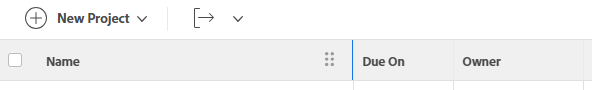
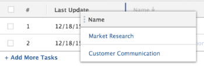

# Modify column width and order

The following are guidelines about how column widths work in Adobe Workfront:

* Workfront defines the width of columns in lists and reports, by default.
* Workfront automatically adjusts the width of the columns according to the `valueformat`information in all lists and reports, unless otherwise specified in the text mode of the column.

  >[!NOTE]
  >
  >Workfront does not adjust the width of the columns according to the `valueformat` information in the lists available in the Setup and Reports areas.

  The `valueformat` value defines what kind of information displays in the column. For example, columns that display a number are narrower than columns that display the Description field.

* You can customize the width of the columns in your Workfront lists and reports to match your needs, depending on what kind of information you want to display in columns.

  You can modify the width of columns temporarily, while viewing a list or report, or permanently, by adjusting the width of the column in the view builder. For information about modifying the width of columns temporarily, see the [Considerations when temporarily modifying the width and order of columns](#considerations-when-temporarily-modifying-the-width-and-order-of-columns) section in this article.

* Columns that appear in built-in views have widths previously defined by Workfront that are hard coded. To modify these widths, you must manually update the width of these columns using text mode in the view builder.

  For information about modifying the column in text mode, see [View: permanently edit the width of a column](../../../reports-and-dashboards/reports/custom-view-filter-grouping-samples/view-edit-column-width-permanently.md).

## Access requirements

You must have the following access to perform the steps in this article:

<table style="table-layout:auto"> 
 <col> 
 <col> 
 <tbody> 
  <tr> 
   <td role="rowheader"><strong>Adobe Workfront plan*</strong></td> 
   <td> 
Any
 </td> 
  </tr> 
  <tr> 
   <td role="rowheader"><strong>Adobe Workfront license*</strong></td> 
   <td> 
Request or higher 
 </td> 
  </tr> 
  <tr> 
   <td role="rowheader"><strong>Access level configurations*</strong></td> 
   <td> 
Edit access to Filters, Views, Groupings
 
Edit access to&nbsp;Reports,&nbsp;Dashboards,&nbsp;Calendars to edit the view in a report
 
Note: If you still don't have access, ask your Workfront administrator if they set additional restrictions in your access level. For information on how a Workfront administrator can modify your access level, see <a href="../../../administration-and-setup/add-users/configure-and-grant-access/create-modify-access-levels.md" class="MCXref xref">Create or modify custom access levels</a>.
 </td> 
  </tr> 
  <tr> 
   <td role="rowheader"><strong>Object permissions</strong></td> 
   <td> 
Manage permissions to a report to edit a view in a report
 
Manage permissions to a view to edit it
 
For information on requesting additional access, see <a href="../../../workfront-basics/grant-and-request-access-to-objects/request-access.md" class="MCXref xref">Request access to objects </a>.
 </td> 
  </tr> 
 </tbody> 
</table>

&#42;To find out what plan, license type, or access you have, contact your Workfront administrator.

## Modify column width and order

You can modify the width and order of the columns in your reports in the following ways:

* [Modify width and order of columns temporarily](#modify-width-and-order-of-columns-temporarily) 
* [Modify width and order of columns permanently](#modify-width-and-order-of-columns-permanently)

### Modify width and order of columns temporarily {#modify-width-and-order-of-columns-temporarily}

You can drag column borders to resize columns and drag and drop columns to temporarily reorder them in most lists throughout the Workfront site. This includes reports, views, reports on dashboards, and the Gantt view.

For more information about Workfront lists, see the article [Get started with lists in Adobe Workfront](../../../workfront-basics/navigate-workfront/use-lists/view-items-in-a-list.md).

* [Considerations when temporarily modifying the width and order of columns](#considerations-when-temporarily-modifying-the-width-and-order-of-columns) 
* [Resize columns temporarily](#resize-columns-temporarily) 
* [Reorder columns temporarily](#reorder-columns-temporarily)

#### Considerations when temporarily modifying the width and order of columns {#considerations-when-temporarily-modifying-the-width-and-order-of-columns}

You can temporarily modify the width and order of columns in a list without editing its view.

Consider the following when temporarily resizing and ordering columns:

* When resizing columns, the new column sizes are stored in your browser's local storage, and are saved by default. Using a different browser or clearing your cache or browsing data results in column sizes being reverted to the default. Refreshing your page keeps the changes you make to the width of the columns.
* When reordering columns, the order you choose is maintained only until you navigate away from the list, or you refresh the browser page. After navigating away from the list or refreshing the browser page, columns return to their default order.
* For optimal performance, the columns you are reordering should not have more than 100 items in the list.
* When you resize columns, your changes apply only to the view you are currently using and are visible only to you. Sharing a view with another user does not share the column sizes that you have defined.
* After you resize a column by dragging its border to the right, the width of the neighboring column is preserved except in the following:

   * The Setup area
   * The Reports area
   * Document lists and reports

  >[!NOTE]
  >
  >You cannot move the left border of a column past the left border of the neighboring column in any list.

* If you export any list to a file, the temporary order of the columns does not transfer to the exported file. The exported file displays the order of the columns in the original list, before the columns have been reordered.

For more information about exporting data from lists and reports, see the article [Export data](../../../reports-and-dashboards/reports/creating-and-managing-reports/export-data.md).

#### Resize columns temporarily {#resize-columns-temporarily}

1. Go to the list that you want to modify.
1. Drag the border of a column until the column reaches the desired size.  
   

#### Reorder columns temporarily {#reorder-columns-temporarily}

1. Go to the list you want to modify. 
1. Click a column you want to move to another location to pick the column. 
1. Drag the column into the correct location. 
1. Drop the column into the location, to move it.

   

>[!TIP]
>
>This is especially useful when viewing the Gantt chart and the list view simultaneously. When viewing the Gantt chart, columns can become hidden. To view a column while the Gantt chart is displayed, simply drag the column that you want to view so that it is displayed on the left side of the page.

### Modify width and order of columns permanently {#modify-width-and-order-of-columns-permanently}

To permanently reorder columns, see the section [Create or customize a standard view](../../../reports-and-dashboards/reports/reporting-elements/views-overview.md#customizing-a-standard-view) in the article [Views overview in Adobe Workfront](../../../reports-and-dashboards/reports/reporting-elements/views-overview.md).

You can permanently modify the width of a column only by using text mode.

For more information about using text mode and permanently modifying the width of a column, see the article [Overview of common uses for Text Mode](../../../reports-and-dashboards/reports/text-mode/understand-common-uses-text-mode.md).
