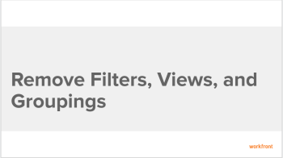

# Remove filters, views, and groupings

<!--

(NOTE: when this goes live, eidt or remove the original aricle: Sharing a Filter, View, or Grouping - see if anything from this old article can remain as a reference; the remove and share a grouping, etc have been turned into how tos) 

-->

The highlighted information on this page refers to functionality not yet generally available. It is available only in the Preview Sandbox environment.

<!--

(NOTE: this is older content - has been drafted and replaced by the DIV below) 

You can remove a filter, view, or grouping from the drop-down menus of lists and reports if you created them or they have been shared with you. You cannot remove default filters, views, or groupings.

<h2>Walk-through</h2>

View the following video to learn how to remove filters, views, and groupings in Adobe Workfront.
 <note type="note">
The video describes how to remove a grouping. However, removing views and filters is identical to removing a grouping.
</note>

This video was recorded in Workfront Classic. However, the content also applies to the new Workfront experience.

 

<h2>How-to steps</h2>

How you remove a reporting element depends on whether you initially created it, or it was shared with you.

For example, when removing a grouping:

<ul>
<li><strong>If you created the grouping and you remove it</strong>, the grouping is removed from the Workfront system. The grouping is no longer available to any users who you previously shared it with.</li>
<li><strong>If the grouping was shared with you and you remove it</strong>, the grouping is removed only for you. The user who originally created it and any other users it has been shared with still have access to the grouping.</li>
</ul>

To remove a filter, view, or grouping:

<ol>
<li value="1"> 
Go to a list of objects or a report.
 </li>
<li value="2"> 
In the <strong>Grouping</strong>,<strong>Filter</strong>, or<strong>View</strong> drop-down menus, click <strong>Remove Grouping</strong>,<strong>Remove Filter</strong>, or<strong>Remove View</strong>.
 
The <strong>My Groupings</strong>,<strong>My Filters,</strong> or<strong>My Views</strong>dialog box displays.
 
All reporting elements that you have rights to remove are available to remove. Other reporting elements are displayed as dimmed.
 </li>
<li value="3">Click the <strong>x</strong> icon next to any reporting element that you want to remove, then click <strong>Done</strong>.</li>
</ol>
<h2>Additional information</h2>

See also:

<ul>
<li data-mc-conditions="QuicksilverOrClassic.Quicksilver"> 
<a href="https://one.workfront.com/s/basic-report-creation-program">Basic Report Creation Program for the new Workfront experience</a> 
 </li>
<li><a href="../../../reports-and-dashboards/reports/reporting-elements/reporting-elements-filters-views-groupings.md" class="MCXref xref">Reporting elements: filters, views, and groupings</a> </li>
<li><a href="../../../reports-and-dashboards/reports/creating-and-managing-reports/create-custom-report.md" class="MCXref xref">Create a custom report</a> </li>
<li><a href="../../../reports-and-dashboards/reports/reporting-elements/create-groupings.md" class="MCXref xref">Create groupings in Adobe Workfront</a> </li>
<li><a href="../../../reports-and-dashboards/reports/reporting-elements/edit-existing-groupings.md" class="MCXref xref">Edit existing groupings</a> </li>
<li><a href="../../../reports-and-dashboards/reports/reporting-elements/filters-overview.md" class="MCXref xref">Filters overview in Adobe Workfront</a> </li>
<li><a href="../../../reports-and-dashboards/reports/reporting-elements/views-overview.md" class="MCXref xref">Views overview in Adobe Workfront</a> </li>
<li><a href="../../../reports-and-dashboards/reports/reporting-elements/groupings-overview.md" class="MCXref xref">Groupings overview in Adobe Workfront</a> </li>
</ul>

-->

You can remove a filter, view, or grouping from lists and reports if you created them or they have been shared with you. You cannot remove default filters, views, or groupings.

## Access requirements

You must have the following:

<table cellspacing="0"> 
 <col> 
 </col> 
 <col> 
 </col> 
 <tbody> 
  <tr> 
   <td role="rowheader">Adobe Workfront plan*</td> 
   <td> 
Any 
 </td> 
  </tr> 
  <tr> 
   <td role="rowheader">Adobe Workfront license*</td> 
   <td> 
Request or higher
 </td> 
  </tr> 
  <tr> 
   <td role="rowheader">Access level configurations*</td> 
   <td> 
View or higher access to&nbsp;Filters, Views, Groupings
 
Note: If you still don't have access, ask your Workfront administrator if they set additional restrictions in your access level. For information on how a Workfront administrator can modify your access level, see <a href="../../../administration-and-setup/add-users/configure-and-grant-access/create-modify-access-levels.md" class="MCXref xref">Create or modify custom access levels</a>.
 </td> 
  </tr> 
  <tr> 
   <td role="rowheader">Object permissions</td> 
   <td> 
View permissions with access to share to the filter, view, or grouping you want to remove
 
For information on requesting additional access, see <a href="../../../workfront-basics/grant-and-request-access-to-objects/request-access.md" class="MCXref xref">Request access to objects </a>.
 </td> 
  </tr> 
 </tbody> 
</table>

&#42;To find out what plan, license type, or access you have, contact your Workfront administrator.

## Considerations about removing filters, views, and groupings

How you remove a reporting element depends on whether you initially created it, or it was shared with you.

The following scenarios exist when you remove a grouping:

* **If you created the grouping and you remove it**, the grouping is removed from the Workfront system. The grouping is no longer available to any users who you previously shared it with.
* **If the grouping was shared with you and you remove it**, the grouping is removed only for you. The user who originally created it and any other users it has been shared with still have access to the grouping.

## Remove a filter, view, or grouping 

<!--
<MadCap:conditionalText data-mc-conditions="QuicksilverOrClassic.Draft mode">
using the standard builder
</MadCap:conditionalText>
-->

<!--

(NOTE: drafted ( as well as below) until the beta interface releases. Then, we can undraft this!)

-->

<!--

You can remove a filter, view, or a grouping for all lists of objects using the standard builder interface. 

-->

Removing filters, views, or groupings in Workfront is identical.

1. Go to a list of objects or a report.
1. (Conditional)&nbsp;From a list, click the **Filter**, **View**, or **Grouping** icon, then hover over the filter, view, or grouping you want to remove, click the **More** icon , then **Remove**. The filter, view, or grouping is removed. 
1. (Conditional)&nbsp;From a report, c lick the **Grouping**,**Filter**, or**View** drop-down menu and select **Remove Grouping**,**Remove Filter**, or**Remove View**.

   The **My Groupings**,**My Filters,** or**My Views** dialog box displays.

   All reporting elements that you have rights to remove are available to remove. Other reporting elements are displayed as dimmed.

1. Click the **x** icon next to any reporting element that you want to remove. 
1. (Conditional) Click **Yes, Delete it** if you selected to delete a filter, view, or grouping that you created and later shared with others.&nbsp;This deletes the filter, view, or grouping from the Workfront system.

   >[!TIP]
   >
   >
   >Removing a filter, view, or grouping that you created without sharing it with others removes it from the system without asking for a confirmation.

1. Click **Done**.

<!--

<h2>Remove a filter<!--
<MadCap:conditionalText data-mc-conditions="QuicksilverOrClassic.Draft mode">
, view,
</MadCap:conditionalText>
--> or grouping using the beta builder</h2> <!--

(NOTE: Drafted "view" because it will not be there for a bit) 

-->

You cannot remove a filter or grouping using the beta builder interface. You can only delete them in a list of projects, tasks, or issues.&nbsp;The beta builder is not available for any other object lists or for views.

For more information, see <a href="../../../reports-and-dashboards/reports/reporting-elements/delete-filters.md" class="MCXref xref">Delete filters</a>.
 <!--

(NOTE:&nbsp;I drafted this DIV because I am not sure if we should refer to these steps as "removing a filter". This is very clearly a deletion and the name of the UI element is "Delete". I would keep this section, but just point it to the "Delete" file (right now, we only have "delete-filters.htm" but it could become "delete-filters-views-groupings.htm"?!)

--> <!--

You can remove a filter or a grouping for lists of projects, tasks, or issues using the beta builder interface. The beta builder interface is not available for any other objects or for views. 
 <!--

(NOTE: this list of objects above will change over time. Update!)

-->
<ol>
<li value="1"> 
Go to a list of projects, tasks, or issues.
 </li>
<li value="2"> 
Click the <strong>Filter</strong><!--
<MadCap:conditionalText data-mc-conditions="QuicksilverOrClassic.Draft mode">
,
<strong>View</strong>,
</MadCap:conditionalText>
-->or <strong>Grouping</strong> icon.<!--
<MadCap:conditionalText data-mc-conditions="QuicksilverOrClassic.Draft mode">
(NOTE: drafted "view")
</MadCap:conditionalText>
-->
 </li>
<li value="3"> 
Enable the beta builder, then locate the item under <strong>My filters</strong>, <!--
<MadCap:conditionalText data-mc-conditions="QuicksilverOrClassic.Draft mode">
<strong>My views</strong>,
</MadCap:conditionalText>
--> or <strong>My groups</strong>, select the <strong>More</strong> icon  next to the item, then select <strong>Delete</strong>. <!--
<MadCap:conditionalText data-mc-conditions="QuicksilverOrClassic.Draft mode">
(NOTE: drafted "My views")
</MadCap:conditionalText>
-->
 </li>
<li value="4"> 
Select <strong>Delete</strong> on the confirmation message to permanently remove the filter, view, or grouping.
 </li>
</ol>

-->

-->

