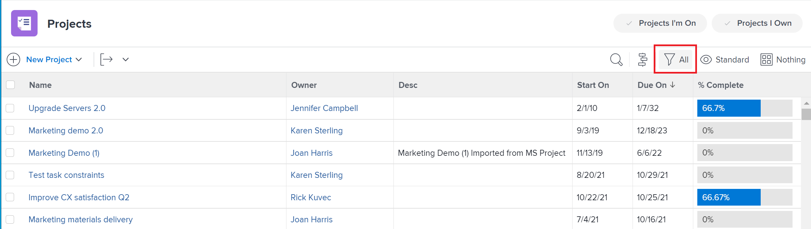

# Reporting elements: filters, views, and groupings

<!--

AL: Add information here about all the different kinds of FVGs: in reports, in lists, beta, etc // OR: this article should be a high-level overview of reporting elements. Then, each type of element should have:

- overview for Filters

- create a filter

- share a filter

ALL in Reporting elements but the Shared ones should be linked to Basics> Sharing; some of the articles in the Basics> Navigation> Use lists might beed to link here as well

-->

There are several elements that make a list or a report possible in Adobe Workfront. The main elements that every list and report must have are a filter, a view, and a grouping. Each element provides different information within any report.

## Considerations about reporting elements

Consider the following when working with filters, views, and groupings:

* Reporting elements function as the building blocks of reporting. They define the look and feel of a report or a list, as well as the information contained in the report or list.
* Reports in Workfront are specific to one object. You must define your main object for a report before you can build the report. Thus, all the reporting elements are object specific.
* Your Workfront administrator must grant you access to filters, views, and groupings in your access level to be able to view or edit them in lists and reports.

  For information about granting access to filters, views, and groupings, see [Grant access to filters, views, and groupings](../../../administration-and-setup/add-users/configure-and-grant-access/grant-access-fvg.md).

* Your Workfront administrator must grant you access to reports, dashboards, and calendars in your access level to be able to view or edit reports.

  For information about granting access to reports, dashboards, and calendars, see [Grant access to reports, dashboards, and calendars](../../../administration-and-setup/add-users/configure-and-grant-access/grant-access-reports-dashboards-calendars.md).

* If you select a filter, view, or grouping on a report or list, Workfront retains this selection for that object's lists even after you log out or close your browser. For example, if you select a specific view for a task report, that selection appears for other task lists, such as the list of tasks on a project.

## Filters

The filter controls the results that appear in a report, typically narrowing results from general to specific. It works like a sieve only grabbing the information that you need and bringing that information back to your report.

For example, if you only want to see tasks that are assigned to the logged-in user, you can create a filter titled "My Tasks," define the criteria that must be met for the filter and run the report to only view tasks assigned to the logged in user.

Some attributes of filters are:

* Workfront provides a number of filters for various objects by default.
* You can customize filters that you own or manage.
  
  For more information about filters, see the article [Filters overview](../../../reports-and-dashboards/reports/reporting-elements/filters-overview.md).

## Views

By defining the view of a report, you define what information you include in the report. Like all reporting elements, views are based on one object type.  
For example, a view for a task report could show Due Dates, include key financial details such as Cost, or be used to show Assignments and Delivery Date details. Views can be used to deliver a variety of details about the data in the report.

Some attributes of views are:

* You can use a default Workfront view, or you can create your own. 
* You can apply additional views from the View drop-down field after running a report.
* Additional views temporarily replace the view that is defined when creating the report; however, the default view is displayed the next time you return to the report.

  For more information about views, see the article [Views overview in Adobe Workfront](../../../reports-and-dashboards/reports/reporting-elements/views-overview.md).

## Groupings

A grouping controls how you organize data, making it easier to read and understand. Groupings create horizontal bars throughout a report that display results listed together by common attributes. You define the criteria for how you want to group the results of your report when creating the grouping.

For example, grouping a list of tasks that span multiple projects by their project name organizes all respective tasks that belong to a single project under that name.

Some attributes of groupings are:

* Groupings are a mandatory reporting element if you want to later add a chart to your report.
* Groupings display an aggregate value in the results.​  
* Groupings determine the axis in charts.
* Groupings determine the header identification in matrix reports.  
  For more information about matrix reports, see the article [Create a matrix report](../../../reports-and-dashboards/reports/creating-and-managing-reports/create-matrix-report.md).

* Groupings help build the Summary tab of a report, providing the aggregated values of the report.
* Workfront provides a number of groupings for different objects by default.
* You can customize groupings that you own or manage.

  For more information about groupings, see [Groupings overview in Adobe Workfront](../../../reports-and-dashboards/reports/reporting-elements/groupings-overview.md).

## Other reporting elements

In addition to filters, views, and groupings, you could also add the following elements to a report:

* **Prompt**: An open filter that can be customized and applied differently every time you run a report.  
  For more information about prompts, see the article [Add a prompt to a report](../../../reports-and-dashboards/reports/creating-and-managing-reports/add-prompt-report.md).

* **Chart**: You can enhance your reports by adding a chart to them and displaying the information in a visual way.  
  For more information about charts in reports, see the article [Add a chart to a report](../../../reports-and-dashboards/reports/creating-and-managing-reports/add-chart-report.md).
