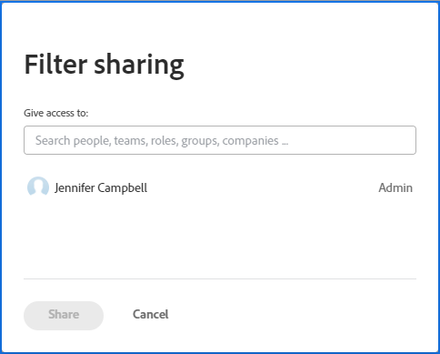
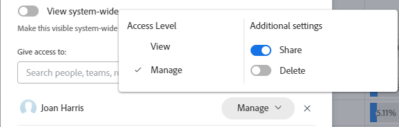
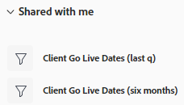
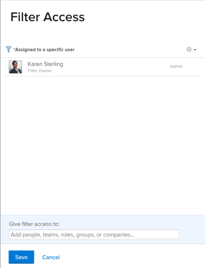

# Share a filter, view, or grouping

<!--

(NOTE: CONSIDER SPLITTING THIS in three articles for each reporting element?)

(NOTE: This is linked from the TOC article in WF Basics > permissions section)&nbsp;

-->

Your Adobe Workfront administrator grants users access to view or edit objects when they assign access levels. For more information about granting access to objects, see [Create or modify custom access levels](../../../administration-and-setup/add-users/configure-and-grant-access/create-modify-access-levels.md).

Along with the access level that users are granted, you can also grant them permissions to view or edit specific objects that you created or have access to share. For more information about access levels and permissions, see [How access levels and permissions work together](../../../administration-and-setup/add-users/access-levels-and-object-permissions/how-access-levels-permissions-work-together.md).

You can share filters, views, and groupings that you have access to view with other users.

When a filter, view, or grouping is shared with you, you can apply that filter, view, or grouping to your lists. Depending on the access granted to you, you might be able to modify it and share it with other users.

For information about how to create a filter, view, or grouping, see the following articles:

* [Filters overview](../../../reports-and-dashboards/reports/reporting-elements/filters-overview.md) 
* [Views overview in Adobe Workfront](../../../reports-and-dashboards/reports/reporting-elements/views-overview.md) 
* [Groupings overview in Adobe Workfront](../../../reports-and-dashboards/reports/reporting-elements/groupings-overview.md)

## Access requirements

You must have the following:

<table style="table-layout:auto"> 
 <col> 
 <col> 
 <tbody> 
  <tr> 
   <td role="rowheader"><strong>Adobe Workfront plan*</strong></td> 
   <td> 
Any 
 </td> 
  </tr> 
  <tr> 
   <td role="rowheader"><strong>Adobe Workfront license*</strong></td> 
   <td> 
Request or higher
 </td> 
  </tr> 
  <tr> 
   <td role="rowheader"><strong>Access level configurations*</strong></td> 
   <td> 
View or higher access to&nbsp;Filters, Views, Groupings
 
Note: If you still don't have access, ask your Workfront administrator if they set additional restrictions in your access level. For information on how a Workfront administrator can modify your access level, see <a href="../../../administration-and-setup/add-users/configure-and-grant-access/create-modify-access-levels.md" class="MCXref xref">Create or modify custom access levels</a>.
 </td> 
  </tr> 
  <tr> 
   <td role="rowheader"><strong>Object permissions</strong></td> 
   <td> 
View or higher permissions with access to share to a view, filter, or grouping
 
For information on requesting additional access, see <a href="../../../workfront-basics/grant-and-request-access-to-objects/request-access.md" class="MCXref xref">Request access to objects </a>.
 </td> 
  </tr> 
 </tbody> 
</table>

&#42;To find out what plan, license type, or access you have, contact your Workfront administrator.

## Share a filter, view, or grouping

<!--

(NOTE: when the beta filters/ groupings come out either consider splitting this in different kinds of FVGs or splitting this article in FVGs for showing sharing on each one of them??)

-->

Sharing filters in select lists is different depending on which interface you use to share the filter from: standard or legacy. For information about the types of filter-building interfaces, see [Create or edit filters in Adobe Workfront](/help/quicksilver/reports-and-dashboards/reports/reporting-elements/create-filters.md).

You can share views and groupings only in the legacy interface.

### Sharing filters using the standard builder interface

You can share a filter in the standard interface from lists of projects, tasks, issues, portfolios, programs, users, templates, or groups. The standard builder interface for filters is not available for any other objects, or for views or groupings.

Share a filter using the standard builder interface:

1. Go to a list of projects, tasks, or issues.
1. Click the **Filter** icon .
   
   

1. Review the following lists of filters:

   <table style="table-layout:auto">
   <col>
   <col>
   <tbody>
   <tr>
   <td role="rowheader"><strong>Favorited</strong></td>
   <td>Filters that you marked as favorites. When you favorite a filter, its original location is shown below the filter name, and it is hidden from the original list unless you remove it as a favorite.</td>
   </tr>
   <tr>
   <td role="rowheader"><strong>Saved</strong></td>
   <td>Filters that you built and saved yourself. By default this list displays saved filters in order of most recently saved, but the filter names can be dragged to manually reorder the list.</td>
   </tr>
   <tr>
   <td role="rowheader"><strong>System defaults</strong></td>
   <td>Workfront system default filters, as well as filters that the Workfront administrator added to your list of filters, either at the system level or in your layout template.</td>
   </tr>
   <tr>
   <td role="rowheader"><strong>Shared with me</strong></td>
   <td>Filters that others created and shared with you or that are shared system-wide.</td>
   </tr>
   </tbody>
   </table>

1. Hover over a filter you have access to at least view and share, then click the **More** menu , then click **Share**.

   

   The Filter sharing box displays.

1. Enable the **View system-wide** setting. This gives anyone in Workfront permission to view the filter.
   
   >[!IMPORTANT]
   >
   >Use this setting with caution. Adding many filters for all users will clutter the filter experience and make filters harder to find.
   
   Or
   Start typing the names of users, teams, roles, groups, or companies that you want to share with in the **Give access to** field.

   

1. (Optional) Click the right-pointing arrow next to the name of an entity to edit their permissions to the filter, then enable either the **View** or **Manage** option. **View** is the default.

   

1. (Optional) Enable or disable the additional permissions for an entity by doing one of the following:

   1. Click **View** and disable the **Share** option. It is enabled by default.
   1. Click **Manage** and disable either the **Share** or the **Delete** option. They are enabled by default.

      >[!NOTE]
      >
      >If you enable Manage access with the Delete option, these users will be able to delete the filter from all users, even though they do not own the filter.

   >[!TIP]
   >
   >Users cannot receive a higher permission than their access level. If they don't have access to Edit filters in their access level, they cannot receive permissions to manage a filter. Workfront disables the Manage option for these users and the option is dimmed.

1. Click **Share**. The filter is shared with the entities you specified.

      >[!TIP]
      >
      >Sharing with groups gives permissions to the filter to the members of the group and of all the subgroups. 

   The filters you shared display in the **Shared with me** section of the filter panel for those entities.

   

### Share filters, views, and groupings using the legacy interface

Sharing filters, views, and groupings in the legacy interface is identical.

1. Go to a list of objects or a report.
1. (Conditional) From a list, click the **Filter**, **View**, or **Grouping** icon, then hover over the filter, view, or grouping you want to share, click the **More** icon , then **Share**.

   From a report, click the **Filter**, **View**, or **Grouping** drop-down menu, then select the filter, view, or grouping you want to share.

1. (Conditional) If sharing from a report, click the **Filter**, **View**, or **Grouping** drop-down menu again, then click **Share Filter**, **Share View**, or **Share Grouping**.  
   The **Filter Access**, **View Access**, or **Grouping Access** dialog box displays.

   

1. Complete either of the following, depending on who you want to share with:

   **To share with individual users, teams, roles, groups, or companies:** In the provided field, begin typing the name of the user, team, role, group, or company you want to share with, then click the name when it appears in the drop-down list.  
   Repeat this process to share access with multiple users, teams, roles, groups, or companies.

      >[!TIP]
      >
      >Sharing with groups gives permissions to the filter, view, or grouping to the members of the group and of all the subgroups. 

   **To share with all users in the system:** Click the **Settings** icon, then click **Make this visible system-wide**.  
   Your administrator must select the Share System-wide option for this option to be available. For more information, see the articles [Create or modify custom access levels](../../../administration-and-setup/add-users/configure-and-grant-access/create-modify-access-levels.md) and [Share reports, dashboards, and calendars](../../../workfront-basics/grant-and-request-access-to-objects/permissions-reports-dashboards-calendars.md).

1. (Conditional) If you are sharing with individual users, teams, roles, groups, or companies, click the drop-down menu to define the level of access you want to grant.

   You can select from the following options:

   <table style="table-layout:auto"> 
    <col> 
    <col> 
    <tbody> 
     <tr> 
      <td role="rowheader"><strong>View it</strong></td> 
      <td> 
Select this option to allow the share recipients only to use the shared Filter, View, or Grouping. When this option is selected, recipients cannot make any modifications to the shared item.
 </td> 
     </tr> 
     <tr> 
      <td role="rowheader"><strong>Manage it</strong></td> 
      <td> 
Select this option to allow the share recipients to use and modify the shared Filter, View, or Grouping.
 </td> 
     </tr> 
     <tr> 
      <td role="rowheader"><strong>Share it</strong></td> 
      <td> 
Click <strong>Advanced Settings</strong>, then select or clear the <strong>Share</strong> option, depending on whether you want the recipients to be able to share with others.
 </td> 
     </tr> 
    </tbody> 
   </table>

1. Click **Save**.

   Users with whom you shared the filter, view, or grouping can access it by clicking the **Filter**, **View**, or **Grouping** drop-down menu or icon and scrolling down to the **Shared with me** section.

