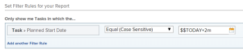

# Use date-based wildcards to generalize reports

You can generalize a report by using wildcards instead of specific information when building certain reporting elements.

For example, if you want to create a report that shows the tasks that have a specific Planned Start Date, you can use the calendar date picker in a filter to select a specific date. However, if you want to create a report that shows tasks that have the Planned Start Date within a certain timeframe from the date when the report is accessed, you can use a wildcard that indicates that when someone views the report it displays information for a timeframe relevant for the moment when they view the report.

For example in the past week, in the past year, in the next two weeks, etc. This way, you build the report once, but because you use a wildcard in the filter, it produces different results every time someone reads it because it adapts to the day when they run the report.

You can use date-based wildcards when building the following reporting elements:

* Filters
* Custom prompts
* Views when adding rules for columns

## Access requirements

You must have the following access to perform the steps in this article:

<table style="table-layout:auto"> 
 <col> 
 <col> 
 <tbody> 
  <tr> 
   <td role="rowheader"><strong>Adobe Workfront plan*</strong></td> 
   <td> 
Any
 </td> 
  </tr> 
  <tr> 
   <td role="rowheader"><strong>Adobe Workfront license*</strong></td> 
   <td> 
Plan 
 </td> 
  </tr> 
  <tr> 
   <td role="rowheader"><strong>Access level configurations*</strong></td> 
   <td> 
Edit access to Filters, Views, Groupings
 
Edit access to&nbsp;Reports,&nbsp;Dashboards,&nbsp;Calendars to edit reporting elements in a report
 
Note: If you still don't have access, ask your Workfront administrator if they set additional restrictions in your access level. For information on how a Workfront administrator can modify your access level, see <a href="../../../administration-and-setup/add-users/configure-and-grant-access/create-modify-access-levels.md" class="MCXref xref">Create or modify custom access levels</a>.
 </td> 
  </tr> 
  <tr> 
   <td role="rowheader"><strong>Object permissions</strong></td> 
   <td> 
Manage permissions to a report to edit reporting elements in a report
 
Manage permissions to a view or filter to edit them
 
For information on requesting additional access, see <a href="../../../workfront-basics/grant-and-request-access-to-objects/request-access.md" class="MCXref xref">Request access to objects </a>.
 </td> 
  </tr> 
 </tbody> 
</table>

&#42;To find out what plan, license type, or access you have, contact your Workfront administrator.

## Prerequisites

You must create a report before you can add wildcard variables to it.

For information on creating a report, see [Create a report](../../../reports-and-dashboards/reports/creating-and-managing-reports/create-report.md).

## How-to steps

To insert a date-based wildcard in a report:

1. Go to a report for which you want to insert a date-based wildcard.
1. Click **Report Actions**, then **Edit**.

1. Click the **Filters** tab.
1. Click **Add a Filter Rule**.
1. Start typing the name of the field that you want to filter by.  
   You must type fields that reference a date.
1. Select **Equal** in the drop-down menu for the filter variable.

   >[!TIP]
   >
   >You must always select the **Equal** filter variable when working with wildcards in Adobe Workfront.

1. In the **Start typing name ...** box, type: `$$TODAY` if you want to display information about something that occurs the same day that the report is run.

   Or

   Type `$$NOW` if you want to display information about something that occurs at the same date and time that the report is run.

   This date is always different, as it changes with the date the report is actually viewed by a user. so the information in the report is different from day to day.

1. (Optional) If you want to display information that occurs within a timeframe after the date when the report is run, type `$$TODAY+1w` to display information in the following week, or `$$TODAY+2m` to display information in the next two months. You can also indicate timeframes for quarters, hours, days, or years.
1. (Optional) If you want to display information about something that occurred within a timeframe before the date when the report is run, type `$$TODAY-1w` to display information from the previous week, or `$$TODAY-2m` to display information from the previous two months. You can also indicate timeframes for quarters, hours, days, or years.

   For a complete list of attributes, qualifiers, and operators that you can use in date-based wildcards, see the article [Wildcard filter variables overview](../../../reports-and-dashboards/reports/reporting-elements/understand-wildcard-filter-variables.md).

   

1. Click **Save + Close**.

## Additional information

See also:

<!--outdated: * [Basic Report Creation Program](https://one.workfront.com/s/basic-report-creation-program) -->
* [Wildcard filter variables overview](../../../reports-and-dashboards/reports/reporting-elements/understand-wildcard-filter-variables.md) 
* [Create or edit filters in Adobe Workfront](../../../reports-and-dashboards/reports/reporting-elements/create-filters.md) 
* [Add a prompt to a report](../../../reports-and-dashboards/reports/creating-and-managing-reports/add-prompt-report.md) 
* [Use conditional formatting in views](../../../reports-and-dashboards/reports/reporting-elements/use-conditional-formatting-views.md)
