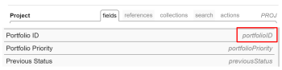
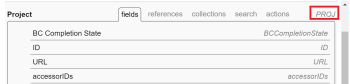

# Create complex Text Mode filters using EXISTS statements

<!-- Audited: 01/2024 -->

<!--

(NOTE: do not EVER&nbsp;delete this article as long as Text Mode still exists in the system.&nbsp;Google ordered this article to be written and we wrote it with the help of consultants, so the use case is very complex and very hard to understand without this. It is also very much used by many customers)

-->

<!--

(NOTE:&nbsp;Alina: **~ Replace screen shot of icons when list/ reporting UI changes)

-->

>[!IMPORTANT]
>
>This article requires a thorough understanding of the Adobe Workfront API and of the text mode reporting interface. For information about the Workfront API, see [API basics](../../../wf-api/general/api-basics.md).   
>For information about using text mode, see [Text Mode overview](../../../reports-and-dashboards/reports/text-mode/understand-text-mode.md).

## Overview of object relationships in Workfront

All objects are linked to other objects in the Workfront database.

Understanding the hierarchy and interdependency of objects helps you find out what objects can be referenced in reports.

For information about what objects are in Workfront and about their hierarchy and interdependency, see [Adobe Workfront objects overview](../../../workfront-basics/navigate-workfront/workfront-navigation/understand-objects.md).

When building filters, you can reference other objects that are connected to the object of the filter within up to 2 levels of relationship using the standard reporting interface.

For example, you can reference the Portfolio ID in an issue filter to display only issues on projects associated with a certain portfolio using the standard interface. In this case, the portfolio is 2 levels away from issues.

However, you cannot reference the Portfolio Owner in an issue filter using the standard interface to display only issues from projects associated with portfolios where the owner is a specific user. You must use text mode to access the Portfolio Owner Name field, which is three levels away from issues.

For a complete list of objects in Workfront, see the [API Explorer](../../../wf-api/general/api-explorer.md).

For information about how to navigate the API Explorer and find objects, see [Using the API Explorer](../../../wf-api/general/using-api-explorer.md).

When building filters, you must build complex statements in the text-mode interface to reference these types of objects.

For information about building complex filters, see the [Overview of complex text mode filters that Use EXISTS statements](#overview-of-complex-text-mode-filters-that-use-exists-statements) section of this article.

## Overview of complex text mode filters that use EXISTS statements {#overview-of-complex-text-mode-filters-that-use-exists-statements}

Consider the following when creating filters that span multiple levels in the object hierarchy or filter for missing objects:

* You must create complex filters when you want to reference objects not directly connected to the filter object.
* You must use an EXISTS statement to do the following:

   * Create filters that span multiple levels.
   * Create filters that look for objects that are missing.  
     For example, when building a user report, you can filter for users who have not logged time for a certain period of time.

Consider the following rules when using EXISTS statements in a filter:

* There are three objects that you could reference in an EXISTS filter:

   * The object of the filter (Original Object).
   * The object whose field you want to reference (Target Object).
   * The object that connects the Original and the Target Objects, in case they are not directly connected to one another (Linking Object).

* Filters that use EXISTS contain two separate statements linked by an equal sign:

   * The statement before the equal sign refers to the object you are referring to (the Linking or the Target Object).
   * The statement after the equal sign refers to the object you are referring from (the Original Object).

* You must use the object code of the Linking Object to connect your statements.  
  You can find the object code of all objects in the API Explorer.  
  For information about the API Explorer, see the [API Explorer](../../../wf-api/general/api-explorer.md).

* When a Linking Object is missing because the Original and the Target Objects are connected to each other directly, you can use the Object Code of the Target Object instead of the Linking Object.  
* You can refer to multiple fields (Target Fields) on the same object (Target Object), in which case you must connect the lines that are referring to the fields by AND.  
  For an example of filtering for more than one field that belongs to the Target Object, see the [Example 4: Filter by multiple fields: tasks by Portfolio Owner Name and Portfolio Alignment Scorecard ID](#example-4-filter-by-multiple-fields-tasks-by-portfolio-owner-name-and-portfolio-alignment-scorecard-id) section in this article.

* The only modifier supported for an EXISTS statement is NOTEXISTS.

## Access requirements

+++ Expand to view access requirements for the functionality in this article.

You must have the following access to perform the steps in this article:

<table style="table-layout:auto"> 
 <col> 
 <col> 
 <tbody> 
  <tr> 
   <td role="rowheader">Adobe Workfront plan</td> 
   <td> 
Any
 </td> 
  </tr> 
  <tr> 
   <td role="rowheader">Adobe Workfront license</td> 
   <td>
New: Standard

       
Or

       
Current: Plan
 </td> 
  </tr> 
  <tr> 
   <td role="rowheader">Access level configurations*</td> 
   <td> 
Edit access to Filters, Views, Groupings
 
Edit access to&nbsp;Reports,&nbsp;Dashboards,&nbsp;Calendars to edit filters in a report
</td> 
  </tr> 
  <tr> 
   <td role="rowheader">Object permissions</td> 
   <td> 
Manage permissions to a report to edit filters in a report
 
Manage permissions to a filter to edit it
</td> 
  </tr> 
 </tbody> 
</table>

For more detail about the information in this table, see [Access requirements in Workfront documentation](/help/quicksilver/administration-and-setup/add-users/access-levels-and-object-permissions/access-level-requirements-in-documentation.md).

+++

## Create complex text mode filters that span multiple levels in the object hierarchy

<!--

(NOTE: Alina: ***[This information is somewhat duplicated from the section below: Create Text-Mode Filters for Missing Objects])

-->

You can build a filter that references objects across multiple levels of the object hierarchy in which the filter object exists. For example, you can build an issue filter for issues that are on projects that are not associated with a certain Portfolio Owner.

You must always use an EXISTS statement and the text mode interface to build this filter.

For examples of filters, see the [Example 1: Filter for issues by Portfolio Owner Name](#example-1-filter-for-issues-by-portfolio-owner-name) section in this article.

To create a filter that spans over multiple levels in the object hierarchy:

1. Identify the object of your filter. We refer to this object as the Original Object.  
   For example, Issue.

1. Identify the field that you want to filter by. We refer to this object as the Target Field that belongs to a Target Object.  
   For example, the ownerID field (Target Field), which belongs to Portfolio (Target Object).

1. (Conditional) If the Original Object (Issue) and the Target Field (ownerID) are not directly connected to each other, you must find a third object, a Linking Object (Project) that connects them. The Linking Object must have at least one field that is referenced from the Fields or References tabs of the Original Object (Linking Field displayed on the Original Object), and it must also have a Linking Field to the Target Object displayed in the Fields or References tabs of the Linking Object. The Linking Field to the Target Object that displays on the Linking Object (or the Linking Field displayed on the Linking Object) must match the Target Field.

   For example, (Project) ID (Linking Field displayed on the Original Object) is referenced from Issues (Original Object). (Portfolio) ownerID (Linking Field to the Target Object) is displayed in the Fields tab of the Project (Linking Object). Portfolio ownerID is also a field on the Target Object (Portfolio). The Linking Field on the Linking Object matches the Target Field.  
     

1. Using the API Explorer, identify the **Object Code** of the Linking Object (Project).  
   For example, the Object Code for Project is PROJ.  
   

1. Create a filter for the Original Object.  
   For example, create an Issue filter.  
   For information about creating filters, see [Filters overview](../../../reports-and-dashboards/reports/reporting-elements/filters-overview.md).

1. Click **Switch to Text Mode**.
1. Paste the following formula example in the text mode interface of the new filter and replace the example text with the correct objects and fields:  

   `EXISTS:A:$$OBJCODE=<Object code of the Linking Object>`

   `EXISTS:A:<Linking Field on the Linking Object>=FIELD:<Linking Field displayed on the Original Object>`

   `EXISTS:A:<Target Object>:<Target Field>=<Your value for the Target Field>`

   For an example using the fields we have identified above, see the [Example 1: Filter for issues by Portfolio Owner Name](#example-1-filter-for-issues-by-portfolio-owner-name) section in this article.

1. Click **Save Filter**.

## Create complex text mode filters for missing objects

<!--

(NOTE: Alina: **^[This information is somewhat duplicated from the section above: Create Text-Mode Filters that Span Multiple Levels in the Object Hierarchy])

-->

You can build a filter that references objects that are missing. For example, you can build a user filter that shows which users have not logged hours in Workfront.

You must always use an *EXISTS* statement and the text mode interface to build this filter.

For examples of filters for missing objects, see the following sections in this article:

* [Example 2: Filter for missing objects: custom fields that do not appear in any custom forms](#example-2-filter-for-missing-objects-custom-fields-that-do-not-appear-in-any-custom-forms) 
* [Example 3: Filter for missing objects: users who did not log time for a certain period of time](#example-3-filter-for-missing-objects-users-who-did-not-log-time-for-a-certain-period-of-time)

To create a filter that references missing objects:

1. Identify the object of your filter. We refer to this object as the Original Object.  
   For example, Parameter or Custom Field.

1. Identify the field that you want to filter by. We refer to this object as the Target Field that belongs to a Target Object.  
   For example, the categoryID field (Target Field), which belongs to Category (Target Object).

1. Because the Original Object (Parameter) and the Target Field (categoryID) are not directly connected to each other, you must find a third object, a Linking Object (a Category Parameter) that connects them. The Linking Object must have at least one field that is referenced from the Fields or References tabs of the Original Object (Linking Field displayed on the Original Object), and it must also have a Linking Field to the Target Object displayed in the Fields or References tabs of the Linking Object. The Linking Field to the Target Object that displays on the Linking Object (or the Linking Field displayed on the Linking Object) must match the Target Field.

   For example, the ID of the Category Parameter (Linking Field displayed on the Original Object) is referenced from Parameter (Original Object). parameterID (Linking Field to the Target Object) is displayed in the Fields tab of the Category Parameter (Linking Object). The Linking Field to the Target Object that displays on the Linking Object matches the Target Field.

1. Using the API Explorer, identify the **Object Code** of the Linking Object (Category Parameter).  
   For example, the Object Code for Category Parameter is CTGYPA.  
   

1. Create a filter for the Original Object.  
   For example, create a Parameter filter.  
   For information about creating filters, see [Filters overview](../../../reports-and-dashboards/reports/reporting-elements/filters-overview.md).

1. Click **Switch to Text Mode**.
1. (Conditional) If you are filtering for objects that are missing, paste the following formula example to the text mode interface of the new filter and replace the example text with the correct objects and fields:

   `EXISTS:A:$$OBJCODE=<Object code of the Linking Object>`

   `EXISTS:A:<Linking Field displayed on the Linking Object>=FIELD:<Linking Field displayed on the Original Object> EXISTS:A:$$EXISTSMOD=NOTEXISTS`

   For an example of reporting on Custom Fields that are not associated with Custom Forms, see the [Example 2: Filter for missing objects: custom fields that do not appear in any custom forms](#example-2-filter-for-missing-objects-custom-fields-that-do-not-appear-in-any-custom-forms) section in this article.

1. Click **Save Filter**.

## Examples of text mode filters that span multiple levels in the object hierarchy

Use these examples to build text mode filters with EXISTS statements.

### Example 1: Filter for issues by Portfolio Owner Name {#example-1-filter-for-issues-by-portfolio-owner-name}

Using the text mode interface, you can build a filter for a list of issues to display only issues that are on projects associated with a portfolio whose owner is a specific user.

To filter issues by the Portfolio Owner Name:

1. Create an Issue filter.  
   For information about creating filters, see [Filters overview](../../../reports-and-dashboards/reports/reporting-elements/filters-overview.md).

1. Click **Switch to Text Mode**.
1. Refer to the following generic code:

   `EXISTS:A:$$OBJCODE=<Object code of the Linking Object>`

   `EXISTS:A:<Linking Field on the Linking Object>=FIELD:<Linking Field displayed on the Original Object>`
   
   `EXISTS:A:<Target Object>:<Target Field>=<Your value for the Target Field>`

1. Paste the following code in the **Set Filter Rules for your Report** area to replace the generic code above:

   `EXISTS:A:$$OBJCODE=PROJ`

   `EXISTS:A:ID=FIELD:projectID`

   `EXISTS:A:portfolio:ownerID=4d94d7da001699b19edf50de15682221`

   >[!NOTE]
   >
   >* The Original Object is the object of the report: Issue
   >* The Target Object is Portfolio.
   >* The Linking Object is Project.
   >* The Target Field and the Linking Field to the Target Object referenced from the Linking Object is ownerID.
   >* The Object code of the Linking Object here is PROJ.
   >* The Linking Field displayed on the Original Object is projectID and the Linking Field is ID.

1. Replace the value of the Target Field (ownerID) in the last statement with a User ID from your environment.
1. Click **Save Filter**.

### Example 2: Filter for missing objects: custom fields that do not appear in any custom forms {#example-2-filter-for-missing-objects-custom-fields-that-do-not-appear-in-any-custom-forms}

Using the text mode interface, you can build a filter to view Custom Fields (Parameters) that are not associated with Custom Forms (Categories). This filter links Parameters to Categories, which are connected through another object, Category Parameter. Because the two fields are not directly connected to one another and because you are filtering for missing information, you must use an EXISTS statement.

>[!IMPORTANT]
>
>A Parameter is a field as it exists in the Field Library referenced in a Custom Form. A Category Parameter is the version of a field that appears on a specific form. For example, if the same field appears on 5 forms, there will be 1 Parameter and 5 Category Parameters in the Workfront database.

To filter for Custom Fields that are not associated with a Custom Form:

1. Create a Parameter or a Custom Field filter.  
   For information about creating filters, see [Filters overview](../../../reports-and-dashboards/reports/reporting-elements/filters-overview.md).

1. Click **Switch to Text Mode**.
1. Refer to the following generic code:

   `EXISTS:A:$$OBJCODE=<Object code of the Linking Object>`

   `EXISTS:A:<Linking Field displayed on the Linking Object>=FIELD:<Linking Field displayed on the Original Object> EXISTS:A:$$EXISTSMOD=NOTEXISTS`

1. Paste the following code in the **Set Filter Rules for your Report** area to replace the generic code above:

   `EXISTS:A:$$OBJCODE=CTGYPA`
   
   `EXISTS:A:parameterID=FIELD:ID`
   
   `EXISTS:A:$$EXISTSMOD=NOTEXISTS`

   >[!NOTE]
   >
   >* The Original Object is the object of the report: Parameter.
   >* The Target Object is Category.
   >* The Linking Object is Category Parameter.
   >* The Object code of the Linking Object is CTGYPA.
   >* The Linking Field to the Target Object is parameterID, because parameterID exists in both the Linking Object Table and Target Object Table.
   >* The Linking Field displayed on the Original Object is ID (of the Category Parameter).

1. Click **Save Filter**.

### Example 3: Filter for missing objects: users who did not log time for a certain period of time {#example-3-filter-for-missing-objects-users-who-did-not-log-time-for-a-certain-period-of-time}

Using the text mode interface, you can build a filter to view users who did not log time for a certain time period. This filter links Users to Hours, which are connected to one another directly. However, you must use an EXISTS statement and the text mode interface to be able to filter for missing information.

To filter for users who did not log time during last week:

1. Create a User filter.  
   For information about creating filters, see [Filters overview](../../../reports-and-dashboards/reports/reporting-elements/filters-overview.md).

1. Click **Switch to Text Mode**.
1. Refer to the following generic code:

   `EXISTS:A:$$OBJCODE=<Object code of the Linking Object>`

   `EXISTS:A:<Linking Field displayed on the Linking Object>=FIELD:<Linking Field displayed on the Original Object> EXISTS:A:$$EXISTSMOD=NOTEXISTS`

1. Paste the following code in the **Set Filter Rules for your Report** area to replace the generic code above:

   `EXISTS:A:$$OBJCODE=HOUR EXISTS:A:ownerID=FIELD:ID EXISTS:A:entryDate=$$TODAYb-1w EXISTS:A:entryDate_Range=$$TODAYe-1w EXISTS:A:entryDate_Mod=between EXISTS:A:$$EXISTSMOD=NOTEXISTS`

   >[!NOTE]
   >
   >* The Original Object is the object of the report: User.
   >* The Target Object is Hour.
   >* You do not need a Linking Object in this example because Users and Hours are directly connected in the Workfront database.
   >* Because there is no Linking Object, you must use the Object Code of the Target Object: HOUR.
   >* The Linking Field to the Target Object is ownerID (which displays on the Original Object; the Linking Object is missing).
   >* The Linking Field displayed on the Original Object is ID (of the Hour) (that displays on the Target Object; the Linking Object is missing).
   >* The EXISTS:A:entryDate statement refers to fields that define the Target Object (Hour) and uses the same syntax as in a regular filter statement. This ensures that you display only those users who did not log time for a specific period of time, in this case, the previous week.
   >* The NOTEXISTS modifier indicates that we are looking for items (Hours) that do not exist for the object of the report (Users).

1. Click **Save Filter**.

### Example 4: Filter by multiple fields: tasks by Portfolio Owner Name and Portfolio Alignment Scorecard ID {#example-4-filter-by-multiple-fields-tasks-by-portfolio-owner-name-and-portfolio-alignment-scorecard-id}

Using the text mode interface, you can build a filter that refers to more than one field on the Target Object. In this case, the filter statements that are referring to the Target Fields must be connected by AND.

For example, you can filter a list of tasks to display only tasks that meet the following criteria:

* They are on a project associated with a portfolio whose owner is a specific user.
* They are on a project associated with a portfolio whose projects are not associated with a specific alignment scorecard.

To filter tasks by the Portfolio Owner Name and Portfolio Alignment Scorecard ID:

1. Create a Task filter.  
   For information about creating filters, see [Filters overview](../../../reports-and-dashboards/reports/reporting-elements/filters-overview.md).

1. Click **Switch to Text Mode**.
1. Paste the following code in the **Set Filter Rules for your Report** area:

   `EXISTS:A:$$OBJCODE=PROJ`
   `EXISTS:A:ID=FIELD:projectID`
   `EXISTS:A:portfolio:ownerID=4d80ce5200000528787d57807732a33f`
   `AND:A:EXISTS:A:$$EXISTSMOD=NOTEXISTS`
   `AND:A:EXISTS:A:$$OBJCODE=PROJ`
   `AND:A:EXISTS:A:ID=FIELD:projectID`
   `AND:A:EXISTS:A:portfolio:alignmentScoreCardID=4da387b00001cbc732bb259355c33dad`

   >[!NOTE]
   >
   >* The Original Object is the object of the filter: Task.
   >* The Target Object is Portfolio.
   >* The first Target Field is ownerID.
   >* The second Target Field is Alignment Scorecard ID.
   >* The Linking Object is Project.
   >* The Object Code of the Linking Object is PROJ.
   >* The Linking Field to the Target Object is the ID (of the Portfolio).
   >* The Linking Field displayed on the Original Object is projectID.
   >* Replace the ownerID with a User ID from your environment.

1. Click **Save Filter**.
