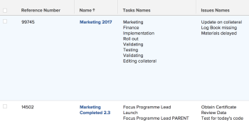
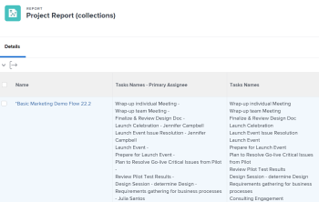
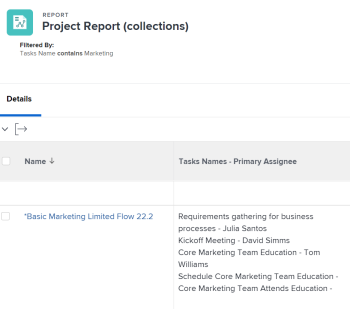

# Reference collections in a report

Building a report in Adobe Workfront allows you to display a set of objects, their respective fields, or linked objects in a list, a grid, or a chart format.

For more information about building a report in Workfront, see [Create a custom report](../../../reports-and-dashboards/reports/creating-and-managing-reports/create-custom-report.md).

## Access requirements

+++ Expand to view access requirements for the functionality in this article.

You must have the following access to perform the steps in this article:

<table style="table-layout:auto"> 
 <col> 
 <col> 
 <tbody> 
  <tr> 
   <td role="rowheader">Adobe Workfront plan*</td> 
   <td> <p>Any</p> </td> 
  </tr> 
  <tr> 
   <td role="rowheader">Adobe Workfront license*</td> 
   <td> <p>Plan </p> </td> 
  </tr> 
  <tr> 
   <td role="rowheader">Access level configurations*</td> 
   <td> <p>Edit access to Filters, Views, Groupings</p> <p>Edit access to&nbsp;Reports,&nbsp;Dashboards,&nbsp;Calendars</p> <p>Note: If you still don't have access, ask your Workfront administrator if they set additional restrictions in your access level. For information on how a Workfront administrator can modify your access level, see <a href="../../../administration-and-setup/add-users/configure-and-grant-access/create-modify-access-levels.md" class="MCXref xref">Create or modify custom access levels</a>.</p> </td> 
  </tr> 
  <tr> 
   <td role="rowheader">Object permissions</td> 
   <td> <p>Manage permissions to a report</p> <p>Manage permissions to a view, filter, or grouping </p> <p>For information on requesting additional access, see <a href="../../../workfront-basics/grant-and-request-access-to-objects/request-access.md" class="MCXref xref">Request access to objects </a>.</p> </td> 
  </tr> 
 </tbody> 
</table>

To find out what plan, license type, or access you have, contact your Workfront administrator.

+++

## Understand collections

A collection is a list of objects that are linked to another object.

You have the following two relationships between objects in Workfront:

* **A one-to-one relationship**: One object can be linked to only one other object at a time.  
  For example, a project can only be linked to one portfolio at a time.

* **A one-to-many relationship**: One object can be linked to several other objects at a time.  
  For example, a project can have multiple tasks. In this case, the list of tasks forms a collection for the project.

>[!IMPORTANT]
>
>You can build a report showing the one-to-one relationship between objects by using the standard report builder. However, you can only build a report showing the one-to-many relationship between objects by using the text mode interface in the report builder.

For more information about building a report in the standard report builder, see [Create a custom report](../../../reports-and-dashboards/reports/creating-and-managing-reports/create-custom-report.md).

For more information about building a report using the text mode interface, see:

* [Text Mode overview](../../../reports-and-dashboards/reports/text-mode/understand-text-mode.md) 
* [Overview of common uses for Text Mode](../../../reports-and-dashboards/reports/text-mode/understand-common-uses-text-mode.md).
* [Text mode syntax overview](../../../reports-and-dashboards/reports/text-mode/text-mode-syntax-overview.md)

## Find collection objects and their fields in the API Explorer {#find-collection-objects-and-their-fields-in-the-api-explorer}

Not all collections can be reported on.

To understand what objects can be associated with a collection of other, you must use the API Explorer.  
For more information about the API Explorer table, see the [API Explorer](../../../wf-api/general/api-explorer.md).

To find out what collections can be reported on:

1. Go to the [API Explorer](../../../wf-api/general/api-explorer.md). 
1. Find the object of your report. 
1. Select the **collections** tab.

   >[!NOTE]
   >
   >Only the objects listed on this tab can be represented as a collection in a report for the object you selected.

1. Expand the object of your collection by clicking it. 
1. Click the link displayed to go to the object of your collection.  
   This opens the **fields** tab for the object of your collection.

   >[!NOTE]
   >
   >Only the fields listed on this tab can be referenced in the collection report, or the fields associated with objects listed on this tab.

## Reference collections in reports

You can reference objects from a collection in the following reporting elements:

* Views
* Filters
* Prompts

You cannot reference objects from a collection in the following reporting elements:

* Groupings
* Chart

For example, you could reference the task or issue collections from a project report, to show task or issue information at the project level.

* [Reference a collection in the View of a report](#reference-a-collection-in-the-view-of-a-report) 
* [Reference a collection in the Filter of a report](#reference-a-collection-in-the-filter-of-a-report) 
* [Reference a collection in the custom prompt of a report](#reference-a-collection-in-the-custom-prompt-of-a-report)

### Reference a collection in the View of a report {#reference-a-collection-in-the-view-of-a-report}

You can reference a collection of objects in the view of a report, to show attributes of objects associated with the object of the report.

For example, you can show task or issue information in a project report, by building a collection column for tasks or issue in the view of the report.

You can display information about the tasks or issues, like names, dates, primary assignees, percent complete, etc in the collection view.

The view displays task or issue information in a list format, with every line of the list representing information about a task or an issue. The list of tasks or issues and their fields appears on the same line as the project the tasks or issues belong to.  


* [Add a collection column in a report View](#add-a-collection-column-in-a-report-view) 
* [Understand the lines of a collection View in Text Mode](#understand-the-lines-of-a-collection-view-in-text-mode) 
* [Limitations of a collection View](#limitations-of-a-collection-view)

### Add a collection column in a report View {#add-a-collection-column-in-a-report-view}

To add a collection column in a report view:

1. Click the **Main** menu , then click **Reports**.
1. Click **New Report**.
1. Select the object of your report.
1. Navigate away from your report, and using the [API Explorer](../../../wf-api/general/api-explorer.md), determine what collections are available for the object you selected for your report.

   For more information about selecting the object of your collection, see the section [Find collection objects and their fields in the API Explorer](#find-collection-objects-and-their-fields-in-the-api-explorer) in this article.  
   Make a note of what the name of the object for the collection is.

1. Using the [API Explorer](../../../wf-api/general/api-explorer.md), go to the list of fields for the object you want to display in the collection.

   For more information about finding the fields of the object of your collection, see the section [Find collection objects and their fields in the API Explorer](#find-collection-objects-and-their-fields-in-the-api-explorer) in this article.  

   Make a note of what the name of the field you want to display in the collection is. 

1. Navigate back to your report, and in the **Columns (View)** tab, click **Add Column**. 
1. Click **Switch to Text Mode**.
1. Mouse over the dialog box, and click **Click to edit text**.
1. Select all text in the **Text Mode** dialog box and remove it, then paste the following code if you are referencing a field of the collection object:

   ```
   valueformat=HTML
   textmode=true
   type=iterate
   listdelimiter=<p>
   displayname=Column Name
   listmethod=nested(collection object name).lists
   valuefield=collection object field
   ```

1. Replace **Column Name** with the name of your column in the `displayname` line.
1. Replace **collection object name**with the name of your collection object in the `listmethod` line, as it appears in the [API Explorer](../../../wf-api/general/api-explorer.md).

1. Replace **collection object field** with the name of the field of your collection object in the `valuefield` line, as it appears in the [API Explorer](../../../wf-api/general/api-explorer.md).

   You can replace **valuefield** with **valueexpression**, if you want to create a custom expression in your view.

   For more information about calculated custom expressions, see [Overview of calculated data expressions](../../../reports-and-dashboards/reports/calc-cstm-data-reports/calculated-data-expressions.md).

   For example, if you want to display a list of the tasks in a project report. This collection uses a `valuefield` line for referencing the names of the tasks.

   Do one of the following:

   * Use the following code to build your column:

     ```   
     valueformat=HTML
     textmode=true
     type=iterate
     listdelimiter=<p>
     displayname=Project Tasks Names
     listmethod=nested(tasks).lists
     valuefield=name
     ```

   * Use the following code to display a list of issues in the report:

     ```   
     displayname=Project Issues Names
     listdelimiter=<p>
     listmethod=nested(issues).lists
     textmode=true
     type=iterate
     valuefield=name
     valueformat=HTML
     ```   
   
     Notice that in a collection you must use **issues** for the **listmethod** line, instead of **opTasks** which is the database name for Issues. For information about when to use **issue** and when to use **opTask** when referring to issues, see [Use "opTask" and "issue" when referencing issues](../../../manage-work/issues/issue-information/use-optask-instead-of-issue.md).
   
   * If you want to display a list of the tasks in a project report along with their primary assignee, you would use a **valueexpression** line for referencing the names of the tasks adjacent to the names of their primary assignees instead of **valuefield**.

     Use the following code to build your column:

     ```   
     valueformat=HTML
     textmode=true
     type=iterate
     listdelimiter=<p>
     displayname=Tasks Names - Primary Assignee
     listmethod=nested(tasks).lists
     valueexpression=CONCAT({name},' - ',{assignedTo}.{name})
     ```

1. The following column displays in the project report, listing all tasks in each project alongside their primary assignees:

   

1. Click **Save**.
1. (Optional) Continue editing the report. 

   Or

   Click **Save + Close** to save the report.

#### Understand the lines of a collection View in Text Mode

The lines in a text mode view for a collection are outlined in the following table: 

<table style="table-layout:auto"> 
 <col> 
 <col> 
 <thead> 
  <tr> 
   <th><strong>Sample Line</strong> </th> 
   <th><strong>Description</strong> </th> 
  </tr> 
 </thead> 
 <tbody> 
  <tr> 
   <td><code>valueformat=HTML</code> </td> 
   <td> <p>You can use various values for this line, but we recommend that the <code style="font-weight: normal;">valueformat</code> for a collection list should be <strong>HTML.</strong></p>
   </td> 
  </tr> 
  <tr> 
   <td><code>textmode=true</code> </td> 
   <td> <p>This line indicates that the column has been configured using text mode. If you remove this line, Workfront adds it back by default.</p> </td> 
  </tr> 
  <tr> 
   <td><code>type=iterate</code> </td> 
   <td> <p>The <code>type</code> of a list is always <code>iterate</code>, when building a view.</p> </td> 
  </tr> 
  <tr> 
   <td><code>listdelimiter=&lt;p&gt;</code> </td> 
   <td> <p>This is the delimiter which is used to separate the values in&nbsp;your list.<br>We recommend to use <code>&lt;p&gt;</code>&nbsp;which adds a line break between the values.</p> <p>You can also use the following:</p> <p><code>&amp;zwj;</code> (zero-width joiner).&nbsp;The&nbsp;values of the collection have no separation between them.<br><strong>,</strong> =comma separator.&nbsp;The values of the collection are separated by a comma followed by no space.<br><strong>/</strong> = slash separator.&nbsp;The values of the collection are separated by a slash.<br><strong>-</strong> = dash separator. The values of the collection are separated by a dash.<br>Leaving this line empty adds a comma followed by a space between the values of the collection, by default.</p> </td> 
  </tr> 
  <tr> 
   <td><code>displayname=</code><em>Column Name</em> </td> 
   <td> <p>Replace <strong>Column Name</strong> with the actual name of your new column.</p> </td> 
  </tr> 
  <tr> 
   <td><code>listmethod=nested(collection object name).list</code> </td> 
   <td> <p> This line defines the collection&nbsp;you are referencing.</p> <p>Replace <strong>collection object name</strong> with the name of the object you are referencing in your collection, as it appears in the <a href="../../../wf-api/general/api-explorer.md" class="MCXref xref">API Explorer</a>. This value is typically the plural form of the collection object name.</p> </td> 
  </tr> 
  <tr> 
   <td><code>valuefield=collection object field</code> </td> 
   <td> <p>This line defines what field you&nbsp;are referencing from the collection object.</p> <p>Replace&nbsp;<strong>collection object field</strong>&nbsp;with the name of the field of the object&nbsp;you are referencing in your collection, as it appears in the <a href="../../../wf-api/general/api-explorer.md" class="MCXref xref">API Explorer</a>.</p> <p>You can replace&nbsp;this line with:</p> <p><strong>valueexpression</strong>=calculated collection object field/ fields</p> <p>Using <strong>valueexpression</strong>, you can &nbsp;display a calculated&nbsp;custom expression in the column.</p> <p>For more information about how to format <strong>valueexpression</strong> lines, see <a href="../../../reports-and-dashboards/reports/text-mode/text-mode-syntax-overview.md" class="MCXref xref">Text mode syntax overview</a>.</p> </td> 
  </tr> 
 </tbody> 
</table>

#### Limitations of a collection View {#limitations-of-a-collection-view}

Consider the following limitations when you are building a collection view:

* You cannot control the order in which collection data is displayed.
* You cannot apply conditional formatting to a collection view.
* You cannot make an object in a collection a clickable link.
* You cannot build a collection view of another collection.  
  For example, you cannot display all the assignees on each task in a project report. You can only display the primary assignee on each task in a project view.

### Reference a collection in the Filter of a report {#reference-a-collection-in-the-filter-of-a-report}

You can reference a collection of objects in the filter of a report, to filter for the attributes of objects associated with the object of the report.

For example, you can filter for task or issue information in a project report by using a reference to the attributes of tasks or issues on the project in the filter statement.

To add a reference to a collection in a report filter:

1. Click the **Main** menu , then click **Reports**.
1. Click **New Report**.
1. Select the object of your report.
1. Navigate away from your report, and using the [API Explorer](../../../wf-api/general/api-explorer.md), determine what collections are available for the object you selected for your report.

   For more information about selecting the object of your collection, see the section [Find collection objects and their fields in the API Explorer](#find-collection-objects-and-their-fields-in-the-api-explorer) in this article.  

   Make a note of what the name of the object for the collection is.  

1. Using the [API Explorer](../../../wf-api/general/api-explorer.md), go to the list of fields for the object you want to display in the collection.

   For more information about finding the fields of the object of your collection, see the section [Find collection objects and their fields in the API Explorer](#find-collection-objects-and-their-fields-in-the-api-explorer) in this article.  

   Make a note of the field you want to display in the collection. 

1. Navigate back to your report, and in the **Filters** tab, click **Switch to Text Mode**.

1. In the **Set Filter Rules for your Report** area, paste the following code:

   ```
   collection object name:collection object field=collection object value
   collection object name:collection object field_Mod=value of the modifier
   ```

1. Replace **collection object name** with the name of your collection object as it appears in the [API Explorer](../../../wf-api/general/api-explorer.md). This value is typically the plural form of the collection object name.

1. Replace **collection object field** with the name of the field of your collection object in, as it appears in the [API Explorer](../../../wf-api/general/api-explorer.md).

1. Replace **collection object value** with the value of the collection object as it appears in Workfront.
1. Replace **value of the modifier** with a valid modifier.

   For a list of modifiers, see [Filter and condition modifiers](../../../reports-and-dashboards/reports/reporting-elements/filter-condition-modifiers.md).  
   For example, to build a project report that displays only projects with tasks that have "Marketing" in their name, use the following code:

   ```
   tasks:name=Marketing
   tasks:name_Mod=cicontains
   ```
   
   This report only displays projects which have at least one task that has the word "marketing" in their name.

   

1. To filter for the name of an issue, use the following code:
   
   ```
   issues:name=Marketing
   issues:name_Mod=cicontains
   ```

   >[!TIP]
   >
   >Notice that you must use `issues` for the collection object name, instead of `optask` which is how issues appear in the API Explorer.

1. Click **Done**.
1. (Optional) Continue editing the report.

   Or

   Click **Save + Close** to save the report.

### Reference a collection in the custom prompt of a report {#reference-a-collection-in-the-custom-prompt-of-a-report}

You can reference a collection of objects in the custom prompt&nbsp;of a report, to&nbsp;filter the results of the report for the&nbsp;attributes of objects associated with the object of the report.

For example, you can prompt&nbsp;for task information in a project report by using a reference to the attributes of tasks on the project in the custom prompt of the report.

>[!NOTE]
>
>You cannot reference collections in a standard prompt.

A custom prompt is a custom filter where the statements are joined by&nbsp;ampersand symbols. We recommend that you build your statement in a filter, first, then join the lines of the statements with ampersands.

For more information about building a filter statement with a collection reference, see the section [Reference a collection in the Filter of a report](#reference-a-collection-in-the-filter-of-a-report) in this article.

To add a reference to a collection&nbsp;in the&nbsp;custom prompt of a report:

1. Click the **Main** menu , then click&nbsp;**Reports**.
1. Click&nbsp;**New Report**.
1. Select the object of your report.
1. Build a filter with a collection reference as described in&nbsp;the section [Reference a collection in the Filter of a report](#reference-a-collection-in-the-filter-of-a-report) in this article.
1. Click **Report Settings**.
1. Click **Report Prompts**.
1. Click **Add Prompt**.
1. Click **Custom Prompt**.
1. Specify the name of the prompt in the&nbsp;**Field****name** field.

1. Specify a **Dropdown Item Label**.
1. Specify the following in the **Condition** field:

   ```
   collection object name:collection object field_Mod=value of the modifier
   ```

1. (Optional) Specify if this choice is displayed by default in the prompt.
1. Replace&nbsp;**collection object name**&nbsp;with the name of your collection object as it appears in the [API Explorer](../../../wf-api/general/api-explorer.md).&nbsp;This value is typically the plural form of the collection object name.
1. Replace&nbsp;**collection object field**&nbsp;with the name of the field of your collection object, as it appears in the [API Explorer](../../../wf-api/general/api-explorer.md).
1. Replace&nbsp;**collection object value**&nbsp;with the value of the collection object as it appears in Workfront.

   For example, if you are filtering for projects in which the name of the task contains "Marketing", replace&nbsp;**collection object value**&nbsp;with&nbsp;**marketing**.

1. Replace&nbsp;**value of the modifier**&nbsp;with a valid modifier.

   For a list of modifiers, see&nbsp; [Filter and condition modifiers](../../../reports-and-dashboards/reports/reporting-elements/filter-condition-modifiers.md).

   **Example:** For example, to build a project report with a custom prompt where you want to display only projects that have at least one task assigned to a specific user, use the code below:

   ```
   tasks:assignedToID=57cf1b7a000077c9f02f66cb09c8f86c&tasks:assignedToID_Mod=in
   ```

   This generates a report where all the projects listed have at least one task assigned to the user whose GUID is&nbsp;57cf1b7a000077c9f02f66cb09c8f86c.

   >[!NOTE]
   >
   >You cannot reference the name of the primary assignee ("Assigned To" field) of a task, according to the [API Explorer](../../../wf-api/general/api-explorer.md). You can only reference the&nbsp;ID of the primary assignee.

   For example, to filter for any projects where any of the project issues are assigned to a specific user use the following code for your custom prompt:

   ```
   issues:assignedToID=57cf1b7a000077c9f02f66cb09c8f86c&issues:assignedToID_Mod=in
   ```

   This generates a report where all the projects listed have at least one issue assigned to the user whose GUID is&nbsp;57cf1b7a000077c9f02f66cb09c8f86c.

   >[!NOTE]
   >
   >Notice that you must use **issues** for the collection object name. The API Explorer&nbsp; does not offer a collection object name for issues at this time.

1. Click&nbsp;**Done**.
1. (Optional) Continue editing the report.  

   Or

   Click&nbsp;**Save + Close** to save the report.
