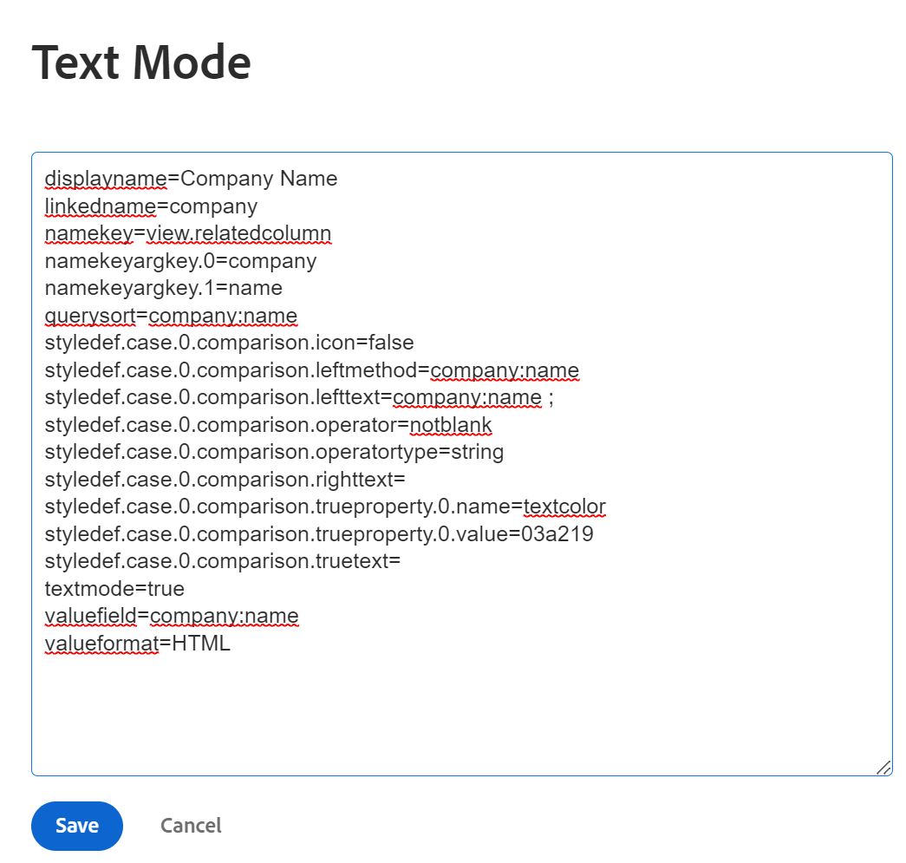
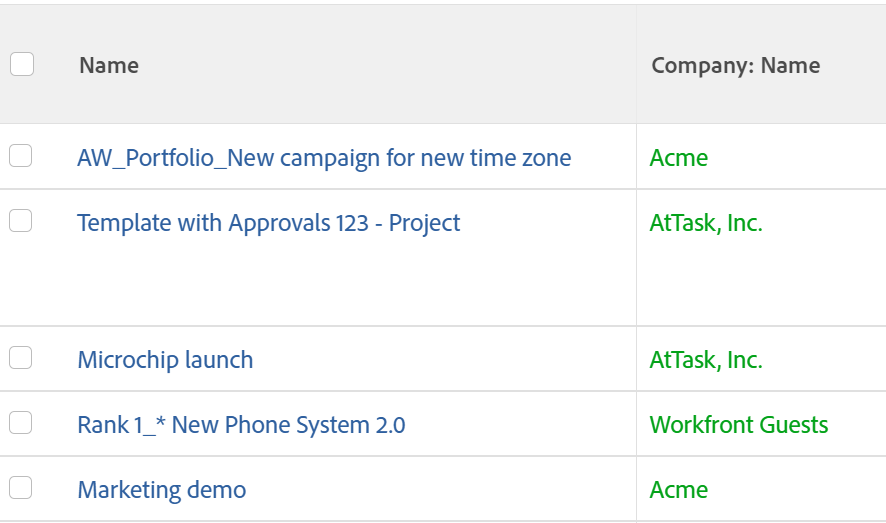
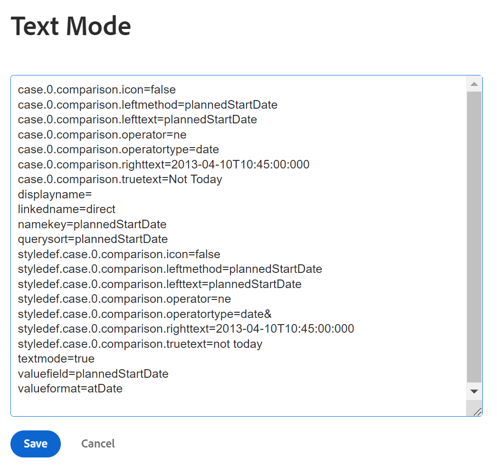
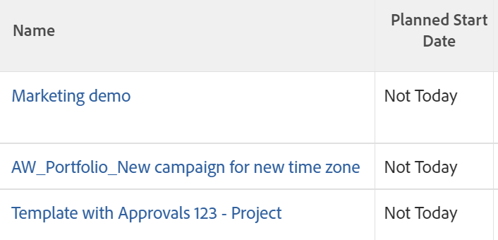
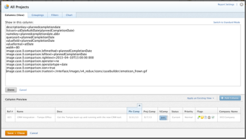
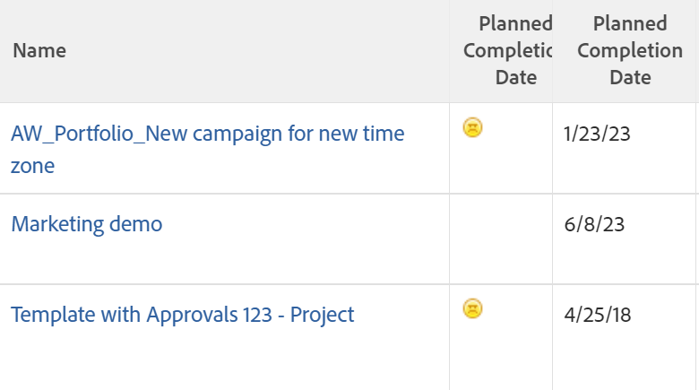

# Use conditional formatting in Text Mode

<!--Audited: 01/2024-->

<!--
(NOTE: Alina: this article might need to be split in its sections. Tony asked that numbers and dates should be in separate articles (??))
-->

The standard interface builder provides a great range of flexibility when creating reporting elements to meet the needs in your organization.

You can apply conditional formatting in a view by using the standard interface.  
For more information about applying conditional formatting to a view, see [Use conditional formatting in views](../../../reports-and-dashboards/reports/reporting-elements/use-conditional-formatting-views.md).

## Access requirements

+++ Expand to view access requirements for the functionality in this article.

You must have the following access to perform the steps in this article:

<table style="table-layout:auto"> 
 <col> 
 <col> 
 <tbody> 
  <tr> 
   <td role="rowheader">Adobe Workfront plan</td> 
   <td> <p>Any</p> </td> 
  </tr> 
  <tr> 
   <td role="rowheader">Adobe Workfront license</td> 
   <td> <p>New: Standard </p> 
   <p>Or</p>
   <p>Current: Plan</p> 
   </td> 
  </tr> 
  <tr> 
   <td role="rowheader">Access level configurations*</td> 
   <td> <p>Edit access to Filters, Views, Groupings</p> <p>Edit access to Reports, Dashboards, Calendars to edit views in a report</p> </td> 
  </tr> 
  <tr> 
   <td role="rowheader">Object permissions</td> 
   <td> <p>Manage permissions to a report to edit views in a report</p> <p>Manage permissions to a view to edit it</p> </td> 
  </tr> 
 </tbody> 
</table>

For more detail about the information in this table, see [Access requirements in Workfront documentation](/help/quicksilver/administration-and-setup/add-users/access-levels-and-object-permissions/access-level-requirements-in-documentation.md).

+++


## Conditional formatting in Text Mode

Text mode enables you to create more complex views, filters, groupings, and prompts by allowing you to use fields that are not available in the standard interface.

For a complete list of all our reportable fields, see the  [API Explorer](../../../wf-api/general/api-explorer.md).

For more information about using text mode syntax, see [Text mode syntax overview](../../../reports-and-dashboards/reports/text-mode/text-mode-syntax-overview.md).

You can also use text mode to format views in reports and lists. Using conditional formatting, you can change the views of your reports by changing the font type and background of the results in the report, as well as icons and flags. We recommend that you always build your views using the standard interface first and switch to the text mode interface only when absolutely necessary.

>[!NOTE]
>
> Using CSS styling to customize conditional formatting is not supported. Instead, you must use the predesigned formatting options that are available in Adobe Workfront.

## Add conditional formatting to Views

For more information about applying conditional formatting to a view in the standard builder interface, see [Use conditional formatting in views](../../../reports-and-dashboards/reports/reporting-elements/use-conditional-formatting-views.md).

To add conditional formatting to a view in the text mode interface:

1. Go to a list of objects.
1. Expand the drop-down menu of a view to which you want to add conditional formatting.
1. Click **Customize View**.
1. Click the column in the view to which you want to apply conditional formatting.
1. Click **Switch to Text Mode**.
1. In the **Show in this column:** area, click **Click to edit text**.
1. Add the code samples provided in [Format Views using Text Mode](#format-views-using-text-mode) at the bottom of the text in the column you selected.
1. Click **Save**, then click **Save View**.

## Format Views using Text Mode {#format-views-using-text-mode}

You can add the following components to a column in a view to conditionally format it in text mode:

* [Column settings](#column-settings) 
* [Column rules](#column-rules) 
* [Conditionally format a valueexpression](#conditionally-format-a-valueexpression)

### Column settings {#column-settings}

You must be familiar with the text mode interface before you can add conditional formatting to your views.

You can customize the following elements of a column when using conditional formatting in a view:

* [Column headers](#column-headers) 
* [Format dates](#format-dates) 
* [Format numbers](#format-numbers)

#### Column headers {#column-headers}

To change the displayed column header, add the following code to your column: `displayname= [Name of column]`. For example, to name a column Project Owner, the text code would look like:

`displayname=Project Owner`

#### Format dates {#format-dates}

Dates can be configured to display in various formats.

For more information, see [Format dates in text mode reports](../../../reports-and-dashboards/reports/text-mode/format-dates-in-text-mode-reports.md).

<!--
<div data-mc-conditions="QuicksilverOrClassic.Draft mode"> 
<p data-mc-conditions="QuicksilverOrClassic.Draft mode">(NOTE: this is drafted and replaced by the article linked above)</p>
<p>To establish a date format, you must modify the <code>valueformat</code> line of the text mode code in the column.</p>
<pre>valueformat= [new date format]</pre>
<p>For example, if you wanted the Projected Completion Date to be displayed as MM/DD/YY the code would look like:</p>
<pre>valueformat=atDate<br>valuefield=projectedCompletionDate </pre>
<p>If you wanted to show the Planned Completion Date as <em>Mth, DD, Year</em>, the code would look like:</p>
<pre>valueformat=mediumAtdate<br>valuefield=plannedCompletionDate</pre>
<p>You can format dates using the following <code>valueformat</code> text mode values:</p>
<table style="table-layout:auto">
<col>
<col>
<col>
<thead>
<tr>
<th scope="col"><strong>Format</strong> </th>
<th scope="col">Example </th>
<th scope="col"><em><strong>valueformat=</strong></em> </th>
</tr>
</thead>
<tbody>
<tr>
<td>MM/DD/YY</td>
<td>10/11/18</td>
<td><pre>atDate</pre> </td>
</tr>
<tr>
<td>MM/DD/YY Time</td>
<td>10/11/18 12:00pm</td>
<td><pre>longAtDate</pre> </td>
</tr>
<tr>
<td>MM/DD/YY</td>
<td>10/11/18</td>
<td><pre>shortAtDate</pre> </td>
</tr>
<tr>
<td>Mth, DD, YR</td>
<td>Oct, 11, 2018</td>
<td><pre>mediumAtDate</pre> </td>
</tr>
<tr>
<td>DW, Mth, Day, YR</td>
<td>Mon, Oct, 11, 2018</td>
<td><pre>partialAtDate</pre> </td>
</tr>
<tr>
<td>DW, Mth, Day, YR Time</td>
<td>Mon, Oct, 11, 2018 12:00 pm</td>
<td><pre>fullAtDate</pre> </td>
</tr>
</tbody>
</table>
</div>
-->

#### Format numbers {#format-numbers}

You can format numeric values to display information that best suits your reporting needs.

For more information, see [Format numbers, currency and percentage values in text mode reports](../../../reports-and-dashboards/reports/text-mode/format-numbers-in-text-mode-reports.md).

<!--
<div data-mc-conditions="QuicksilverOrClassic.Draft mode">
<p>To modify the format of a numeric value, you must edit the <strong>valueformat</strong> line of your column.</p> 
<p data-mc-conditions="QuicksilverOrClassic.Draft mode">(NOTE: this is drafted and replaced by the article linked above) </p>
<p>For example, if you wanted to display the Budget column as $1000, the value format line would look like:</p>
<pre>valueformat=currencyStringCurrencyRounded<br>valuefield=budget</pre>
<p>You can format numbers using the following values for the <code>valueformat</code> line of your column:</p>
<table border="2" cellspacing="15" cellpadding="1">
<col>
<col>
<thead>
<tr>
<th scope="col"><strong>Example</strong> </th>
<th scope="col"><em><code>valueformat=</code></em> </th>
</tr>
</thead>
<tbody>
<tr>
<td>1234</td>
<td><pre>doubleAsString</pre> or <pre>int</pre></td>
</tr>
<tr>
<td>1,234</td>
<td><pre>doubleAsInt</pre> </td>
</tr>
<tr>
<td>$1,234</td>
<td><pre>currencyStringCurrencyRounded</pre> </td>
</tr>
<tr>
<td>1234.56</td>
<td><pre>doubleAsDouble</pre> </td>
</tr>
<tr>
<td>$1,234.56</td>
<td><pre>currencyStringCurrency</pre> </td>
</tr>
<tr>
<td>12%</td>
<td><pre>doubleAsPercentRounded</pre> </td>
</tr>
<tr>
<td>12.34%</td>
<td><pre>doubleAsPercent</pre> </td>
</tr>
<tr>
<td>(1,234.56)</td>
<td><pre>doubleAsFinancial</pre> </td>
</tr>
<tr>
<td>(1,234)</td>
<td><pre>doubleAsFiancialRounded</pre> </td>
</tr>
</tbody>
</table>
</div>
-->

### Column rules {#column-rules}

Column rules allow for the addition of images, color, formatting, and text overrides within a view. Column rules can be established independently or can contain multiple conditions for a column.

* [Conditional formatting](#conditional-formatting) 
* [Multiple conditional formats](#multiple-conditional-formats) 
* [Apply text](#apply-text) 
* [Apply row formats](#apply-row-formats) 
* [Apply images](#apply-images)

#### Conditional formatting {#conditional-formatting}

A specific text mode statement must be applied when incorporating color or formatting text.

>[!NOTE]
>
>Conditional formatting may not be supported in merged columns.  
>For more information on merging columns with Text Mode, see [View: merge information from multiple columns in one shared column](../../../reports-and-dashboards/reports/custom-view-filter-grouping-samples/view-merge-columns.md).

Insert the following code in any column where you want to add conditional formatting to:

```
styledef.case.0.comparison.leftmethod= [field name]
styledef.case.0.comparison.lefttext= [field name]
styledef.case.0.comparison.righttext= [field value]
styledef.case.0.comparison.operator= [qualifier]
styledef.case.0.comparison.operatortype= [data type]
styledef.case.0.comparison.icon=false
styledef.case.0.comparison.truetext= 
styledef.case.0.comparison.trueproperty.0.name= [format option]
styledef.case.0.comparison.trueproperty.0.value= [format style]

```

>[!NOTE]
>
>The `styledef.case.0.comparison.icon` line is always false unless working with icons.
>
>The `styledef.case.0.comparison.truetext` line is always left blank until working with overwriting text.
>
>The `styledef.case.0.comparison.righttext` line is blank when the qualifier is notblank.

For example, if we wanted to show the Company Name in green text on a project report, you can use the following code:

```
styledef.case.0.comparison.leftmethod=company:name
styledef.case.0.comparison.lefttext=company:name ;
styledef.case.0.comparison.righttext= 
styledef.case.0.comparison.operator=notblank
styledef.case.0.comparison.operatortype=string
styledef.case.0.comparison.icon=false
styledef.case.0.comparison.truetext=
styledef.case.0.comparison.trueproperty.0.name=textcolor
styledef.case.0.comparison.trueproperty.0.value=03a219

```

>[!NOTE]
>
>* While this statement could be applied to a Company Name column, it could also be applied to any other column on the report. Green text would only be displayed if the project had a Company associated with it. Remember the `[field name]`, `[value]`, and `[qualifier]` drive whether or not the conditioning ultimately displays on the column.
>* When working with qualifiers, we recommended using `cicontains` rather than `equal`. By default, `equal` looks for ID numbers. Using the `cicontains` qualifier, you can access items by their name.





Whether Text Color, Alignment, Font Style, or Background Color are applied to a text mode, the same statement (shown above) is used.

The following lines must be modified to reflect the corresponding formatting needed for the column:

```
styledef.case.0.comparison.trueproperty.0.name= [format option]
styledef.case.0.comparison.trueproperty.0.value= [format style]

```

Use the following tables to identify which lines must be modified and what values you should specify to define the format style of your column:

| **Text Color** |**Line: textcolor=** |
|---|---|
| Black |`000000` |
| Dark Blue |`0c6aca` |
| Teal |`1b878c` |
| Green |`03a219` |
| Purple |`6408c4` |
| Grey |`767676` |
| Red |`d30519` |
| Yellow |`e19503` |

{style="table-layout:auto"}

| **Alignment** |**Line: align=** |
|---|---|
| Left alignment |`left` |
| Right alignment |`right` |
| Center Alignment |`center` |

{style="table-layout:auto"}

| Font |Line: ***fontstyle=*** |
|---|---|
| Bold |`bold` |
| Italic |`italic` |

{style="table-layout:auto"}

| **Background Color** |**Line: bgcolor=** |
|---|---|
| Teal |`dcf6f7` |
| Green |`def6e2` |
| Grey |`e8e8e8` |
| Blue |`e8f1ff` |
| Purple |`e9def4` |
| Red |`eac6c9` |
| Yellow |`feecc8` |
| White |`ffffff` |

{style="table-layout:auto"}

#### Multiple conditional formats {#multiple-conditional-formats}

You can apply more than one formatting style to a statement. The core statement would remain unchanged and any additional formatting expressions would be added to the statement.

For example, using the earlier statement to include Company Name in green bolded text. The statement would be written using the following code:

```
styledef.case.0.comparison.leftmethod=company:name
styledef.case.0.comparison.lefttext=company:name
styledef.case.0.comparison.righttext=
styledef.case.0.comparison.operator=notblank
styledef.case.0.comparison.operatortype=string
styledef.case.0.comparison.icon=false
styledef.case.0.comparison.truetext= 
styledef.case.0.comparison.trueproperty.0.name=textcolor
styledef.case.0.comparison.trueproperty.0.value=03a219
styledef.case.0.comparison.trueproperty.1.name=fontstyle
styledef.case.0.comparison.trueproperty.1.value=bold

```

>[!NOTE]
>
>When including more than one conditional formatting expression, it is necessary to numerically identify each expression in the statement. Notice that expression 0 and expression 1 have been identified.

#### Apply text {#apply-text}

If you want to replace the default values that populate in a column with a value of your choosing, it is possible when applying text to the column.

For example, on a project report, set the Planned Start Date column value to not display the planned start date for the project, but rather the text 'Not Today.' Use the following code for the Planned Start Date column:

```
case.0.comparison.leftmethod=plannedStartDate
case.0.comparison.lefttext=plannedStartDate
case.0.comparison.righttext=2013-04-10T10:45:00:000
case.0.comparison.operator=ne
case.0.comparison.operatortype=date
case.0.comparison.icon=false
case.0.comparison.truetext=not today
styledef.case.0.comparison.leftmethod=plannedStartDate
styledef.case.0.comparison.lefttext=plannedStartDate
styledef.case.0.comparison.righttext=2013-04-10T10:45:00:000 
styledef.case.0.comparison.operator=ne
styledef.case.0.comparison.operatortype=date&
styledef.case.0.comparison.icon=false
styledef.case.0.comparison.truetext=not today

```

>[!NOTE]
>
>The lines that start with `case.0.` use case comparisons to identifying the use of text. The lines that start with `styledef.case.0.` are early conditional formatting statements where we identify the use of text through the `truetext` expression. Make sure to set `truetext` to a value, rather than leaving it blank.





#### Apply row formats {#apply-row-formats}

If you would like to apply a condition to the entire row, use the following code with your column code:


```
styledef.case.0.comparison.icon=false
styledef.case.0.comparison.isrowcase=true
styledef.case.0.comparison.leftmethod= [field name]
styledef.case.0.comparison.lefttext= [field name]
styledef.case.0.comparison.operator= [qualifier]
styledef.case.0.comparison.operatortype= [data type]
styledef.case.0.comparison.righttext= [field value]
styledef.case.0.comparison.trueproperty.0.name= [format option]
styledef.case.0.comparison.trueproperty.0.value= [format style]
styledef.case.0.comparison.truetext=
row.0.styledef.applyallcases=true
row.0.styledef.case.0.comparison.icon=false
row.0.styledef.case.0.comparison.isrowcase=true
row.0.styledef.case.0.comparison.leftmethod= [field name]
row.0.styledef.case.0.comparison.lefttext= [field name]
row.0.styledef.case.0.comparison.operator= [qualifier]
row.0.styledef.case.0.comparison.operatortype= [data type]
row.0.styledef.case.0.comparison.righttext= [field value]
row.0.styledef.case.0.comparison.trueproperty.0.name= [format option]
row.0.styledef.case.0.comparison.trueproperty.0.value= [format style]
row.0.styledef.case.0.comparison.truetext=

```


#### Apply images {#apply-images}

Similarly to formatting with text, images can be used to display information in reports. Workfront has a number of built-in images to convey visual information in a report setting. To use images in the conditional formatting setting the following statement is needed:

```
image.case.0.comparison.leftmethod= [field name]
image.case.0.comparison.lefttext= [field name]
image.case.0.comparison.righttext= [field value]
image.case.0.comparison.operator= [qualifier]
image.case.0.comparison.operatortype= [data type]
image.case.0.comparison.icon=true
image.case.0.comparison.truetext=

```

For example, on a project report, you want to build a column where you would show a frown face for every Planned Completion Date that does not equal to today's date. Use the following text mode code to add the icon to your column:


```
image.case.0.comparison.leftmethod=plannedCompletionDate
image.case.0.comparison.lefttext=plannedCompletionDate
image.case.0.comparison.righttext=2013-04-10T13:00:00:000 
image.case.0.comparison.operator=ne 
image.case.0.comparison.operatortype=date
image.case.0.comparison.icon=true
image.case.0.comparison.truetext=/interface/images/v4_redux/icons/casebuilder/emoticon_frown.gif

```

>[!NOTE]
>
>Notice that the statement uses the `icon=true` expression. This statement is also different from other conditional formatting statements in that it does not use the `style.def` format, but rather a unique image format.





To use the images available, apply the following code and values:

| **Icon** |**Line: image.case.0.comparison.truetext=** |
|---|---|
| Frown Face |=`/interface/images/v4_redux/icons/casebuilder/emoticon_frown.gif` |
| Happy Face |=`/interface/images/v4_redux/icons/casebuilder/emoticon_smile.gif` |
| Blue Flag  |=`/interface/images/v4_redux/icons/casebuilder/flag_blue.gif` |
| Green Flag  |=`/interface/images/v4_redux/icons/casebuilder/flag_green.gif` |
| Red Flag  |=`/interface/images/v4_redux/icons/casebuilder/flag_red.gif` |
| Yellow Flag  |=`/interface/images/v4_redux/icons/casebuilder/flag_yellow.gif` |
| Black Circle  |=`/interface/images/v4_redux/icons/casebuilder/light_black.gif` |
| Blue Circle |=`/interface/images/v4_redux/icons/casebuilder/light_blue.gif` |
| Grey Circle |=`/interface/images/v4_redux/icons/casebuilder/light_grey.gif` |
| Green Circle |=`/interface/images/v4_redux/icons/casebuilder/light_green.gif` |
| Orange Circle |=`/interface/images/v4_redux/icons/casebuilder/light_orange.gif` |
| Pink Circle |=`/interface/images/v4_redux/icons/casebuilder/light_pink.gif` |
| Purple Circle |=`/interface/images/v4_redux/icons/casebuilder/light_purple.gif` |
| Red Circle |=`/interface/images/v4_redux/icons/casebuilder/light_red.gif` |
| White Circle |=`/interface/images/v4_redux/icons/casebuilder/light_white.gif` |
| Yellow Circle |=`/interface/images/v4_redux/icons/casebuilder/light_yellow.gif` |

{style="table-layout:auto"}

### Conditionally format a `valueexpression` {#conditionally-format-a-valueexpression}

To display a calculated value in a column, you can replace the `valuefield` line of code in the column with a `valueexpression`. A calculated value allows you to display a new value for an object based on the calculation between two existing fields on that same object.

For more information about how to format the `valueexpression line`, see [Text mode syntax overview](../../../reports-and-dashboards/reports/text-mode/text-mode-syntax-overview.md).

You cannot conditionally format a column which contains a `valueexpression` line of code. Instead, you can add a Calculated Custom Field to a Custom Form and associate it with the objects you are displaying in the report. Then, you can conditionally format the columns displaying this field.

For more information about Calculated Custom Fields, see [Add calculated data to a custom form](../../../administration-and-setup/customize-workfront/create-manage-custom-forms/add-calculated-data-to-custom-form.md).

## Add an aggregator value in a Text Mode column

We recommend that you build the column in the builder interface first, add the aggregator value there, and then edit the column in Text Mode.

Consider the following when adding aggregators to a column in Text Mode:

* The values in the column must have a format that can be summarized. For example, they must have one of the following formats:

   * Number
   * Date
   * Currency

* You can add an aggregator to a column that displays a calculation. The aggregated value displays in the grouping of the view or report. For more information, see [Grouping: display the result of aggregating multiple calculated values in a grouping](../../../reports-and-dashboards/reports/custom-view-filter-grouping-samples/grouping-calculation-between-two-fields-aggregated-in-grouping.md).
* The lines of code for the definition of the column must be identical to the lines of code introducing the aggregator and preceded by "aggregator." For example, if you have a column where you display Planned Hours on a project, the text mode of the main lines of the column is:
  
```
  valuefield=workRequired
  valueformat=compound

```  
  
  When you want to aggregate the values of all the lines in the grouping of the view, we can add the following code to add the aggregator values: 
  
  `aggregator.valuefield=workRequired` (the `aggregator.valuefield` line must be the same as the `valuefield` that describes the column) 
  
  `aggregator.valueformat=compound` (the `aggregator.valueformat` line must have the same value as the `valueformat` that describes the column) 
  
  `aggregator.function=SUM` (this is a mandatory line that indicates how you want to aggregate the column, in this case, you want to add all the individual Planned Hours into one number in the grouping line) 
  
  `aggregator.displayformat=minutesAsHoursString` (because hours are stored in Workfront in minutes, we want to indicate the `displayformat` for hours when they are stored in minutes)
