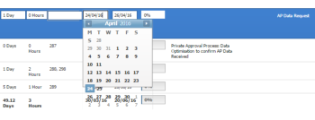

# Inline editing dates shifts calendar display outside of box

## Problem

When inline editing dates in a list of objects, the calendar displays more dates than it should. This&nbsp;causes the days to display outside the calendar box.  

## Cause

The view of the browser window has been modified to display in a zoom level higher than 100%.

## Solution

You must change the zoom level on your browser to be 100% or less.

Changing the zoom level on your browser depends on what browser you are using.

To change the zoom level in Google Chrome:

1. Inside a browser window, navigate to **View**.
1. Click **Zoom In** to reduce the zoom level in the current browser window.  
   The display area in your browser is reduced.
