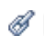

# Built-in Status Icons in Views

<!--

(NOTE: ALina: ***Link this from the Understanding Fields in Lists and Reports.) 

-->

You can add the built-in Status Icons field as a column in your views to enhance visibility into key points about your objects. Using Status Icons, you can see at a glance when the following conditions exist:

* An object has documents attached
* An object is associated with an approval process
* An object has additional notes associated with it
* An expense is billable or reimbursable 
* A task is on a critical path
* A user belongs to a company, a team, or is located in a different time zone

Consider the following:

* Most of the indicators in the Status Icons field are quick links to the actual object or area of the object that they represent.

* If any of the items represented by the icons are missing from the object, the icon representing the missing item appears dimmed in the Status Icons column instead of a colored image.  

     

   For more information, see the [Overview of Status Icons and Flags](#overview-of-status-icons-and-flags) section in this article.  

* In some views, the **Status Icons** field is named **Flags** or **View Icons**.  
You cannot customize the look and feel of the icons that are included in the Status Icons field.

* You cannot edit the number of icons in the Status Icons field. 

## Access requirements

You must have the following access to perform the steps in this article:

<table style="table-layout:auto"> 
 <col> 
 <col> 
 <tbody> 
  <tr> 
   <td role="rowheader">Adobe Workfront plan*</td> 
   <td> 
Any
 </td> 
  </tr> 
  <tr> 
   <td role="rowheader">Adobe Workfront license*</td> 
   <td> 
Request or higher
 </td> 
  </tr> 
  <tr> 
   <td role="rowheader">&nbsp;</td> 
   <td>&nbsp;</td> 
  </tr> 
  <tr> 
   <td role="rowheader">Access level configurations*</td> 
   <td> 
Edit access to Filters, Views, Groupings
 
Edit access to Reports,&nbsp;Dashboards, Calendars to add columns to a report
 
Note: If you still don't have access, ask your Workfront administrator if they set additional restrictions in your access level. For information on how a Workfront administrator can modify your access level, see <a href="../../../administration-and-setup/add-users/configure-and-grant-access/create-modify-access-levels.md" class="MCXref xref">Create or modify custom access levels</a>.
 </td> 
  </tr> 
  <tr> 
   <td role="rowheader">Object permissions</td> 
   <td> 
Manage permissions to an existing view
 
Manage permissions to a report to add columns to it
 
For information on requesting additional access, see <a href="../../../workfront-basics/grant-and-request-access-to-objects/request-access.md" class="MCXref xref">Request access to objects </a>.
 </td> 
  </tr> 
 </tbody> 
</table>

&#42;To find out what plan, license type, or access you have, contact your Workfront administrator.

## Add the Status Icons field to a view

Some built-in views and reports already have the Status Icons field included.

You cannot add the Status Icons field to all views.

To add the Status Icons field to a custom view that you build from scratch:

1. Go to a list of any of the following objects:

   * Tasks
   * Issues
   * Projects
   * Template Tasks
   * Templates
   * Expenses
   * Documents
   * Users  
     Only these objects have the **Status Icons** field available.  
     For information on object lists, see [Get started with lists in Adobe Workfront](../../../workfront-basics/navigate-workfront/use-lists/view-items-in-a-list.md).

1. From the **View** drop-down menu, select **New View**.

1. Click **Add Column**.
1. In the **Show in this column** box, start typing any of the following field names, then select it when it appears in the list:

   * *Status Icons*
   * *Flags*
   * *View Icons *(only in Document views).

   The built-in icons are listed under any of these names.  
   A Template view contains both the **Status Icons** and the **Flags** fields. In this case, the two columns contain identical icons.   
   Document views contain a **View Icons** field.

1. Click **Save View**. 
1. (Optional) Specify a new name for your view, then click **Save View**.  
   This adds the **Status Icons** column to your View.
1. (Optional) Mouse over an icon to understand what it represents.
1. (Optional) Click an icon to go to the area of the object represented by it.  
   Not all icons are links to objects.  
   For a complete list of attributes for each icon, see the [Overview of Status Icons and Flags](#overview-of-status-icons-and-flags) section.

## Overview of Status Icons and Flags {#overview-of-status-icons-and-flags}

The following table lists all the Status Icons available in Workfront, the type of objects that can be associated with them, as well as what happens when you click them.

You must have permissions to at least View the objects in order to be able to click some of the following icons and access those objects. 

<table style="table-layout:auto"> 
 <col> 
 <col> 
 <col> 
 <col> 
 <col> 
 <thead> 
  <tr> 
   <th><strong>Status Icon or Flag</strong> </th> 
   <th><strong>Description</strong> </th> 
   <th><strong>Object</strong> </th> 
   <th>On Click</th> 
   <th> </th> 
  </tr> 
 </thead> 
 <tbody> 
  <tr> 
   <td> or   or   or </td> 
   <td>Indicates that the Condition of the project is On Target (green), In Trouble (red), or At Risk (yellow). For information about project Condition, see <a href="../../../manage-work/projects/manage-projects/project-condition-and-condition-type.md" class="MCXref xref">Overview of Project Condition and Condition Type</a>.</td> 
   <td>Projects</td> 
   <td>Click to open the tasks list of the project. </td> 
   <td> </td> 
  </tr> 
  <tr> 
   <td>  </td> 
   <td>Indicates that the object has notes (updates) in the Updates tab.</td> 
   <td> 
Projects Tasks Issues Templates Template Tasks
 </td> 
   <td> 
Click to open the Updates tab of the object. 
 </td> 
   <td> </td> 
  </tr> 
  <tr> 
   <td> or </td> 
   <td>Indicates that the object has documents attached. </td> 
   <td> Projects Tasks Issues Templates Template Tasks </td> 
   <td>Click to open the Documents tab of the object. </td> 
   <td> </td> 
  </tr> 
  <tr> 
   <td> or </td> 
   <td>Indicates that there are open issues on the project or the task.</td> 
   <td> Projects Tasks </td> 
   <td>Click to open the object. </td> 
   <td> </td> 
  </tr> 
  <tr> 
   <td>  or </td> 
   <td>Indicates that there is an approval on the object.</td> 
   <td> Projects Tasks Issues Templates Template Tasks </td> 
   <td>Click to open the object. </td> 
   <td> </td> 
  </tr> 
  <tr> 
   <td>  </td> 
   <td> 
You can add an Expenses Icon column in your view to display this icon. This indicates that the project or the task has expenses associated with them.
 </td> 
   <td> 
Projects
 
Tasks
 </td> 
   <td>Click to open the Expenses tab of the project or the task. </td> 
   <td> </td> 
  </tr> 
  <tr> 
   <td>           </td> 
   <td> 
Indicates that the Progress Status of a task is one of the following:
 
    <ul> 
     <li>On Time (green square)</li> 
     <li>Late (red circle)</li> 
     <li>At Risk (blue diamond)</li> 
     <li>Behind (yellow triangle)</li> 
    </ul> 
For information about the Progress Status of tasks, see <a href="../../../manage-work/tasks/task-information/task-progress-status.md" class="MCXref xref">Task Progress Status overview</a>.
 </td> 
   <td>Tasks</td> 
   <td>Click to open the task. </td> 
   <td> </td> 
  </tr> 
  <tr> 
   <td>  or </td> 
   <td>Indicates that the task is currently on the Critical Path.  For information about tasks on a Critical Path of the project, see <a href="../../../manage-work/tasks/manage-tasks/critical-path.md" class="MCXref xref">Overview of the project Critical Path</a>.</td> 
   <td>Tasks</td> 
   <td>Click to open the task.</td> 
   <td> </td> 
  </tr> 
  <tr> 
   <td>  </td> 
   <td>Indicates that the task is associated with a milestone. Your system administrator can customize the color of the diamond in your environment. For information about milestones, see <a href="../../../administration-and-setup/customize-workfront/configure-approval-milestone-processes/create-milestone-path.md" class="MCXref xref">Create a milestone path</a>.</td> 
   <td>Tasks</td> 
   <td>Click to open the task. </td> 
   <td> </td> 
  </tr> 
  <tr> 
   <td>  </td> 
   <td>Link to the source object of an issue. The source object of an issue is the object where the issue was logged. A task or a project can be source objects for issues. </td> 
   <td>Issues</td> 
   <td>Click to open the source object (task or project) of an issue. </td> 
   <td> </td> 
  </tr> 
  <tr> 
   <td>  </td> 
   <td>Indicates that there is a resolving object which ultimately resolves the issue. In this case, you cannot complete the issue. It is completed when the resolving object completes.  For information about resolving objects, see <a href="../../../manage-work/issues/convert-issues/resolving-and-resolvable-objects.md" class="MCXref xref">Overview of Resolving and Resolvable Objects </a>.</td> 
   <td>Issues</td> 
   <td>Click to open the resolving object of the issue. </td> 
   <td> </td> 
  </tr> 
  <tr> 
   <td>  </td> 
   <td>View a document.</td> 
   <td>Documents</td> 
   <td>Click to download the document.</td> 
   <td> </td> 
  </tr> 
  <tr> 
   <td>  </td> 
   <td>Download a document.</td> 
   <td>Documents</td> 
   <td>Click to download the document.</td> 
   <td> </td> 
  </tr> 
  <tr> 
   <td>  </td> 
   <td>Indicates the type of document.</td> 
   <td>Documents</td> 
   <td>Click to download the document.</td> 
   <td> </td> 
  </tr> 
  <tr> 
   <td>  </td> 
   <td>Indicates that the user is associated with a Company. </td> 
   <td>Users</td> 
   <td>Unavailable</td> 
   <td> </td> 
  </tr> 
  <tr> 
   <td>  </td> 
   <td>Indicates that the user is associated with a Team.</td> 
   <td>Users</td> 
   <td>Click to open the user profile.</td> 
   <td> </td> 
  </tr> 
  <tr> 
   <td>  </td> 
   <td>Shortcut to the Allocation tab of the user. </td> 
   <td>Users</td> 
   <td>Click to open the Allocation tab of the user and learn to what work items the user is assigned.</td> 
   <td> </td> 
  </tr> 
  <tr> 
   <td>  </td> 
   <td>Indicates that the user is in a different time zone than that of the system.</td> 
   <td>Users</td> 
   <td>Unavailable</td> 
   <td> </td> 
  </tr> 
  <tr> 
   <td>  </td> 
   <td>Indicates that an expense is billable. For information about expenses, see <a href="../../../manage-work/projects/project-finances/manage-project-expenses.md" class="MCXref xref">Manage project expenses </a>.</td> 
   <td>Expenses</td> 
   <td>Unavailable</td> 
   <td> </td> 
  </tr> 
  <tr> 
   <td>  </td> 
   <td> Indicates that an expense is reimbursable. For information about expenses, see <a href="../../../manage-work/projects/project-finances/manage-project-expenses.md" class="MCXref xref">Manage project expenses </a>.</td> 
   <td>Expenses</td> 
   <td>Unavailable</td> 
   <td> </td> 
  </tr> 
  <tr> 
   <td> </td> 
   <td> Indicates that an expense has been reimbursed. For information about expenses, see <a href="../../../manage-work/projects/project-finances/manage-project-expenses.md" class="MCXref xref">Manage project expenses </a>.</td> 
   <td>Expenses</td> 
   <td>Unavailable</td> 
   <td> </td> 
  </tr> 
 </tbody> 
</table>
