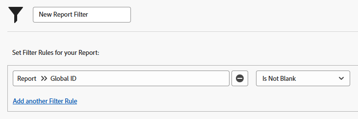

# Use Adobe Workfront built-in reports

<!--Audited: 07/2024-->

Adobe Workfront has an extensive list of built-in reports that you can use.

Workfront administrators can hide built-in reports so users do not have access to them.  

For more information about how to hide built-in reports, see [Hide built-in reports](../../../administration-and-setup/manage-workfront/configure-reports/hide-built-in-reports.md).

## Access requirements

You must have the following access to perform the steps in this article:

<table style="table-layout:auto"> 
 <col> 
 <col> 
 <tbody> 
  <tr> 
   <td role="rowheader">Adobe Workfront plan</td> 
   <td> 
Any
 </td> 
  </tr> 
  <tr> 
   <td role="rowheader">Adobe Workfront license*</td> 
   <td> 
New: Contributor or higher
  
   
Current: Request or higher
 </td> 
  </tr> 
  <tr> 
   <td role="rowheader">Access level configurations</td> 
   <td> 
Edit access to Filters, Views, Groupings
 
View or higher access to  Reports,  Dashboards,  Calendars
 </td> 
  </tr> 
  <tr> 
   <td role="rowheader">Object permissions</td> 
   <td> 
Manage permissions to a report to add or edit a filter to a report
 
Manage permissions to a filter to edit it in a list
 </td> 
  </tr> 
 </tbody> 
</table>

*For information, see [Access requirements in Workfront documentation](/help/quicksilver/administration-and-setup/add-users/access-levels-and-object-permissions/access-level-requirements-in-documentation.md). 

## Overview of built-in reports {#overview-of-built-in-reports}

You can customize a built-in report and save it as a new report. For more information about customizing built-in reports, see [Create a custom report](../../../reports-and-dashboards/reports/creating-and-managing-reports/create-custom-report.md).

The following reports come with the Workfront package. The reports are available to all users who have at least View rights to built-in reports in their access level.

<table style="table-layout:auto"> 
 <col> 
 <col> 
 <thead> 
  <tr> 
   <th><strong>Report Name</strong> </th> 
   <th><strong>Report Description</strong> </th> 
  </tr> 
 </thead> 
 <tbody> 
  <tr> 
   <td>Actual Portfolio Cost by Program</td> 
   <td>A Project report that displays the Planned Cost and the Actual Cost of the projects. The report is grouped by Program Name, prompted by Portfolio Name, and it includes a chart.</td> 
  </tr> 
  <tr> 
   <td>Actual Portfolio Cost by Project</td> 
   <td>A Project report that displays the Planned Cost and the Actual Cost of the projects. The report is grouped by Project Name, prompted by Portfolio Name, and it includes a chart.</td> 
  </tr> 
  <tr> 
   <td>Actual Portfolio Revenue by Program</td> 
   <td>A Project report that displays the Planned Revenue and the Actual Revenue of the projects. The report is grouped by Program Name, prompted by Portfolio Name, and it includes a chart.</td> 
  </tr> 
  <tr> 
   <td>Actual Portfolio Revenue by Project</td> 
   <td>A Project report that displays the Planned Revenue and the Actual Revenue of the projects. The report is grouped by Project Name, prompted by Portfolio Name, and it includes a chart.</td> 
  </tr> 
  <tr> 
   <td>Actual Revenue by Company</td> 
   <td>A Project report that displays the Actual Revenue and the Company of the projects. The report is grouped by Company Name, and it includes a chart.</td> 
  </tr> 
  <tr> 
   <td>Actual Revenue by Group</td> 
   <td>A Project report that displays the Actual Revenue and Group of the projects. The report is grouped by Group Name, and it includes a chart.</td> 
  </tr> 
  <tr> 
   <td>All Open Timesheets</td> 
   <td>A Timesheet report that displays Open Timesheets. The report displays the following fields: the Date Range, Owner Name, Total Hours, Overtime, Approver Name, and Status of the timesheets.</td> 
  </tr> 
  <tr> 
   <td>Approval Timesheets(Prompted)</td> 
   <td>A Timesheet report that displays Submitted or Rejected Timesheets with approvers. The report displays the following fields: the Date Range, Owner, Total Hours, Overtime, Approver Name, and Status of the timesheets. The report is prompted by: Timesheet Start Date, Timesheet End Date, Timesheet Approver Name, and User Name.</td> 
  </tr> 
  <tr> 
   <td>At Risk Projects</td> 
   <td>A Project report that displays Current and Planning projects that have a Condition of At Risk or In Trouble. The report displays the following fields: the Description, Planned Completion Date, Projected Completion Date, Percent Complete, Status, and Priority of the projects. The report is grouped by Portfolio Name.</td> 
  </tr> 
  <tr> 
   <td>Billing Revenue by Company</td> 
   <td>A Project report that displays the Company and Billing Revenue of the projects. The report is grouped by Company Name, and it includes a chart.</td> 
  </tr> 
  <tr> 
   <td>Billing Revenue by Group</td> 
   <td>A Project report that displays the Billing Revenue and Group of the projects. The report is grouped by Group Name, and it includes a chart.</td> 
  </tr> 
  <tr> 
   <td>Billing Revenue by Month</td> 
   <td>A Billing Record report that displays the Project Name, Project Billing Revenue and the Bill Date of the billing records. The report is grouped by the month of the Billing Date of the billing records, and it includes a chart.</td> 
  </tr> 
  <tr> 
   <td>Completed Issues By Week</td> 
   <td>An Issue report that displays the Actual Completion Date of the issues. The report is grouped by the week of the Actual Completion Date of the issues and it includes a chart.</td> 
  </tr> 
  <tr> 
   <td>Completed Issues By Week By User</td> 
   <td>An Issue report that displays the Actual Completion Date and Assignments of the issues. The report is grouped by the primary assignee and by the week of the Actual Completion Date of the issues, and it includes a chart.</td> 
  </tr> 
  <tr> 
   <td>Current Projects</td> 
   <td>A Project report that displays all Current projects. The report displays the following fields: the Description, Planned Completion Date, Projected Completion Date, Percent Complete, Status, and Priority of the projects.</td> 
  </tr> 
  <tr> 
   <td>Hour Costs by User by Month</td> 
   <td>A matrix Hour report that displays the number of logged Hours and their Actual Cost. The report is grouped by Owner Name and the month of the Entry Date of the hours.</td> 
  </tr> 
  <tr> 
   <td>Hours By User</td> 
   <td>An Hour report that displays the number of logged hours. The report is grouped by Owner Name and includes a chart.</td> 
  </tr> 
  <tr> 
   <td>Hours by User by Week</td> 
   <td>A matrix Hour report that displays the number of logged hours in the past four weeks and the Entry Date of the hours. The report is prompted by the Entry Date of the hours and is grouped by Owner Name and the month of the Entry Date of the hours.</td> 
  </tr> 
  <tr> 
   <td>Issues By Status</td> 
   <td>An Issue report that displays the Status of issues. The report is grouped by Status of the issues, and it includes a chart.</td> 
  </tr> 
  <tr> 
   <td>Issues by Status and Project</td> 
   <td>A matrix Issue report that displays the Status of issues in Current projects and the Project Name. The report is grouped by Project Name and Status of the issues.</td> 
  </tr> 
  <tr> 
   <td>Labor vs. Expense Costs by Portfolio</td> 
   <td>A Project report that displays the Planned Labor Cost, Actual Labor Cost, Planned Expense Cost, and Actual Expense Cost of the projects. The report is grouped by Portfolio Name, and it includes a chart.</td> 
  </tr> 
  <tr> 
   <td>Labor vs. Expense Costs by Program</td> 
   <td>A Project report that displays the Planned Labor Cost, Actual Labor Cost, Planned Expense Cost, and Actual Expense Cost of the projects. The report is grouped by Portfolio Name and Program Name, and it includes a chart.</td> 
  </tr> 
  <tr> 
   <td>Monthly Portfolio Planned Cost vs Actual by Project</td> 
   <td>A matrix Project (Financial Data) report that displays the Allocation Date, Total Planned Cost, Total Actual Cost and Total Cost Variance of the projects. The report is grouped by Project Name, the quarter and the month of the Allocation Date.</td> 
  </tr> 
  <tr> 
   <td>Monthly Portfolio Planned Revenue vs Actual by Project</td> 
   <td>A matrix Project (Financial Data) report that displays the Allocation Date, Total Planned Revenue, Total Actual Revenue and Total Revenue Variance of the projects. The report is grouped by Project Name, the quarter and the month of the Allocation Date.</td> 
  </tr> 
  <tr> 
   <td>Monthly Project Planned Costs vs Actual</td> 
   <td>A matrix Project (Financial Data) report that displays the Allocation Date, Total Planned Cost, Total Actual Cost and Total Cost Variance of the projects. The report is grouped by Project Name, the quarter and the month of the Allocation Date and is prompted by Project Name.</td> 
  </tr> 
  <tr> 
   <td>Monthly Project Planned Revenue vs Actual</td> 
   <td>A matrix Project (Financial Data) report that displays the Allocation Date, Total Planned Revenue, Total Actual Revenue and Total Revenue Variance of the projects. The report is grouped by Project Name, the quarter and the month of the Allocation Date and is prompted by Project Name.</td> 
  </tr> 
  <tr> 
   <td>My Documents</td> 
   <td>A Document report that displays documents uploaded by the logged in user. The report displays the following fields: the Owner Name, Modified Date, Size, Version Count, Source, and Type of the documents.</td> 
  </tr> 
  <tr> 
   <td>My Favorites</td> 
   <td>A Favorites report that displays a list of objects marked as favorites by the logged in user. The report displays the following fields: the Object Type and the Name of the favorites.</td> 
  </tr> 
  <tr> 
   <td>My Issues</td> 
   <td>An Issue report that displays incomplete Issues assigned to the user who is logged in. The report displays the following fields: Source Name, Issue Type, primary assignee, Entry Date, Status, and Priority of the issues.</td> 
  </tr> 
  <tr> 
   <td>My Portfolios</td> 
   <td>A Portfolio report that displays active Portfolios where the logged in user is the Portfolio Manager.</td> 
  </tr> 
  <tr> 
   <td>My Programs</td> 
   <td>A Program report that displays Programs and their Description, where the logged in user is the Program Manager.</td> 
  </tr> 
  <tr> 
   <td>My Project Open Issues</td> 
   <td>An Issue report that displays incomplete issues in projects whose Project Team includes the logged in user. The report displays the following fields: Source Name, Issue Type, primary assignee, Entry Date, Status, and Priority of the issues.</td> 
  </tr> 
  <tr> 
   <td>My Projects</td> 
   <td>A Project report that displays Current projects whose Project Team includes the logged in user. The report displays the following fields: the Description, Planned Completion Date, Projected Completion Date, Percent Complete, Status, and Priority of the projects.</td> 
  </tr> 
  <tr> 
   <td>My Submitted Issues</td> 
   <td>An Issue report that displays issues submitted by the logged in user, which have been closed in the past three months or are currently open. The report displays the following fields: Source Name, Issue Type, Entry Date, Status, and Priority of the issues.</td> 
  </tr> 
  <tr> 
   <td>My Tasks</td> 
   <td>A Task report that displays incomplete tasks in Current Projects that are assigned to the logged in user. The report displays the following fields: the Planned Duration, Project Name, primary assignee, Planned Start, Planned Completion, Percent Complete, and Priority of the tasks.</td> 
  </tr> 
  <tr> 
   <td>My Timesheets</td> 
   <td>A Timesheet report that displays all timesheets of the logged in user. The report displays the following fields: the Date Range, Owner Name, Total Hours, Overtime, Approver Name, and Status of the timesheets.</td> 
  </tr> 
  <tr> 
   <td>My Unassigned Issues</td> 
   <td>An Issue report that displays open issues assigned to any one of the job roles of the logged in user and which are not assigned to the user. The report displays the following fields: Source Name, Issue Type, Entry Date, Status, and Priority of the issues.</td> 
  </tr> 
  <tr> 
   <td>My Unassigned Tasks</td> 
   <td>A Task report that displays incomplete tasks assigned to any one of the job roles of the logged in user and are not assigned to the user. The report displays the following fields: the Planned Duration, Project Name, primary assignee, Planned Start Date, Planned Completion Date, Percent Complete, and Priority of the tasks.</td> 
  </tr> 
  <tr> 
   <td>My Upcoming Tasks</td> 
   <td>A Task report that displays incomplete tasks that should start in the next two weeks, are on Current projects, and are assigned to the logged in user. The report displays the following fields: the Project Name, Planned Completion Date, Projected Completion Date, Percent Complete, and Status of the tasks.</td> 
  </tr> 
  <tr> 
   <td>Open Timesheets(Prompted)</td> 
   <td>A Timesheet report that displays Open Timesheets. The report displays the following fields: the Date Range, Owner, Total Hours, Overtime, Approver Name, Status of the timesheets. The report is prompted by: Timesheet Start Date, Timesheet End Date, Timesheet Approver Name, and User Name.</td> 
  </tr> 
  <tr> 
   <td>Over Budget Projects by Portfolio</td> 
   <td>A Project report that displays the Planned Cost and Actual Cost of the projects. The report is grouped by Portfolio Name.</td> 
  </tr> 
  <tr> 
   <td>Planned Portfolio Cost by Program</td> 
   <td>A Project report that displays the Planned Cost and Actual Cost of the projects. The report is prompted by Portfolio Name, grouped by Program Name, and it includes a chart.</td> 
  </tr> 
  <tr> 
   <td>Planned Portfolio Cost by Project</td> 
   <td>A Project report that displays the Planned Cost and Actual Cost of the projects. The report is prompted by Portfolio Name, grouped by Project Name, and it includes a chart.</td> 
  </tr> 
  <tr> 
   <td>Planned Portfolio Revenue by Program</td> 
   <td>A Project report that displays the Planned Revenue and Actual Revenue of the projects. The report is prompted by Portfolio Name, grouped by Program Name, and it includes a chart.</td> 
  </tr> 
  <tr> 
   <td>Planned Portfolio Revenue by Project</td> 
   <td>A Project report that displays the Planned Revenue and Actual Revenue of the projects. The report is prompted by Portfolio Name, grouped by Project Name, and it includes a chart.</td> 
  </tr> 
  <tr> 
   <td>Planned vs. Actual Costs by Portfolio</td> 
   <td>A Project report that displays the Planned Cost and Actual Cost of the projects by Portfolio. The report is grouped by Portfolio Name, and it includes a chart.</td> 
  </tr> 
  <tr> 
   <td>Planned vs. Actual Costs by Program</td> 
   <td>A Project report that displays the Planned Cost and Actual Cost of the projects by Program. The report is grouped by Portfolio Name, and it includes a chart.</td> 
  </tr> 
  <tr> 
   <td>Planned vs. Actual Revenue by Portfolio</td> 
   <td>A Project report that displays the Planned Revenue and the Actual Revenue of the projects. The report is grouped by Portfolio Name, and it includes a chart.</td> 
  </tr> 
  <tr> 
   <td>Planned vs. Actual Revenue by Program</td> 
   <td>A Project report that displays the Planned Revenue and the Actual Revenue of the projects. The report is grouped by Program Name, and it includes a chart.</td> 
  </tr> 
  <tr> 
   <td>Portfolio Costs grouped by Program and by Month</td> 
   <td>A matrix Project report that displays the Planned Cost, Budgeted Cost, and Actual Cost of the projects. The report is grouped by Portfolio Name, Program Name and the month of the Planned Start Date of the projects.</td> 
  </tr> 
  <tr> 
   <td>Portfolio Projects by Status grouped by Program</td> 
   <td>A Project report that displays the Status of the projects. The report is grouped by Program Name and Project Status, and it includes a chart.</td> 
  </tr> 
  <tr> 
   <td>Portfolio Projects grouped by Status and Portfolio</td> 
   <td>A Project report that displays the Portfolio Name and the Status of the projects. The report is grouped by the Portfolio Name and the Status of the projects, and it includes a chart.</td> 
  </tr> 
  <tr> 
   <td>Portfolio Revenue by Program</td> 
   <td>A Project report that displays the Portfolio Name, Program Name, Planned Revenue and Actual Revenue of the projects. The report is grouped by the Portfolio Name and the Program Name, and it includes a chart.</td> 
  </tr> 
  <tr> 
   <td>Portfolio Revenue grouped by Program and by Month</td> 
   <td>A matrix Project report that displays Planned Revenue, Actual Revenue, Portfolio Name and Program Name. The report is grouped by the Portfolio Name, Program Name and the month of the Planned Start Date of the projects.</td> 
  </tr> 
  <tr> 
   <td>Project Costs and Revenue by Task Status</td> 
   <td>A matrix Task report that displays the Planned Cost, Actual Cost, Planned Revenue, Actual Revenue, and Project Name of the tasks. The report is grouped by Project Name and Status of the tasks.</td> 
  </tr> 
  <tr> 
   <td>Project Costs vs. Revenues by Portfolio</td> 
   <td>A Project report that displays the Portfolio Name, Actual Cost and Actual Revenue of the projects. The report is grouped by Portfolio Name, and it includes a chart.</td> 
  </tr> 
  <tr> 
   <td>Project Expenses by Month and Quarter</td> 
   <td>A matrix Expense report that displays the Entry Date, the Planned Amount, the Actual Amount and the Project of the expenses. The report is grouped by the Project Name, the quarter and the month of the Entry Date of the expenses.</td> 
  </tr> 
  <tr> 
   <td>Project Hourly Costs by Hour Type by Month</td> 
   <td>A matrix Hour report that displays the following fields: Hours, Entry Date, Actual Cost of the projects, Hour Type, Project Name. The report is grouped by Project Name, month of the Entry Date of the hours, and Hour Type.</td> 
  </tr> 
  <tr> 
   <td>Project Labor and Expense Costs by Month and Quarter</td> 
   <td>A matrix Project report that displays the Planned Labor Cost, Actual Labor Cost, Planned Expense Cost and Actual Expense Cost of the projects. The report is grouped by the Project Name and the quarter and the month of the Actual Start Date of the projects.</td> 
  </tr> 
  <tr> 
   <td>Project Performance</td> 
   <td>A Project report that displays the following fields of Current projects: the Due Date, CPI, SPI, CSI, Planned Cost, Budget, EAC and Expenses of the projects.</td> 
  </tr> 
  <tr> 
   <td>Project Requests</td> 
   <td>A Project report that displays Requested projects. The report displays the following fields: the Description, Planned Completion Date, Projected Completion Date, Percent Complete, Status, and Priority of the projects.</td> 
  </tr> 
  <tr> 
   <td>Projects By Condition</td> 
   <td>A Project report that displays the Condition of the projects. The report is grouped by Condition, and it includes a chart.</td> 
  </tr> 
  <tr> 
   <td>Projects By Condition By Group</td> 
   <td>A Project report that displays the Progress Status and Group of the projects. The report is grouped by Group Name and Progress Status, and it includes a chart.</td> 
  </tr> 
  <tr> 
   <td>Projects By Priority</td> 
   <td>A Project report that displays the Priority of projects. The report is grouped by Priority, and it includes a chart.</td> 
  </tr> 
  <tr> 
   <td>Projects By Progress Status</td> 
   <td>A Project report that displays the Progress Status of the projects. The report is grouped by the Progress Status, and it includes a chart.</td> 
  </tr> 
  <tr> 
   <td>Tasks By Progress Status</td> 
   <td>A Task report that displays the Progress Status of all Tasks in Current Projects. The report is grouped by Progress Status, and it includes a chart.</td> 
  </tr> 
  <tr> 
   <td>Tasks By Status</td> 
   <td>A Task report that displays the Status of all tasks. The report is grouped by Status, and it includes a chart.</td> 
  </tr> 
  <tr> 
   <td>Timesheets to Review</td> 
   <td>A Timesheet report that displays Submitted and Rejected timesheets whose approver is the logged in user. The report displays the following fields: the Date Range, Owner, Total Hours, Overtime, Approver Name and Status of the timesheets.</td> 
  </tr> 
  <tr> 
   <td>Trouble Tasks</td> 
   <td>A Task report that displays incomplete tasks with a Progress Status of Late or Behind, a Handoff Date earlier than tomorrow and where the logged in user is part of the Project Team of the project the tasks are on. The report displays the following fields: Planned Duration, Project Name, primary assignee, Planned Start, Planned Completion, Percent Complete, and Priority of the tasks.</td> 
  </tr> 
  <tr> 
   <td>User Logins</td> 
   <td>A User report that displays the following fields: the unique ID, Login Count (the number of times the user logged in since starting with Workfront), Last Login Date of the users. The report is grouped by the Access Level of the users.</td> 
  </tr> 
 </tbody> 
 
 
 
</table>

## Access built-in reports

<!--

(NOTE: Section directly linked to "Getting Started with Workfront Reporting." Do not change/ rename.) 

-->

{{step1-click-main-menu}}

1. Click **Reports**.
1. Click **All Reports**.
1. Expand the **Filter** drop-down menu, and select **New Filter**.

1. Click **Add a Filter Rule**.
1. In the **Start typing field name** field, start typing **Global ID**.

1. Under the **Report** object, select **Global ID**.

1. In the filter modifier drop-down menu, select **Is Not Blank**.  
   

1. Click **Save Filter**.  
   The reports list displays only built-in reports.  
   For more information about what built-in reports are available, see the section [Overview of built-in reports](#overview-of-built-in-reports) in this article.
