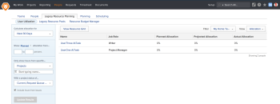

# Difference between Legacy Resource Planning and Planning

<!--

(NOTE: Alina: *** Article should be removed when the Legacy Planning is removed from the system - mark this in the excel spreadsheet, when you add it there) 

-->

>[!IMPORTANT]
>
>You can access Legacy&nbsp;Resource Planning tools only when using Adobe Workfront Classic. This article refers to differences between Legacy Resource Planning and Planning tools when using Adobe Workfront Classic. &nbsp;The Legacy Resource Planning functionality is deprecated and it will be removed from Adobe Workfront.&nbsp;  
>For more information about Legacy Resource Planning, see the&nbsp;Legacy Resource Planning&nbsp;section.&nbsp;  
>For information about planning resources in the new Adobe Workfront experience, see [Get started with Resource Planning](../../resource-mgmt/resource-planning/get-started-resource-planning.md).

## Overview of resource planning in&nbsp;Adobe Workfront

Resource Planning in Workfront allows you to accurately allocate your resources based on their availability to projects in order of their priority. When planning your resources, you are performing a high-level allocation&nbsp;of resources, which distributes them&nbsp;to the projects you are currently working on. To specifically assign resources to work items (issues and tasks), use the Resource Scheduling tools.   
For more information about scheduling resources, see the [Resource Scheduling](../../resource-mgmt/resource-scheduling/resource-scheduling-overview.md) section.&nbsp;

As a Resource Manager, you can manage your resources in Workfront by leveraging two distinct areas of functionality.

>[!NOTE]
>
>&nbsp;These two types of resource planning tools&nbsp;do not communicate with one another and they must&nbsp;be configured&nbsp;separately.&nbsp;:

You can manage your resources by using the following areas of Workfront:

* **Planning** (recommended): you can add users to Resource Pools, add Resource Pools to your projects, and manage all&nbsp;allocations (for job roles as well as users) in the **Resource Planner**.  
  For more information about planning resources, see the&nbsp; [Resource Planning](../../resource-mgmt/resource-planning/resource-planning-overview.md)&nbsp;section.&nbsp; 

* **Legacy Resource Planning**: you can add job roles to Legacy Resource Pools and manage&nbsp;their availability in the **Resource Budget Manager**, and their allocations to projects in the **Capacity Planner**. As a subset of Legacy Resource Planning, you can also manage your user allocations in the **User Utilization** report and **Resource Grid**.

## Access the Legacy Resource Planning and the Planning areas

1. (Conditional) In Adobe Workfront Classic, go to the **People** area in the Global Navigation Bar.
1. (Recommended) Select the&nbsp;**Planning** tab for configuring the current resource planning&nbsp;tools.

   Or

   Select the **Legacy Resource Planning** tab for configuring the legacy resource planning&nbsp;tools.

   This is only possible when using Adobe Workfront Classic.

   You might not have access to this functionality because it is supported by Flash, which has been deprecated in most environments.

   For more information about the functionality in the **Legacy Resource Planning** tab, see [Overview of the Legacy Resource Planning tab](#overview-of-the-legacy-resource-planning-tab).

   For more information about the functionality in the **Planing** tab, see [Overview of the Planning tab](#overview-of-the-planning-tab).

## Overview of the Planning tab {#overview-of-the-planning-tab}

We recommend that you leverage the functionality in the **Planning**&nbsp;tab in the **People** area of Workfront for managing the allocation of your resources to projects.

To use the tools available when planning your resources, you must add users to&nbsp;**Resource Pools** and use the **Resource Planner** to manage your resources across your projects.

For more information about Resource Planning, refer to the following articles:

* [Resource pools overview](../../resource-mgmt/resource-planning/resource-pools/work-with-resource-pools.md) 
* [Resource Planner overview](../../resource-mgmt/resource-planning/get-started-resource-planner.md)

The budgeting information defined in this area also reflects in the Resource Budgeting area of the Business Case, at the project level.  
For more information about budgeting resources in the Business Case, see [Budget resources in the Business Case](../../manage-work/projects/define-a-business-case/budget-resources-in-business-case.md).

For a complete list of the prerequisites that must be met before you can start using the tools in the Planning tab, see the [Get started with Resource Planning](../../resource-mgmt/resource-planning/get-started-resource-planning.md) section in [Get started with Resource Planning](../../resource-mgmt/resource-planning/get-started-resource-planning.md)For all information about managing your resources in the&nbsp;**Planning** tab, see the&nbsp; [Resource Planning](../../resource-mgmt/resource-planning/resource-planning-overview.md)&nbsp;section.&nbsp;&nbsp;

## Overview of the Legacy Resource Planning tab {#overview-of-the-legacy-resource-planning-tab}

>[!IMPORTANT]
>
>The functionality available in this area is deprecated and it will be removed from Workfront in 2018.&nbsp;If you have been using the functionality in this area, we encourage you to configure the current&nbsp;functionality for resource management, available in the **Planning** tab in the **People** area.  
>For more information about understanding Legacy Resource Planning, see *"Understanding Legacy Resource Planning."*

You can manage your resources in the following ways by using the tools in the Legacy Resource Planning tab:

* If you assign job roles to work items, you can:

   1. Place&nbsp;job roles that are associated with users in Legacy Resource Pools which are attached to projects. 
   1. Manage the job role availability&nbsp;to each Legacy Resource Pool in the Resource Budget Manager.  
      For more information about budgeting Legacy Resource Pools, see Work with Legacy Resource Pools and &nbsp;Budget Legacy Resource Pools in the Resource Budget Manager .
   1. Manage the job role allocation to projects&nbsp;in the Capacity Planner of the Legacy Resource Pool.Budget Legacy Resource Pools in the Resource Budget Manager For more information about managing resources in the Capacity Planner, see Plan resources in the Capacity Planner and Allocate resources in the Capacity Planner The budgeting information defined in this area also reflects in the Legacy Resource Estimates area of the Business Case, at the project level.&nbsp;

* If you assign users to work items, you can use&nbsp;the User Utilization report and the Resource Grid to manage the allocation and availability of your users.  
  For more information about user utilization and the User Resource Grid, see Overview of the User Utilization report in the Legacy Resource Management area and Overview of the Resource Grid .

For more information about using the Legacy Resource Planning tools, see the Legacy Resource Planning section.  

&nbsp;
