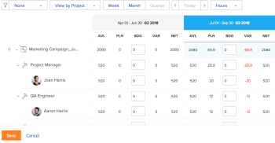

# Budget resources in the Resource Planner using the Project and Role views

<!--

(NOTE: broken off of another larger article (Planning in the RP); reformat, restructure, relink)

-->

The main function of the Resource Planner is to budget your resources for the work that must be completed on projects.

>[!IMPORTANT]
>
>You can budget your resources only if you apply the **View by Project** or **View by Role** views to the Resource Planner.

Before starting to budget information in the Resource Planner, see the following articles:

* [Resource Planner overview](../../resource-mgmt/resource-planning/get-started-resource-planner.md) 
* [Access needed to budget resources in Adobe Workfront](../../resource-mgmt/resource-planning/access-needed-to-budget-resources.md) 
* [Overview of hours, FTE, and cost information in the Project and Role views of the Resource Planner](../../resource-mgmt/resource-planning/overview-of-planner-hour-fte-cost-information-in-role-project-views.md)

## Access requirements

+++ Expand to view access requirements for the functionality in this article.

You must have the following access to perform the steps in this article:

<table style="table-layout:auto"> 
 <col> 
 <col> 
 <tbody> 
  <tr> 
   <td role="rowheader">Adobe Workfront plan</td> 
    <td>
New: Any

       
or

       
Current: Pro or higher
 </td> 
  </tr> 
  <tr> 
   <td role="rowheader">Adobe Workfront license</td> 
   <td>
New: Standard

       
or

       
Current: Plan
</td> 
  </tr> 
  <tr> 
   <td role="rowheader">Access level configurations</td> 
   <td> 
Edit access to Resource Management that includes access to Edit priorities and budget hours in the Resource Planner
 
Edit access to Financial Data to budget resources by Cost
 
Edit access to Projects and Users
</td> 
  </tr> 
  <tr> 
   <td role="rowheader">Object permissions</td> 
   <td> 
Manage permissions to the projects you want to budget information for
</td> 
  </tr> 
 </tbody> 
</table>

For more detail about the information in this table, see [Access requirements in Workfront documentation](/help/quicksilver/administration-and-setup/add-users/access-levels-and-object-permissions/access-level-requirements-in-documentation.md).

+++

## Budget resources in the Resource Planner

* [Budget resources in the Project View](#budget-resources-in-the-project-view) 
* [Budget resources in the Role View](#budget-resources-in-the-role-view) 
* [Budget resources in bulk](#budget-resources-in-bulk)

### Budget resources in the Project View {#budget-resources-in-the-project-view}

<!--

(NOTE: this section is linked to the Budgeting Project Resources in the Business Case article)

-->

{{step1-to-resourcing}}

1. The **Planner** displays by default.  
1. (Conditional) Select the **View by Project** view. 
1. Expand the projects and the job roles to manage the allocation for the project, job roles, or users. 
1. To budget allocation for users do one of the following:

   * In the **BDG** column, manually specify a number of budgeted hours, FTE, or cost for the users.  
   
   * Click the **More** menu for the job role of the user, then click **Set Users' Planned Hours as Budgeted**.  
     The Budgeted Hours of each user are calculated using the following formula:

     `User Budgeted Hours = User Planned Hours`

1. To budget allocation for job roles, do one of the following:

   * In the **BDG** column, manually specify a number of budgeted hours, FTE, or cost for the job role.

     >[!NOTE]
     >
     >The Role Budgeted Hours are added to the Project Budgeted Hours.

   * (Conditional) If you have budgeted hours for users, click the **More** menu for the job role, then click **Total Users' Budgeted Hours for Role**.  
     The Budgeted Hours for each role are calculated using the following formula:

     `Role Budgeted Hours = SUM(User Budgeted Hours)`

   * Click the **More** menu for the project, then click **Set Roles' Planned Hours as Budgeted**.  
     The Budgeted Hours for each role are calculated using the following formula:  
     * 
   
     `Role Budgeted Hours = Role Planned Hours`
   
     >[!NOTE]
     >   
     >* The Role Budgeted Hours are added to the Project Budgeted Hours.
     >* Users can be budgeted for both Primary and Other (or secondary) Roles. 
     >* The **Percentage of FTE Availability** for the roles of the user must be a number different than 0% for the Available Hours to display a value in the Resource Planner for a job role. If a user is associated with a role with a 0% **Percentage of FTE Availability**, the Available Hours value is zero for that job role. In this case, the role might show a negative **Net Value**.  
     >For more information about the **Percentage of FTE Availability** for job roles, see the article [Edit a user's profile](../../administration-and-setup/add-users/create-and-manage-users/edit-a-users-profile.md). 

   * In the **BDG** column, manually specify a number of budgeted hours, FTE, or cost for the project. This distributes the number of Project Budgeted Hours to each role under the project. The following scenarios exist:

      * If the number of Project Budgeted Hours your specify equals the Project Planned Hours, the Role Budgeted Hours match the Role Planned Hours.
      * If the number of Project Budgeted Hours you specify does not equal the Project Planned Hours, the Role Budgeted Hours are distributed according to the percentage of Planned Hours needed for each role.  
        For example, if a project has 20 Planned Hours, and they are distributed between two job roles (Consultant requires 12 Planned Hours and Engineer requires 8 Planned Hours), and you budget 30 hours for the Project, the hours are distributed as follows: the Consultant role receives 18 Budgeted Hours, and the Engineer role receives 12 Budgeted Hours.

1. To budget allocation for the project, do one of the following:

   * Budget the roles under the project, as described in Step 7.  
     The Project Budgeted Hours is calculated by the following formula:

     `Project Budgeted Hours = SUM(Role Budgeted Hours)`

   * In the **BDG** column, manually specify a number of budgeted hours, FTE, or cost for the project.  
     This updates the Role Budgeted Hours, as described in Step 7.  
     

1. Click **Save**.  
   After you budget your resources in the Resource Planner, the Budgeted Hours for your resources and any cost associated with them are listed in the Business Case of every project.  
   For more information about understanding the Resource Budgeting area of the Business Case, see the section "Resource Budgeting" in the article [Overview of the Areas of the Business Case](../../manage-work/projects/define-a-business-case/areas-of-business-case.md).

1. (Optional) Select the User view to notice any user overallocations or underutilization between the Available and the Planned Hours for each user. Budgeted Hours are not visible in the User view.

    For information about how Workfront calculates a user's availability, see [Configure Resource Management preferences](../../administration-and-setup/set-up-workfront/configure-system-defaults/configure-resource-mgmt-preferences.md). 

### Budget resources in the Role View {#budget-resources-in-the-role-view}

<!--

(NOTE: THIS IS WRONG - I LOGGED A BUG TO FIX THIS LINK - IT SHOULD GO TO"ACCESS NEEDED TO BUDGET IN THE RP":

Planning in the resource planner has links to the UI - ensure Flare notes are there for this: https://workfront.zendesk.com/hc/en-us/articles/115006356928 - the "Budgeting resources in the role view" is linked to this tooltip: ***This is linked to the product in the RP when the user does not have Manage rights on one of the projects under the role. This tool tip is linked here: "You don't have Manage permissions for all projects. Budget hours by individual project instead. Learn more...")

-->

You must have Edit access to Resource Management and Financial Data and Manage Finance permissions on the projects in order to budget resources in the Resource Planner. If you only have View access to at least one project listed under a job role, you cannot budget allocations for the role in the Role view. You can still budget allocation for the projects where you have Manage permissions.

For information about the access needed for budgeting resources, see the article [Access needed to budget resources in Adobe Workfront](../../resource-mgmt/resource-planning/access-needed-to-budget-resources.md).

To budget allocations in the Resource Planner in the**** Role view:

1. Click the **Main Menu** icon  in the upper-right corner of Adobe Workfront.

1. Click **Resourcing**. 
1. The **Planner** displays by default. 
1. (Conditional) Select the **View by Role** view. 
1. Expand the job roles and the projects to manage the allocation for the project, job roles, or users. 
1. To budget allocation for users, do one of the following:

   * In the **BDG** column, manually specify a number of budgeted hours, FTE, or cost for the users. 
   * Click the **More** menu for the project, then click **Set Users' Planned Hours as Budgeted**.  
     The Budgeted Hours of each user are calculated using the following formula:

     `User Budgeted Hours = User Planned Hours`

1. To budget allocation for job roles, do one of the following:

   * In the **BDG** column, manually specify a number of budgeted hours, FTE, or cost for the job roles.  
     This distributes the Role Budgeted Hours to the Project Budgeted Hours for the projects that you have access to manage.
   
   * Click the **More** menu for the job role, then click **Set Projects' Planned Hours as Budgeted.**The Role Budgeted Hours are calculated using the following formula:  
     * 
   
     `Role Budgeted Hours = SUM(Project Budgeted Hours)`

     *The Project Budgeted Hours are calculated using the following formula:

     `Project Budgeted Hours = Project Planned Hours`

   * In the **BDG** column, manually specify a number of budgeted hours, FTE, or cost for the projects listed under the job role.  
     This adds the number of Project Budgeted Hours to the role.

   >[!NOTE]
   >
   >Users can be budgeted for both Primary and Other (or secondary) Roles. The **Percentage of FTE Availability** for the roles of the user must be a number different than 0% for the Available Hours to display a value in the Resource Planner for a job role. If a user is associated with a role with a 0% **Percentage of FTE Availability**, the Available Hours value is zero for that job role. In this case, the role might show a negative **Net Value**.   
   >For more information about the **Percentage of FTE Availability** for job roles, see the article [Edit a user's profile](../../administration-and-setup/add-users/create-and-manage-users/edit-a-users-profile.md).

1. To budget allocation for the project, do one of the following:

   * In the **BDG** column, manually specify a number of budgeted hours, FTE, or cost for the projects.  
     This also updates the Budgeted Hours for the roles under which the project is listed. 
   
   * Click the **More** menu for the job role, then click **Set Projects' Planned Hours as Budgeted**.  
     The Project Budgeted Hours are calculated by the following formula:

     `Project Budgeted Hours = Project Planned Hours`

     The Project Budgeted Hours are added to the Role Budgeted Hours. 
   
   * (Conditional) If you have budgeted the hours for the users, click the **More** menu for the project, then click **Total Users' Budgeted Hours for Project**.  
     The Project Budgeted Hours is calculated using the following formula:

     `Project Budgeted Hours = SUM(User Budgeted Hours)`

     

1. Click **Save**.  
   After you budget your resources in the Resource Planner, the Budgeted Hours for your resources and any cost associated with them are listed in the Business Case of every project.
   For more information about understanding the Resource Budgeting area of the Business Case, see the article [Budget resources in the Business Case](../../manage-work/projects/define-a-business-case/budget-resources-in-business-case.md).

1. (Optional) Select the **View by User** view to notice any user overallocations or underutilization between the Available and the Planned Hours for each user. Budgeted Hours are not visible in the View by User view.

### Budget resources in bulk {#budget-resources-in-bulk}

You can budget allocations for your resources in bulk when using quick links. The quick links are available only for the Project and Role Views.

>[!NOTE]
>
>When using the quick links to budget allocations for resources, the budgeting is automatically applied only to the time periods displayed on the screen. If the timeline of a project spans over a period of time longer than the one displayed on your screen, you must scroll from left to right, and then use the quick links to automatically budget your resources.

To budget your resources in bulk:

1. Go to the .  
   For more information about accessing the Resource Planner, see the "Access the Resource Planner" section in the article [Resource Planner overview](../../resource-mgmt/resource-planning/get-started-resource-planner.md).   
   A list of projects you can manage displays in the list.  

1. (Optional) Expand each project to see a list of job roles associated with it.  
   Or
1. (Optional) Select **View by Role**, then expand each role to see a list of projects associated with it. 
1. Hover over the name of a project or of a job role.
1. Click the **More** icon which displays to the far right of the project or role name.  

1. Click one of the available options to automatically specify the amount of Budgeted Hours (BDG) for other objects.

   Depending on whether you clicked the More icon on a project or a role, the options for budgeting in bulk differ. The table below illustrates the options available for projects and roles:

   <table style="table-layout:auto"> 
    <col> 
    <col> 
    <col> 
    <tbody> 
     <tr> 
      <td> </td> 
      <td><strong>Project View</strong> </td> 
      <td><strong>Role View</strong> </td> 
     </tr> 
     <tr> 
      <td>Project Options</td> 
      <td> 
       <ul> 
        <li><strong>Set Roles' Planned Hours as Budgeted</strong>: Select this option to make the Budgeted Hours of the role become identical to their Planned Hours. The total of the Budgeted Hours for the roles will display for the Project Budgeted Hours. </li> 
        <li><strong>Adjust Budgeting Dates</strong> : Select this option to move the Budgeted Hours to a different timeframe. For more information about adjusting budgeting dates, see <a href="../../resource-mgmt/resource-planning/adjust-budgeting-dates.md" class="MCXref xref">Adjust budgeting dates in the Resource Planner</a>.</li> 
       </ul> </td> 
      <td> 
       <ul> 
        <li><strong>Set Users' Planned Hours as Budgeted</strong>: Select this option to make the Budgeted Hours of the user become identical to the their Planned Hours. </li> 
        <li><strong>Total Users' Budgeted Hours for Project</strong>: Select this option to add all the user Budgeted Hours together and display the total as the Budgeted Hours for the project and for the role. We recommend that you use this option after you have either manually budgeted your users, or you have used the previous option first. </li> 
       </ul> </td> 
     </tr> 
     <tr> 
      <td>Role Options</td> 
      <td> 
       <ul> 
        <li><strong>Set Users' Planned Hours as Budgeted</strong>: Select this option to make the Budgeted Hours of the user become identical to their Planned Hours. </li> 
        <li><strong>Total Users' Budgeted Hours for Role</strong>: Select this option to add all the Budgeted Hours of the user together and display the total as the Budgeted Hours for the role and the project. We recommend that you use this option after you have either manually budgeted your users, or you have used the previous option first. </li> 
       </ul> </td> 
      <td> 
       <ul> 
        <li><strong>Set Projects' Planned Hours as Budgeted</strong>: Select this option to make the project Budgeted Hours become identical with the project Planned Hours. </li> 
       </ul> </td> 
     </tr> 
    </tbody> 
   </table>

   >[!NOTE]
   >
   >Some of the options might not display if some of the prerequisites of working in the Resource Planner are missing. 
   >
   >
   >For more information about the prerequisites that must be met for accurate budgeting in the Resource Planner, see the "Prerequisites for working in the Resource Planner" section in the [Resource Planner overview](../../resource-mgmt/resource-planning/get-started-resource-planner.md) article.  
   >For example, some of the options might not display in the following scenarios:
   >
   >   
   >   
   >   * When projects are not associated with Resource Pool
   >   * When Resource Pools that are associated with projects do not contain users
   >   * When Resource Pools that are associated with projects contain users with no job role associated with them.
   >   
   >
