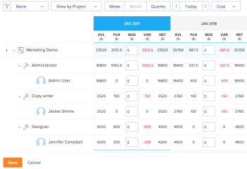

# Calculate costs in the Resource Planner

<!--

(Alina: ***Linked to the Planning in the Resource Planner article, Understanding areas of the Resource Planner. - do not move/ change/ delete.)

-->

<!--'(Alina: ***Linked to the Planning in the Resource Planner article, Understanding areas of the Resource Planner. - do not move/ change/ delete.)'-->

You can budget your resources in the Adobe Workfront Resource Planner by using Cost values, instead of Hours or FTE values. Cost values are not available for the**View by User** view in the Resource Planner.

>[!IMPORTANT]
>
>You must associate users and job roles with Cost per Hour rates in order to display Cost information in the Resource Planner.  
>For more information about associating Cost per Hour rates with job roles, see [Create and manage job roles](../../administration-and-setup/set-up-workfront/organizational-setup/create-manage-job-roles.md).  
>For more information about associating Cost per Hour rates with users, see [Edit a user's profile](../../administration-and-setup/add-users/create-and-manage-users/edit-a-users-profile.md).

Before budgeting your resources, ensure you have a good understanding of what work needs to be done (Planned Hours, FTE, or Cost) and what time your users are open to work (Available Hours, FTE, or Cost).  
For more information about understanding the information in the Resource Planner when budgeting by Hours or FTE, see [Overview of hours, FTE, and cost information in the Project and Role views of the Resource Planner](../../resource-mgmt/resource-planning/overview-of-planner-hour-fte-cost-information-in-role-project-views.md).

## Access requirements

+++ Expand to view access requirements for the functionality in this article.

You must have the following access to perform the steps in this article:

<table style="table-layout:auto"> 
 <col> 
 <col> 
 <tbody> 
  <tr> 
   <td role="rowheader">Adobe Workfront plan</td> 
    <td>
New: Any

       
or

       
Current: Pro or higher
 </td> 
  </tr> 
  <tr> 
   <td role="rowheader">Adobe Workfront license</td> 
   <td>
New: Standard

       
or

       
Current: Plan
</td> 
  </tr> 
  <tr> 
   <td role="rowheader">Access level configurations</td> 
   <td> 
Edit access to Resource Management that includes access to Edit priorities and budget hours in the Resource Planner
 
Edit access to Financial Data, Projects, and Users
</td> 
  </tr> 
  <tr> 
   <td role="rowheader">Object permissions</td> 
   <td> 
Manage permissions to the projects you want to budget information for with ability to Manage Finances
</td> 
  </tr> 
 </tbody> 
</table>

For more detail about the information in this table, see [Access requirements in Workfront documentation](/help/quicksilver/administration-and-setup/add-users/access-levels-and-object-permissions/access-level-requirements-in-documentation.md).

+++

## Display information in the Resource Planner by Cost

By default, the availability and allocation information is displayed in Hours in the Resource Planner.

To display Available, Planned, and Budgeted information by Cost in the Resource Planner:

{{step1-to-resourcing}}

1. Go to the Resource Planner.
1. (Conditional) Select **View by Project** or **View by Role**.  
   By default **View by Project** is selected.  
   The allocation and availability information displays in Hours.

1. From the **Hours** drop-down menu, select **Cost**.

   If you do not have access to Financial Data in your access level, this option is not available.  
   If projects have a different currency than the system currency the Cost for these projects displays in the Resource Planner converted in the currency of the system. Your system administrator defines the system currency.  
   For more information about setting up the system currency in Workfront and conversion rates, see [Set up exchange rates](../../administration-and-setup/manage-workfront/exchange-rates/set-up-exchange-rates.md).  
   

## Calculate Available Cost in the Resource Planner

To display Available Cost values in the Resource Planner you must have the following:

* Cost per Hour rates for the users and roles
* Information about user availability.

  Obtaining information about user availability depends on how your Workfront administrator configures the Resource Management Preferences.  
  For more information about calculating user availability and setting Resource Management Preferences, see [Configure Resource Management preferences](../../administration-and-setup/set-up-workfront/configure-system-defaults/configure-resource-mgmt-preferences.md).

The following table illustrates how Available Cost is calculated in the Resource Planner: 

<table style="table-layout:auto"> 
 <col> 
 <col> 
 <thead> 
  <tr> 
   <th><strong>Available Cost</strong> </th> 
   <th><strong>Calculation</strong> </th> 
  </tr> 
 </thead> 
 <tbody> 
  <tr> 
   <td>User Available Cost</td> 
   <td> 
The Available Cost per user is calculated using the following formula:
 
<code>Available User Cost = User Available Hours * User Cost per Hour Rate</code> 
 
<b>NOTE</b>
   
   If the user does not have a Cost per Hour rate in their profile, the Cost per Hour rate of the job role under which they are listed is used in the calculation. If the user has no role associated with them, the Available User Cost is $0. 
 </td> 
  </tr> 
  <tr> 
   <td>Role Available Cost</td> 
   <td> 
The Available Cost per role is calculated using the following formula:
 
<code>Available Role Cost = Role Available Hours * Role Cost per Hour Rate</code> 
 
<b>NOTE</b>
   
   If the role does not have a Cost per Hour rate, the Available Role Cost is $0.
 </td> 
  </tr> 
  <tr> 
   <td>Project Available Cost</td> 
   <td> 
The Available Cost per project is calculated using the following formula:
 
<code>Available Project Cost = SUM(User Available Hours * User Cost per Hour Rate)</code> 
 </td> 
  </tr> 
 </tbody> 
</table>

## Calculate Planned Cost in the Resource Planner

Although you cannot view task information in the Resource Planner, the Planned Costs for users, roles, and the projects are calculated by taking into account the following task information:

* The type of assignment on the task.  
  You can leave a task unassigned, or assign the following entities to a task:

   * A User (with or without a Job Role)
   * A Role
   * A Team  
     A task assigned to a Team is considered unassigned, from the perspective of the Resource Planner.

* The **Cost Type** of the tasks on the project.  
  For more information about the Cost Type of a task, see [Track costs](../../manage-work/projects/project-finances/track-costs.md).

* The effective dates of the cost rates for job roles and users.

  For example, if the role or user has 10 planned hours in February and 10 planned hours in March, but the cost rate has changed from $12 to $20 in March, the value for the Planned Cost in February is $120, and in March the Planned Cost is $200.

>[!NOTE]
>
>User Planned Costs do not influence the Project Planned Cost. Only the Role Planned costs affect the Project Planned Costs, in the Resource Planner.

The following scenarios exist when calculating the Planned Cost for users, roles, and the project:

* When the **Cost Type** is **User Hourly **and there is **no assignment** on the task:

   * **Role and user Planned Cost**:

     The Role and User Planned Costs are $0.00.
   
   * **Project Planned Cost**:

     The Project Planned Cost is $0.00.

* When the **Cost Type** is **User Hourly** and there is a **user assignment** on the task:

   * **Role and user Planned&nbsp;Cost**:

     The User Planned Cost is calculated using the following formula:

     `User Planned Cost Rate = User Planned Hours * User Cost per Hour Rate`

     If a user has a cost rate in their profile, then that rate is used to calculate Planned Cost. Otherwise, the system-level Cost per Hour rate of their Primary Role is used.

     >[!NOTE]
     >
     >The user can be assigned to the task with one of their secondary job roles, but the rate of the primary job role is used here instead.

     The Role Planned Cost is calculated using the following formula:

     `Role Planned Cost = SUM(User Planned Cost)`

   * **Project Planned Cost**:

     The Project Planned Cost is $0.00.

* When the **Cost Type** is **User Hourly** and there is a **job role assignment** on the task:

   * **Role and user Planned Cost**:

     The User Planned Cost is $0.00.

     The Role Planned Cost is calculated using the following formula:

     `Role Planned Cost = Role Planned Hours * Role Cost per Hours`

     The system-level Cost per Hour rate of the job role assigned to the task is used to calculate Planned Cost.
   
   * **Project Planned Cost**:

     The Project Planned Cost is $0.00.

* When the **Cost Type** is **Role Hourly** and there is **no assignment** on the task:

   * **Role and user Planned Cost**:

     The Role and User Planned Costs are $0.00.
   
   * **Project Planned Cost**:

     The Project Planned Cost is $0.00.

* When the **Cost Type** is **Role Hourly** and there is a **user assignment** on the task:

   * **Role and user Planned Cost**:

     The User Planned Cost is $0.00.

     The Role Planned Cost is calculated by the following formula:

     `Role Planned Cost = Role Planned Hours * Role Cost per Hours`

     Workfront looks at the job role that the user fulfills on the task to calculate the Planned Cost for the role.

     If the user is not associated with any role on the task, the Planned Cost is $0.00.
   
   * **Project Planned Cost**:

     The Project Planned Cost is calculated using the following formula:

     `Project Planned Cost = SUM(Role Planned Costs)`

* When the **Cost Type** is **Role Hourly** and there is a **job role assignment** on the task:

   * **Role and user Planned Cost**:

     The User Planned Cost is $0.00.

     The Role Planned Cost is calculated by the following formula:

     `Role Planned Cost = Role Planned Hours * Role Cost per Hours`

     Workfront looks at the job role that the user fulfills on the task to calculate the Planned Cost for the role. 
   
   * **Project Planned Cost**:

     The Project Planned Cost is calculated using the following formula:

     `Project Planned Cost = SUM(Role Planned Costs)`

<!--

(table below ideal but drafted because it does not display correctly in Markdown)

-->

<!--
<table style="table-layout:auto">
<col>
<col>
<col>
<col>
<col>
<col>
<col>
<tbody>
<tr>
<td rowspan="2">&nbsp;</td>
<td colspan="3"> 
<strong>Cost Type = User Hourly</strong> 
<strong>User Planned Cost</strong> </td>
<td colspan="3"> 
<strong>Cost Type = Role Hourly</strong> 
<strong>Role Planned Cost</strong> </td>
</tr>
<tr>
<td> 
<strong>No Assignment</strong> 
 </td>
<td> 
<strong>User Assignment</strong> 
 </td>
<td> 
<strong>Job Role Assignment</strong> 
 </td>
<td> 
<strong>No Assignment</strong> 
 </td>
<td> 
<strong>User Assignment</strong> 
 </td>
<td> 
<strong>Job Role Assignment</strong> 
 </td>
</tr>
<tr>
<td> 
<strong>User and Role Planned Cost</strong> 
 
 
 </td>
<td> 
The Role and User Planned Costs are $0.00.
 </td>
<td> 
 The User Planned Cost is calculated using the following formula: 
 
<code> User Planned Cost Rate = User Planned Hours * User Cost per Hour Rate </code> 
 
 If a user has a cost rate in their profile, then that rate is used to calculate Planned Cost. Otherwise, the system-level Cost per Hour rate of their Primary Role is used.  <note type="note">
The user can be assigned to the task with one of their secondary job roles, but the rate of the primary job role is used here instead.
</note>
 
 The Role Planned Cost is calculated using the following formula: 
 
<code>Role Planned Cost = SUM(User Planned Cost)</code> 
 </td>
<td> 
 The User Planned Cost is $0.00. 
 
 The Role Planned Cost is calculated using the following formula: 
 
<code> Role Planned Cost = Role Planned Hours * Role Cost per Hours </code> 
 
 The system-level Cost per Hour rate of the job role assigned to the task is used to calculate Planned Cost. 
 </td>
<td> 
The Role and User Planned Costs are $0.00.
 </td>
<td> 
 The User Planned Cost is $0.00. 
 
 The Role Planned Cost is calculated by the following formula: 
 
<code>Role Planned Cost = Role Planned Hours * Role Cost per Hours</code> 
 
Workfront looks at the job role that the user fulfills on the task to calculate the Planned Cost for the role. 
 
 If the user is not associated with any role on the task, the Planned Cost is $0.00. 
 </td>
<td> 
 The User Planned Cost is $0.00. 
 
 The Role Planned Cost is calculated by the following formula: 
 
<code>Role Planned Cost = Role Planned Hours * Role Cost per Hours</code> 
 
Workfront looks at the job role that the user fulfills on the task to calculate the Planned Cost for the role. 
 
 
 
 
 </td>
</tr>
<tr>
<td rowspan="2"> 
<strong>Project Planned Cost</strong> 
 
 
 </td>
<td> 
The Project Planned Cost is $0.00.
 </td>
<td> 
The Project Planned Cost is $0.00.
 </td>
<td> 
The Project Planned Cost is $0.00.
 </td>
<td> 
The Project Planned Cost is $0.00.
 </td>
<td colspan="2"> 
 The Project Planned Cost is calculated using the following formula: 
 
<code> Project Planned Cost = SUM(Role Planned Costs) </code> 
 
 
 </td>
</tr>
<tr>
<td colspan="6"> <note type="note">
User Planned Costs do not influence the Project Planned Cost. Only the Role Planned costs affect the Project Planned Costs, in the Resource Planner.
</note> </td>
</tr>
</tbody>
</table>
-->

## Calculate Budgeted Cost in the Resource Planner

To display Budgeted Cost values in the Resource Planner you must have the following:

* Budgeted Hours for roles, users, and projects.
* Cost per Hour rates for users and roles.

>[!NOTE]
>
>The Budgeted Hours for the projects are calculated based on the Budgeted Hours for the Roles, not those of users.

The following table illustrates how Budgeted Cost is calculated in the Resource Planner: 

<table style="table-layout:auto"> 
 <col> 
 <col> 
 <thead> 
  <tr> 
   <th><strong>Budgeted Cost</strong> </th> 
   <th><strong>Calculation</strong> </th> 
  </tr> 
 </thead> 
 <tbody> 
  <tr> 
   <td>User Budgeted Cost</td> 
   <td> 
The Budgeted Cost per user is calculated using the following formula:
 
<code>Budgeted User Cost = User Budgeted Hours * User Cost per Hour Rate</code> 
 
 
<b>NOTE</b>
   
   If the user does not have a Cost per Hour rate in their profile, the Budgeted User Cost is $0.00.
 
 </td> 
  </tr> 
  <tr> 
   <td>Role Budgeted Cost</td> 
   <td> 
The Role Budgeted Cost is calculated using the following formula:
 
<code>Role Budgeted Cost = Role Budgeted Hours * Role Cost per Hour Rate</code> 
 
 
<b>NOTE</b>
   
   If the role does not have a Cost per Hour rate, the Budgeted Role Cost is $0.00.
 
 </td> 
  </tr> 
  <tr> 
   <td>Project Budgeted Cost</td> 
   <td> 
The Budgeted Cost per project is calculated using the following formula:
 
<code>Project Budgeted Cost = SUM(Role Budgeted Cost). </code> 
 </td> 
  </tr> 
 </tbody> 
</table>
