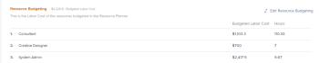

# Locate the Resource Planner

<!--

(This came off this article: draft that content in the article when this comes live: /Content/Resource Mgmt/Resource Planning/get-started-resource-planner.html)

-->

You can use the Resource Planner to manage the allocation of your resources to projects. You can access the Resource Planner for multiple projects at the same time or for one project, from the project's Business Case area.

## Access requirements

+++ Expand to view access requirements for the functionality in this article.

<table style="table-layout:auto"> 
 <col> 
 <col> 
 <tbody> 
  <tr> 
   <td>Adobe Workfront package</td> 
   <td>
Any
</td>
  </tr> 
  <tr> 
   <td>Adobe Workfront license</td> 
   <td>
Light or higher for one project; Standard for multiple projects

       
Review or higher for one project; Plan for multiple projects
</td>
  </tr> 
  <tr> 
   <td>Access level configurations</td> 
   <td> 
View access or higher to Resource Management
 </td> 
  </tr> 
  <tr> 
   <td>Object permissions</td> 
   <td> 
View permissions to projects and users 
 </td> 
  </tr> 
 </tbody> 
</table>

For information, see [Access requirements in Workfront documentation](/help/quicksilver/administration-and-setup/add-users/access-levels-and-object-permissions/access-level-requirements-in-documentation.md).

+++

## Prerequisites

Ensure that all prerequisites for accessing and working with the Resource Planner are met before starting to use it. This way, you ensure that the Resource Planner displays the correct information before you start budgeting your resources.

For information about Resource Planner prerequisites, see [Get started with Resource Planning](../../resource-mgmt/resource-planning/get-started-resource-planning.md).

## Locate the Resource Planner

You can locate the Resource Planner in two areas of Workfront, depending on whether you want to budget your resources for multiple projects, or for just one project.

* [Use the Resource Planner for multiple projects](#use-the-resource-planner-for-multiple-projects) 
* [Use the Resource Planner for one project](#use-the-resource-planner-for-one-project)

### Use the Resource Planner for multiple projects {#use-the-resource-planner-for-multiple-projects}

When using the Resource Planner for multiple projects, the allocation numbers for your resources represent numbers across multiple projects.

To access the Planner section in the Resourcing area:

{{step1-to-resourcing}}

   The Planner displays by default.  For information about budgeting resources in the Resource Planner, see the article [Budget resources in the Resource Planner using the Project and Role views](../../resource-mgmt/resource-planning/budget-resources-project-role-views-resource-planner.md).

   

1. Click **Resource Pools** in the left panel.
   For information about creating resource pools, see [Create resource pools](../../resource-mgmt/resource-planning/resource-pools/create-resource-pools.md).

### Use the Resource Planner for one project {#use-the-resource-planner-for-one-project}

When using the Resource Planner for one project, the allocation numbers for your resources represent numbers for the selected project.

1. Go to a project you want to budget resources for.
1. Click **Business Case** in the left panel.
1. Scroll to the **Resource Budgeting** section of the Business Case.
1. Click **Edit Resource Budgeting** to add resource pools to your project and start budgeting your resources.

   >[!TIP]
   >
   >You can only add a resource pool in the Resource Budgeting area of the Business Case when the project has no resource pools associated with it. When the project already has a Resource Pool, the users in the pool and their job roles display in the Resource Budgeting area by default.

   

   For information about budgeting resources for one project, see the article [Budget resources in the Business Case](../../manage-work/projects/define-a-business-case/budget-resources-in-business-case.md).
