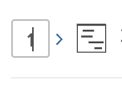
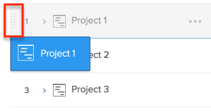
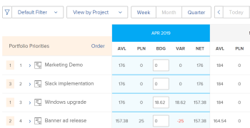
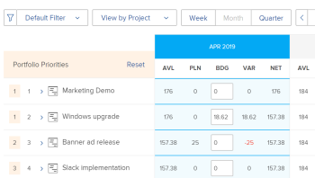

# Prioritize projects in the Resource Planner

Projects are listed in order of priority in the Resource Planner with the most important project at the top.

## Access requirements

+++ Expand to view access requirements for the functionality in this article.

You must have the following access to perform the steps in this article:

<table style="table-layout:auto"> 
 <col> 
 <col> 
 <tbody> 
  <tr> 
   <td role="rowheader">Adobe Workfront plan</td> 
    <td>
New: Any

       
or

       
Current: Pro or higher
 </td> 
  </tr> 
  <tr> 
   <td role="rowheader">Adobe Workfront license</td> 
   <td>
New: Standard

       
or

       
Current: Plan
</td> 
  </tr> 
  <tr> 
   <td role="rowheader">Access level configurations</td> 
   <td> 
Edit access to Resource Management that includes access to Edit priorities and budget hours in the Resource Planner
 
Edit access to Financial Data, Projects, and Users
</td> 
  </tr> 
  <tr> 
   <td role="rowheader">Object permissions</td> 
   <td> 
Manage permissions to the projects you want to budget information for with ability to Manage Finances
</td> 
  </tr> 
 </tbody> 
</table>

For more detail about the information in this table, see [Access requirements in Workfront documentation](/help/quicksilver/administration-and-setup/add-users/access-levels-and-object-permissions/access-level-requirements-in-documentation.md).

+++

## Default order of projects in the Resource Planner

By default, the projects are listed in the Project View of the Resource Planner by taking into consideration the criteria below.

>[!IMPORTANT]
>
>Projects are listed according to the three criteria below only the first time you open the Resource Planner. However, this default priority automatically becomes your custom priority and cannot be reverted to the original priority any time you do one of the following:
>
>* When you click Save at any time.
>* When you manually change the project planning priority. For information about changing the project planning priority manually, see the section [Manually change the Project Planning Priority](#manually-change-the-project-planning-priority) in this article.
>
>After the project priority becomes your custom priority, any changes in the project information no longer affect the ordering of the projects using these criteria. After this, you can prioritize projects only manually.

The original default criteria for listing the projects in the Project View are as follows, in this order:

1. By the Alignment Score on the project.   
   For more information about the Alignment Score of the project, see [Apply a scorecard to a project and generate an Alignment Score](../../manage-work/projects/define-a-business-case/apply-scorecard-to-project-to-generate-alignment-score.md) .

1. By the Planned Start Date of the project (if the Alignment field is null or is the same for several projects). 
1. Alphabetically (if the Alignment field is null or is the same, and the Planned Start date is the same for several projects).

Consider the following when working with project priorities in the Resource Planner:

* You can manually customize the project priority only when you apply the Project View. This also changes the order of the projects in the Resource Planner.
* When you apply the Role or User Views in the Resource Planner, the projects appear in the same order of priority established in the Project View.
* The order of the projects in the Resource Planner is unique to you. Other users can view the same projects in the Resource Planner, but in a different order. You cannot report on the Project Planning Priority field. This is visible just in the Resource Planner and it serves as a flag for prioritizing your projects.

Projects associated with a portfolio might have a portfolio-level priority. You can enable viewing the portfolio priority of a project in the Resource Planner, in addition to the Resource Planner priority. You can also order the projects according to their portfolio priority. 

## Manually change the Project Planning Priority {#manually-change-the-project-planning-priority}

You must have Edit access to Resource Management and Manage permissions to projects, to reorder projects in the Resource Planner.

By giving projects a new priority, you can rank them in order of importance.

To edit the Project Planning Priority:

1. Go to the **Resource Planner**.  

1. Click inside the field to the left of the project name which contains a number, and enter a number to change Planning Priority, then press Enter.  
     
   Or  
   Hover over the name of the project and click the indicator to the left of the project name, and drag it and drop it in the correct spot, to change the priority.

   

   When you select numbers to prioritize projects, select lower numbers for higher (more important) priorities, and higher numbers for lower (less important) priorities. When you change the priority number of a project to a lower number (higher priority), all other projects in the Resource Planner shift down on the list (become less important).  
   When you change the priority number of a project to a higher number (lower priority), all other projects in the Resource Planner shift up on the list (become more important).

1. Click **Save**.  
   The order of the projects changes according to your selections and this becomes your custom project priority in the Resource Planner. Other users cannot see your order of priority for the projects in the Resource Planner, although they might be able to view the same projects in their Resource Planners.

## Order projects according to their Portfolio Priority in the Resource Planner

>[!IMPORTANT]
>
>Your company must have a Business or higher Workfront plan to prioritize projects in the Portfolio Optimizer. 
>
>For more information on the Workfront plans, see [Our Plans](https://www.workfront.com/plans). 
>
>For information about prioritizing projects in the Portfolio Optimizer, see [Prioritize projects in the Portfolio Optimizer](../../manage-work/portfolios/portfolio-optimizer/prioritize-projects-in-portfolio-optimizer.md).

1. Open the **Resource Planner** in the **Project View**.
1. Click the **Settings** icon.
1. Enable the **Display Portfolio Priorities** setting to display the project priorities according to the Portfolio they are assigned to. The priority of the projects according to their portfolios displays next to the Resource Planner priority. This setting is disabled by default.

   <!--
   
(NOTE: check screen shot to see if this is accurate still - should say Order, and not Sort:)

   -->

   

   The portfolio priorities of the projects display only in the Project view of the Resource Planner.

1. Click **Order** to order the projects according to the portfolio priorities.

   If you have projects that belong to more than one portfolio, you could see multiple projects with the same portfolio priority in the Resource Planner. In this case, the projects with the same portfolio priority are listed by the following criteria, in this order:

   1. Alignment Score
   1. Planned Start Date
   1. Project Name

   

1. Click **Save**.

## The effect of changing the Project Planning Priority on User Available Hours

The Project Planning Priority affects the Available Hours of users. The users associated with the project with the highest priority show their fullest availability for the Available Hours (AVL) column for this project, according to their schedules.

The same users associated with the second project in order of priority will show an Available Hours value which is the difference between their full amount of Available Hours and what has already been budgeted for the first project in the Budgeted Hours column, and so on. For information about budgeting resources in the Resource Planner, see [Budget resources in the Resource Planner using the Project and Role views](../../resource-mgmt/resource-planning/budget-resources-project-role-views-resource-planner.md).

If no hours have been budgeted for the first project (in order of priority) for a user, but hours have been budgeted for the second project for the same user, the user will show the full amount of available hours for both projects.

We recommend updating the Budgeted Hours column for your users in the order of the projects in the Resource Planner, to ensure that you can accurately see the Available Hours for the user at all times.

>[!NOTE]
>
>Because the Project Planning Priority is unique to every resource manager, your second priority project might be a first priority project for another user viewing the same projects in their Resource Planner. If another resource manager budgets a resource for their first project, the Available Hours will decrease for that resource for your first project based on that change.
>
>The user who budgets the hours first allocates that resource and reduces the number of Available Hours for that resource across the system. The amount of Available Hours should update for all the users as soon as the Budgeted Hours are saved for a resource in the Resource Planner.
>
>For more information about Available Hours, see [Availability and allocation of resources](../../resource-mgmt/resource-planning/resource-availability-allocation-resource-planner.md#availability-and-allocation-of-resources).
