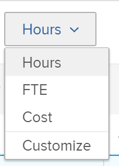
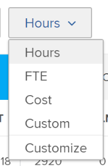
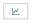

# Review resource availability and allocation using the Adobe Workfront Resource Planner

You can view the availability of your resources and the amount of planned or budgeted work for your projects in the Resource Planner. These values are displayed in Hours, FTE (Full Time Equivalent), or Cost amounts and are organized in columns.

## Access requirements

+++ Expand to view access requirements for the functionality in this article.

You must have the following access to perform the steps in this article:

<table style="table-layout:auto"> 
 <col> 
 <col> 
 <tbody> 
  <tr> 
   <td role="rowheader">Adobe Workfront plan</td> 
   <td>
New: Any

       
or

       
Current: Pro or higher
 </td> 
  </tr> 
  <tr> 
   <td role="rowheader">Adobe Workfront license</td> 
   <td>
New: Light or higher

       
or

       
Current: Review or higher
</td>
  </tr> 
  <tr> 
   <td role="rowheader">Access level configurations</td> 
   <td> 
View or higher access to the following:
 
    <ul> 
     <li> 
Resource Management
 </li> 
     <li> 
Financial Data
 </li> 
     <li> 
Users
 </li> 
     <li> 
Projects
 </li> 
    </ul> </td> 
  </tr> 
  <tr> 
   <td role="rowheader">Object permissions</td> 
   <td> 
View or higher permissions to the projects you want to view in the Resource Planner
 </td> 
  </tr> 
 </tbody> 
</table>

For more detail about the information in this table, see [Access requirements in Workfront documentation](/help/quicksilver/administration-and-setup/add-users/access-levels-and-object-permissions/access-level-requirements-in-documentation.md).

+++

## Prerequisites

You must meet all the prerequisites required to work with the Resource Planner.&nbsp;For more information, see [Resource Planner overview](../../resource-mgmt/resource-planning/get-started-resource-planner.md).

>[!IMPORTANT]
>
>If any of the prerequisites required for the correct functionality of the Resource Planner are missing, some of the numbers may be zero, or the Budgeted Hours might be dimmed.

## Availability and allocation of resources

The columns that display the availability and allocation of your resources change depending on which view you apply to the Resource Planner. For information about displaying the information in the Resource Planner by Project, Role, or User see [Resource Planner navigation overview](../../resource-mgmt/resource-planning/resource-planner-navigation.md).

Consider the following when changing your view to the Resource Planner:

* When you apply the **View by Project** or**View by Role** views, you can see the following columns: 

  <!--
  <MadCap:conditionalText data-mc-conditions="QuicksilverOrClassic.Draft mode">
  (NOTE: Alina: (some of the information in this area is also covered in Calculating Costs in the RP - https://workfront.zendesk.com/hc/en-us/articles/115004186433 - update this article also, when changes here occur)
  </MadCap:conditionalText>
  -->

  

   * Available Hours, FTE, or Cost
   * Planned Hours, FTE, or Cost
   * Budgeted Hours, FTE, or Cost
   * Hours, FTE, or Cost Variance
   * Net Hours, FTE, or Cost

* When you apply the **View by User** view, you can see the following columns:

   * Available Hours or FTE 
   * Planned Hours or FTE 
   * Hour or FTE Difference 
   * Planned Hours Allocation Percentage

>[!TIP]
>
>The information is not available as Cost when applying the **View by User** view to the Resource Planner.
>
>For more information about what each column displays, mouse over the name of the column in which the number is displayed.  
>  
>
>For more information about the data displayed in each column, see the following articles:
>
>* [Overview of hours, FTE, and cost information in the Project and Role views of the Resource Planner](../../resource-mgmt/resource-planning/overview-of-planner-hour-fte-cost-information-in-role-project-views.md) 
>* [View Available, Planned, and Actual Hours or FTE in the Resource Planner when using the User view](../../resource-mgmt/resource-planning/view-hours-fte-user-view-resource-planner.md) 
>

## View information by Hour, FTE, or Cost

1. Go to the Resource Planner.

   By default, information displays by Hours in the Resource Planner.

1. Expand the drop-down menu.   
   

1. Select from the following options:

   <table style="table-layout:auto"> 
    <col> 
    <col> 
    <tbody> 
     <tr> 
      <td role="rowheader">Hours</td> 
      <td>Displays availability and allocation information in Hours.</td> 
     </tr> 
     <tr> 
      <td role="rowheader">FTE</td> 
      <td> 
Displays availability and allocation information in FTE.
 
For more information about how the FTE is calculated in the Resource Planner, see <a href="../../resource-mgmt/resource-planning/calculate-hours-fte-for-users-roles-resource-planner.md" class="MCXref xref">Overview of calculating hours and FTE for users and roles in the Resource Planner</a>. 
 </td> 
     </tr> 
     <tr> 
      <td role="rowheader">Cost</td> 
      <td> 
Displays availability and allocation information by cost, if you are viewing the Resource Planner in the Project or Role views. The information displays values in the currency of your system. Your Workfront administrator defines the system currency. For more information about setting up the system currency in Workfront, see <a href="../../administration-and-setup/manage-workfront/exchange-rates/set-up-exchange-rates.md" class="MCXref xref">Set up exchange rates</a>.
 
<b>NOTE</b>
      
      You must associate users and job roles with Cost per Hour rates in order to display Cost information in the Resource Planner. For more information about associating Cost per Hour rates with job roles, see <a href="../../administration-and-setup/set-up-workfront/organizational-setup/create-manage-job-roles.md" class="MCXref xref">Create and manage job roles</a>. For more information about associating Cost per Hour rates with users, see <a href="../../administration-and-setup/add-users/create-and-manage-users/edit-a-users-profile.md" class="MCXref xref">Edit a user's profile</a>. For more information about how Cost is calculated in the Resource Planner, see <a href="../../resource-mgmt/resource-planning/calculate-costs-resource-planner.md" class="MCXref xref">Calculate costs in the Resource Planner </a>.
 </td> 
     </tr> 
     <tr> 
      <td role="rowheader">Customize</td> 
      <td>Creates a custom view of the columns that display in the Resource Planner. Select the options that you want to display in the Resource Planner, as described in the steps below. </td> 
     </tr> 
    </tbody> 
   </table>

1. (Conditional) If you selected **Customize**, indicate options in the **Customize displayed metrics** box to set up your custom view.

   

1. In the **View type** column on the left, select one of the following views:

   * Project 
   * Role
   * User

1. In the **Display selected items** section, select the type of information you want to display in the columns of the selected view.&nbsp;The following table shows what options are available in each view:

   | **Option** |User View |Project View |Role View |
   |---|---|---|---|
   | Available |✔ |✔ |✔ |
   | Planned  |✔ |✔ |✔ |
   | Budgeted |&nbsp; |✔ |✔ |
   | Variance |&nbsp; |✔ |✔ |
   | Net |&nbsp; |✔ |✔ |
   | Actual |✔ |&nbsp; |&nbsp; |
   | Difference |✔ |&nbsp; |&nbsp; |
   | Percent |✔ |&nbsp; |&nbsp; |

1. Select **Use Planned (PLN) values in NET calculations** to use Planned instead of Budgeted information when calculating the Net values in the Project and Role views.

   When selecting this option Workfront calculates the Net values using the following formula:

   `Net = Available - Planned`

   >[!TIP]
   >
   >**This option is applied only when you select at least one option to customize the view in the Display selected items section.**

1. Click **Save**.

   The customized view that includes your selected columns displays.

   The Resource Planner lists the customized view as Custom in the Hours drop-down menu.

   >[!NOTE]
   >
   >You can have only one customized view.

   

## View the User Allocation chart

You can display the Planned Allocation of users against their availability in a chart.

To display the allocation of users in a chart:

1. Go to the Resource Planner.

   For more information about accessing the Resource Planner, see the [Locate the Resource Planner](../../resource-mgmt/resource-planning/get-started-resource-planner.md#accessing-the-resource-planner) section in the article [Resource Planner overview](../../resource-mgmt/resource-planning/get-started-resource-planner.md).

1. Select **View by User**.

   >[!TIP]
   >
   >You can view the User Allocation Chart only in the User View.

1. Click the **User allocation chart** icon  to display the following information:

   <table style="table-layout:auto"> 
    <col> 
    <col> 
    <tbody> 
     <tr> 
      <td role="rowheader">Availability % with no overallocation for all users</td> 
      <td>This is the amount of time that all users are available for work in a time period, shown as a percentage from their total available time. </td> 
     </tr> 
     <tr> 
      <td role="rowheader">Overallocation % for all users </td> 
      <td> 
This is the amount of time that users are overallocated in a time period, shown as a percentage from the total available time.
 
<b>NOTE</b> 
      
      An overallocation happens when the Planned Hours are higher than the Available Hours. 
 </td> 
     </tr> 
     <tr> 
      <td role="rowheader">Underutilization % for all users</td> 
      <td> 
This is the amount of time that users are underutilized in a time period, shown as a percentage from the total available time.
 
<b>NOTE</b> 
      
      Underutilization happens when the Planned Hours are lower than the Available Hours. 
 </td> 
     </tr> 
     <tr> 
      <td role="rowheader">There is an overallocation for at least one user during this time period</td> 
      <td>This indicates that there is an overallocation for at least one user in a time period, although the total amount of time of all users is not overallocated for the time period. You must scroll through the list of users and the hours for the user who is overallocated are highlighted in red.</td> 
     </tr> 
    </tbody> 
   </table>

   

1. (Optional) Click the **Overallocation % for all users** area in the chart.  
   All users that are overallocated are highlighted in red.
1. (Optional) Click the **Underutilization % for all users** area in the chart.  
   All users that are underutilized are highlighted in blue.

1. (Optional) Click the indicator icon  that shows where you have at least one user overallocated.  
   The users that are overallocated are highlighted in red. 

1. (Optional) Refresh the page to collapse the chart.
