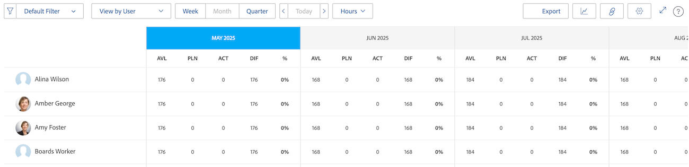
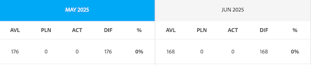
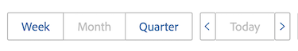
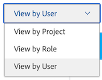
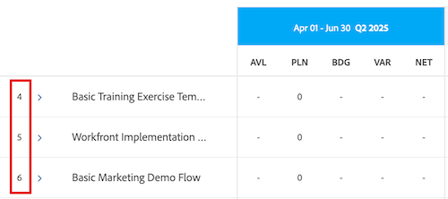
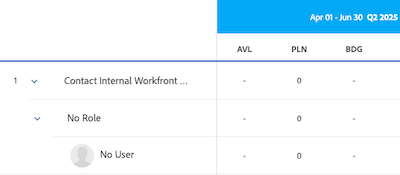
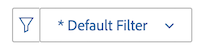
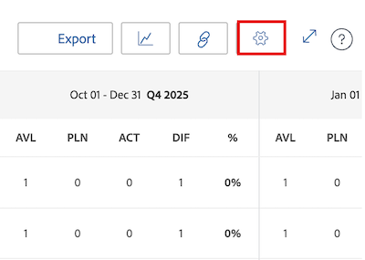
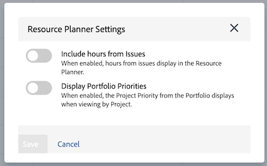

# Resource Planner navigation overview

<!-- Audited: 5/2025 -->

The Adobe Workfront Resource Planner helps you easily understand the availability of your resources and the planned time necessary to complete the work on your projects. You can then manage the allocation of your users and their job roles on the projects they're assigned to.

>[!TIP]
>
>You can't manage the allocation of teams on the tasks they are assigned to in the Resource Planner.

You must meet the prerequisites needed to fully use the Resource Planner. For more information about the Resource Planner, see [Resource Planner overview](../../resource-mgmt/resource-planning/get-started-resource-planner.md).

The following sections outline all areas of the Resource Planner.

## Timeline of projects

Use the calendar at the top of the Resource Planner to navigate the timeline of the projects you are viewing. The timeline starts with today's month, by default.  

For more information about changing the timeframe of the timeline you are displaying in the Resource Planner, see the section [Timeframe selection](#timeframe-selection) in this article.

## Timeframe selection  {#timeframe-selection}

By default, the Resource Planner shows resource information for 3 or 4 months at a time, starting with the current month. The number of time periods displayed depends on the width of your screen.

>[!TIP]
>
>You cannot display more than 4 time periods at a time in the Resource Planner.

To navigate the timeline, click the back and forward arrows to move backwards and forwards on the timeline. You can then select from the following date range options in the Resource Planner by clicking the appropriate buttons:

   <table style="table-layout:auto"> 
    <col> 
    <col> 
    <tbody> 
     <tr> 
      <td role="rowheader">Week</td> 
      <td>Displays information by week. The number of the week displays next to the dates in the column header. </td> 
     </tr> 
     <tr> 
      <td role="rowheader">Month</td> 
      <td> Displays information by month.</td> 
     </tr> 
     <tr> 
      <td role="rowheader">Quarter</td> 
      <td>Displays information by quarter. The number of the quarter displays next to the dates in the column header. Custom quarters do not display in the Resource Planner. </td> 
     </tr> 
     <tr> 
      <td role="rowheader">Today</td> 
      <td>Returns to today's month, week, or quarter.</td> 
     </tr> 
    </tbody> 
   </table>

## Project/ Role/ User view selection

You can change the view in the Resource Planner depending on how you want the information to display.

By default, the Resource Planner displays in the User View. You can change the view to the Project or Role Views. When you change it to another view, your choice becomes your default view.

When you change the view, the following information also changes:

* The object hierarchy (information in the rows of the Resource Planner). 
* The hour allocation information (information in the columns of the Resource Planner).

  For more information about what the columns show in the Resource Planner depending on which view you select, see [Review resource availability and allocation using the Adobe Workfront Resource Planner](../../resource-mgmt/resource-planning/resource-availability-allocation-resource-planner.md).

In order to display accurate information in the Resource Planner, you must meet a set of prerequisites. For more information about the prerequisites, see the Prerequisites for working in the Resource Planner section in the [Resource Planner overview](../../resource-mgmt/resource-planning/get-started-resource-planner.md) article.  

To change the view in the Resource Planner, select one of the following views in the View by drop-down menu:

   * [View by Project](#view-by-project)
   * [View by Role](#view-by-role)
   * [View by User](#view-by-user)

### View by Project {#view-by-project}

Consider the following when selecting the Project View in the Resource Planner:

* You can see projects that you have permissions to view.
* When you access the Resource Planner for the first time, you can see projects filtered by the Default Filter.   
  For more information, see [Filter information in the Resource Planner](../../resource-mgmt/resource-planning/filter-resource-planner.md).

* The number of items you display or can export from the Project View is limited to improve performance.  
  For more information, see the Limitations in the Project View section in the [Resource Planner display limitations](../../resource-mgmt/resource-planning/resource-planner-display-limitations.md) article. 

* The projects are listed in the order of their priority in the Project View.  
  For more information, see the [Project Planning Priority](#project-planning-priority) section in this article.

* As you expand each project, you can display the job roles associated with it.  
  
* As you expand each role, you can display users associated with it. Scroll to load more roles and users under each project. 

* When this view is applied, the Role Hours, FTE or Cost add up to the Project Hours, FTE or Cost.  

* You can view the following hour, FTE, or Cost information in the Project view:

   * Available
   * Planned
   * Budgeted
   * Variance 
   * Net

     For more information, see [Budget resources in the Resource Planner using the Project and Role views](../../resource-mgmt/resource-planning/budget-resources-project-role-views-resource-planner.md).

### View by Role {#view-by-role}

Consider the following when selecting the Role View in the Resource Planner:

* You must have at least View access to Resource Management and view permissions on projects to view the roles associated with those projects.  
* You can expand each role to display a list of projects, and every project to display a list of users that can fulfill those roles on the projects. 
* The number of items you display or can export from the Role View is limited, to improve performance.  
  For more information, see the Limitations in the Role View section in [Resource Planner display limitations](../../resource-mgmt/resource-planning/resource-planner-display-limitations.md). 

* The projects are listed under the job role in the same order of priority as they are listed in the Project View. 
* When this view is applied, the Project Hours, FTE or Cost add up to the Role Hours, FTE or Cost.  
* You can view the following hour, FTE, or Cost information in the Role view:

   * Available
   * Planned
   * Budgeted
   * Variance 
   * Net

     For more information, see [Budget resources in the Resource Planner using the Project and Role views](../../resource-mgmt/resource-planning/budget-resources-project-role-views-resource-planner.md).

### View by User {#view-by-user}

You can display the Resource Planner in the User View to understand the difference between the Planned and the Available Hours or FTE for your users or to see the amount of Actual Hours they have logged.

You can't budget your resources when applying the User View to the Resource Planner. You must budget your resources using the Project or Role views, and use the User view to review your users' allocation and availability in relation to the planned work.

The User View is the default view of the Resource Planner.

Consider the following when selecting the User View in the Resource Planner:

* You can see all the users you have permissions to View, up to 2,000 users, that are active and have logged in to Adobe Workfront at least once. Filter the user list by Team, Job Role, or Pools to see users associated only with those entities. 
* If you have filtered the list of users by projects, only the users associated with the filtered projects can be expanded and display hour information.  
  For more information, see [Filter information in the Resource Planner](../../resource-mgmt/resource-planning/filter-resource-planner.md).

* The number of items you display or can export from the User View is limited to improve performance.  
  For more information, see the Limitations in the User View section in [Resource Planner display limitations](../../resource-mgmt/resource-planning/resource-planner-display-limitations.md) . 

* The projects are listed under the user's name in the same order of priority as they are listed in the Project View.  
  For more information, see the [Project Planning Priority](#project-planning-priority) section in this article. 

* If users have no job role associated with them, the Hours or FTE values are listed under the No Role section. 
* When this view is applied, the Project Hours or FTE add up to the User Hours or FTE.

  >[!TIP]
  >
  >You can't display the allocation and availability of the users by Cost in the User View.

* Your project and task permissions determine what is displayed under the names of users you see in the User View.   
  
  The following scenarios exist:

   * When you don't have permissions to see projects and the tasks or issues that are assigned to the users displayed in the Resource Planner, those items are listed under the Inaccessible Items sections. In this case, these sections replace the Project or Task sections.

   * When you don't have permissions to see the projects, but you have access to see the tasks or issues on the projects, the projects, tasks, and issues are listed under the names of the users assigned to them.
   * When you have permissions to see the projects, but not any tasks or issues on the projects, the project name displays, and the tasks and issues are listed under the Inaccessible Items section.  

     For more information, see [Overview of sharing permissions on objects](../../workfront-basics/grant-and-request-access-to-objects/sharing-permissions-on-objects-overview.md).

* You can view the following hour and FTE information in the User view:

   * Available
   * Planned
   * Actual 
   * Difference between Planned and Actual
   * Percentage of Planned allocation

     For more information, see [View Available, Planned, and Actual Hours or FTE in the Resource Planner when using the User view](../../resource-mgmt/resource-planning/view-hours-fte-user-view-resource-planner.md)

## Project Name

You can see the following projects in the Resource Planner:

* Projects you have permissions to view. You must also have access to View Resource Management in your access level.

  For information, see [Access needed to budget resources in Adobe Workfront](../../resource-mgmt/resource-planning/access-needed-to-budget-resources.md). 

* Projects limited by the filter applied to the Resource Planner.

  For more information, see [Filter information in the Resource Planner](../../resource-mgmt/resource-planning/filter-resource-planner.md).

  >[!NOTE]
  >
  >We recommend using filters to reduce the number of projects you display in the Resource Planner.

## Project Planning Priority {#project-planning-priority}

Projects are listed in order of priority in the Resource Planner with the most important project at the top. The priority is indicated by a number in front of the project name.

You can also enable a setting to display the project priorities according to their portfolios when they're associated with a portfolio. For information, see [Prioritize projects in the Resource Planner](../../resource-mgmt/resource-planning/prioritize-projects-resource-planner.md).

## Job Role Name

The following categories of job roles are listed in the Resource Planner:

* The job roles that are assigned to tasks.  
* The job roles that are not assigned to tasks, but are the primary job roles of the users associated with the resource pools of the projects. 
* The secondary job roles of users who are assigned to tasks in those job roles. 
* The secondary job roles of users who have a valid Percentage of FTE Availability in their profile.  
  For more information about the Percentage of FTE Availability for job roles, see [Edit a user's profile](../../administration-and-setup/add-users/create-and-manage-users/edit-a-users-profile.md).

>[!NOTE]
>
>Job roles assigned to issues are also listed when the Include hours from Issue setting is enabled. For more information about enabling issue hours in the Resource Planner, see the [Settings](#settings) section.

## User Name

The users listed in the Project and Role views in the Resource Planner belong to the resource pools associated with the projects.   
For more information, see [Associate resource pools with users](../../resource-mgmt/resource-planning/resource-pools/associate-resource-pools-with-users.md).

All users that you have access to View and who have logged in to Workfront at least once display in the User View.

In the Project and Role Views, users could appear listed under the following types of job roles:

* Their primary job role
* Their secondary job role, in the following scenarios:

   * If the secondary job role has a valid number for the Percentage of FTE Availability in their user profile.
   * If the user is assigned to tasks in those roles.

For more information about the Percentage of FTE Availability for a job role, see [Edit a user's profile](../../administration-and-setup/add-users/create-and-manage-users/edit-a-users-profile.md) .

## No Role and No User sections

### No Role section  {#no-role-section}

When a user belongs to a resource pool associated with a project, but they do not have a job role associated with them, they appear in the No Role section instead of under a specific job role.

You cannot budget hours for a user in a No Role section. The user must have at least one job role associated with them to be budgeted for work.  

### No User section  {#no-user-section}

When you assign a task to a team, or you leave it unassigned, the Planned Hours appear under the No User section which appears under the No Role section in the Resource Planner. These tasks do not appear in the Resource Planner when using the View by User view.

You can see the amount of Planned Hours attributed to tasks on the project in the No User section in the Resource Planner, but you cannot budget for these allocations.

## Filters

Using filters, you can limit the information that you display in the Resource Planner.

For more information about filtering in the Resource Planner, see [Filter information in the Resource Planner](../../resource-mgmt/resource-planning/filter-resource-planner.md) .

## Settings {#settings}

From the Settings area, you can enable or disable options to display or hide information in the Resource Planner. To open the Resource Planner Settings dialog box, click the Settings icon in the upper-right corner of the page. 

   

From here, you can enable one or both of the following settings: 

* **Include hours from Issues**: This displays Planned Hours from issues.

   Consider the following when you enable this setting: 

   * The name of the user assigned to the issues is displayed under the job role associated with them on the issue. You can specify Budgeted Hours for the user and the job role in the Project and Role views. 
   * The issues the users are assigned to are listed under the names of the job roles in the User view.

     >[!IMPORTANT]
     >
     >When the issue Planned Start and Completion Dates are outside the timeline of the project, the Planned Hours for the issue display according to the dates of the issue. For example, if the project timeline is between January and March, but the timeline of the issues is in August, the Planned Hours for the issues appear in the August time period.

* **Display Portfolio Priorities**: Displays the project priorities according to the Portfolio they're assigned to.

   For information about prioritizing projects in the Resource Planner, see [Prioritize projects in the Resource Planner](../../resource-mgmt/resource-planning/prioritize-projects-resource-planner.md).

     

## Full-screen option

You can display the Resource Planner in full screen to enlarge the amount of information you can view on the screen. This option is available for all views.

To display the Resource Planner in full screen, click the Full Screen icon in the top-right corner of the page. 
  
     

Once the screen has expanded, you can click the Close Full Screen icon to revert back to the previous display. 

## Export option

You can export information to an Excel (.xlsx) file from any view of the Resource Planner.  

For information about exporting information from the Resource Planner, see [Export information from the Resource Planner](../../resource-mgmt/resource-planning/export-resource-planner.md).

You can manage the amount of information and the display of your exported file.  

For information about what information you can export from the Resource Planner and how to manage the look and feel of the exported file, see [Resource Planner display limitations](../../resource-mgmt/resource-planning/resource-planner-display-limitations.md).
