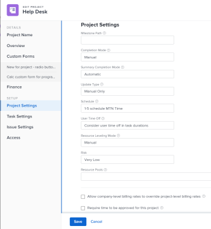

# Associate resource pools with projects and templates

<!-- drafted for bulk editing projects: keep this in yellow till this releases to ALL customers - May 1, 2023

Also - take out all the references to Preview and Prod at prod final
-->

<!--The highlighted information on this page refers to functionality not yet generally available. It is available for all customers in the Preview environment and for a select group of customers in the Production environment.-->

<!--

The sections about how to add resource pools to templates, projects are duplicated from the articles listed in those sections (Editing Projects, Creating a Template, etc).

***I decided to keep these steps here, though, because it's hard to parse through those much lunger articles for just updating this one field.)

-->

Resource pools are collections of users what help you manage resources in Adobe Workfront.

After you create resource pools, you can associate them with projects or templates so you can later budget your resources on the projects.

We recommend that you create your resource pools in advance, associate them with projects, and budget your resources before the project starts.

For information about resource pools, see [Resource pools overview](../../../resource-mgmt/resource-planning/resource-pools/work-with-resource-pools.md).

For information about creating resource pools, see [Create resource pools](../../../resource-mgmt/resource-planning/resource-pools/create-resource-pools.md).

## Access requirements

+++ Expand to view access requirements for the functionality in this article.

You must have the following access to perform the steps in this article:

<table style="table-layout:auto"> 
 <col> 
 <col> 
 <tbody> 
  <tr> 
   <td role="rowheader">Adobe Workfront plan</td> 
   <td>
New: Any

       
or

       
Current: Pro and higher
 </td> 
  </tr> 
  <tr> 
   <td role="rowheader">Adobe Workfront license</td> 
   <td>
New: Standard

       
or

       
Current: Plan
</td>
  </tr> 
  <tr> 
   <td role="rowheader">Access level configurations</td> 
   <td> 
Edit access to Resource Management that includes access to Manage Resource Pools
 
Edit access to Projects, Templates, and Users
</td> 
  </tr> 
  <tr data-mc-conditions=""> 
   <td role="rowheader">Object permissions</td> 
   <td>Manage permissions for the projects, templates, and users that you want to associate the Resource Pools with</td> 
  </tr> 
 </tbody> 
</table>

For more detail about the information in this table, see [Access requirements in Workfront documentation](/help/quicksilver/administration-and-setup/add-users/access-levels-and-object-permissions/access-level-requirements-in-documentation.md).

+++

## Associate resource pools with one project or template

You can associate resource pools with a template in the same manner you associate resource pools with a project. This article describes how you can associate resource pools with projects.

1. Go to a project and click the **More** icon next to the project name, then click **Edit**.

1. Click **Project Settings**. 

1. Start typing the name of a resource pool in the **Resource Pools** field, then select it from the list when it appears.  
   You can associate multiple resource pools with one project or template.

   

1. Click **Save**.

For more information about how to edit a project and associate it with resource pools, see [Edit projects](../../../manage-work/projects/manage-projects/edit-projects.md).

For more information about how to edit a template and associate it with resource pools, see [Edit project templates](../../../manage-work/projects/create-and-manage-templates/edit-templates.md).

## Associate resource pools with several projects or templates in bulk

You can edit multiple projects or templates in bulk and associate the same resource pools with all of them at the same time.

You can associate resource pools with templates in the same manner you associate resource pools with projects.

To associate resource pools with several projects in bulk:

1. Go to a list of projects.
1. Select multiple projects, then click the **Edit** icon  at the top of the list. 

1. Click **Settings**.
1. Start typing the name of a resource pool in the **Resource Pools** field, then select it from the list when it appears.  
   You can associate multiple resource pools with the projects or templates.

   >[!NOTE]
   >
   >* When you edit templates in bulk, only the resource pools that are common to all the templates selected appear in this field. If the templates selected have no shared resource pools, this field is empty. The resource pools you specify here overwrite the individual resource pools of the projects or templates.
   >
   >* When you edit projects in bulk, there is a "Multiple values" indicator if the selected projects have different resource pools. If you add resource pools in bulk for projects, all the pools are added to the selected project, overwriting the original resource pools.

    

1. Click **Save Changes**.   
   When your resource pools are associated with your projects or your templates, you can budget user allocations for your projects inside the Resource Planner.   
   For more information about the Resource Planner, see [Resource Planner overview](../../../resource-mgmt/resource-planning/get-started-resource-planner.md).

For more information about how to edit projects in bulk, see the "Edit projects in bulk" section in [Edit projects](../../../manage-work/projects/manage-projects/edit-projects.md).

For more information about how to edit templates in bulk, see the "Edit templates in bulk" section in [Edit project templates](../../../manage-work/projects/create-and-manage-templates/edit-templates.md).
