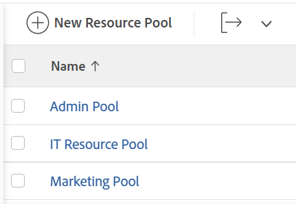
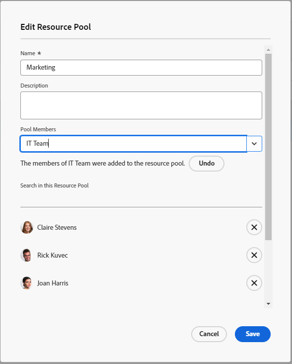

# Create resource pools

{{preview-and-fast-release-Q424}}

Resource pools are collections of users that help you manage resources easier in Adobe Workfront. For more information about resource pools, see [Resource pools overview](../../../resource-mgmt/resource-planning/resource-pools/work-with-resource-pools.md).

## Access requirements

+++ Expand to view access requirements for the functionality in this article.

You must have the following access to perform the steps in this article:

<table style="table-layout:auto"> 
 <col> 
 <col> 
 <tbody> 
  <tr> 
   <td role="rowheader">Adobe Workfront plan</td> 
   <td>
New: Any

       
or

       
Current: Pro or higher
 </td> 
  </tr> 
  <tr> 
   <td role="rowheader">Adobe Workfront license</td> 
   <td>
New: Standard

       
or

       
Current: Plan
</td>
  </tr> 
  <tr> 
   <td role="rowheader">Access level configurations</td> 
   <td> 
Edit access to Resource Management that includes access to Manage Resource Pools
 
Edit access to Projects, Templates, and Users
</td> 
  </tr> 
  <tr data-mc-conditions=""> 
   <td role="rowheader">Object permissions</td> 
   <td>Manage permissions for the projects, templates, and users that you want to associate the Resource Pools with</td> 
  </tr> 
 </tbody> 
</table>

For more detail about the information in this table, see [Access requirements in Workfront documentation](/help/quicksilver/administration-and-setup/add-users/access-levels-and-object-permissions/access-level-requirements-in-documentation.md).

+++

## Create a Resource Pool {#create-a-resource-pool}

{{step1-to-resourcing}}

1. Click **Resource Pools** in the left panel.   
   
   Sample image in the Preview environment:
   

   Sample image in the Production environment:
   

1. Click **New Resource Pool**.
1. Specify the following:

   <table style="table-layout:auto">
    <col>
    <col>
    <tbody>
     <tr>
      <td role="rowheader"><strong>Name</strong></td>
      <td>This is the name of the Resource Pool.</td>
     </tr>
     <tr>
      <td role="rowheader"><strong>Description</strong></td>
      <td>This is a brief description about this Resource Pool. For example, you can specify for what purpose it should be used.</td>
     </tr>
     <tr>
      <td role="rowheader"><strong>Pool Members</strong></td>
      <td>
 Add users to the Resource Pool individually. Or  To add a large amount of users to the Resource Pool at one time. You can add one of the following entities associated with users or collection of users:
        <ul>
         <li><strong>Teams</strong>: all members of the team are added to the Resource Pool.</li>
         <li><strong>Groups</strong>: all members of the group are added to the Resource Pool.</li>
         <li><strong>Roles</strong>: all users associated with that role are added to the Resource Pool.</li>
         <li><strong>Companies</strong>: all users in the company are added to the Resource Pool.</li>
        </ul>
Tip: You can only add active users, teams, roles, or companies.
 You might need to scroll down in the dialog to see all of the users in the Resource Pool.
        
Note:  If a user becomes a member of a group, team, company or is associated with a job role after the group, team, company or job role have been added to the Resource Pool, the new member is not automatically added to the Resource Pool.  If a user belongs to the team, group, company, and job role you are adding, at the same time, the user is added only once to the Resource Pool. Users who are deactivated after having been added to the Resource Pool appear dimmed in the list of users and are marked as being deactivated.

</td>
     </tr>
    </tbody>
   </table>

1. (Optional) Use the **Undo** link to remove the users added through a group, team, company or job role.

   >[!NOTE]
   >
   >There is no limit to how many users you can have in a Resource Pool. However, we recommend not adding too many users to a Resource Pool, as Resource Management could become a challenge otherwise. The list of users only shows the first 2,000 users in the Resource Pool, and they are listed alphabetically.

   Sample image in the Preview environment:
   

   Sample image in the Production environment:
   

1. (Optional) Click the X icon to the right of a user's name to remove a user. For more information about removing users from a resource pool, see [Remove users from resource pools](../../../resource-mgmt/resource-planning/resource-pools/remove-users-from-resource-pool.md).
1. (Optional) Use the **Search** option to find a user in the Resource Pool.
1. Click **Create**.
