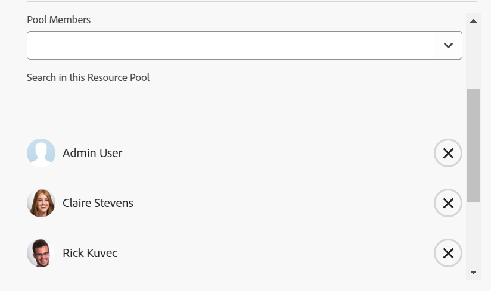

# Remove users from resource pools

{{highlighted-preview}}

Although there is no limit to how many users you can have in a resource pool, the list of users only displays the first 2000 users, listed alphabetically.

We recommend that you remove users that have been deactivated or have moved roles or departments, to ensure you always have an accurate list of users in all resource pools.

For more information about resource pools, see [Resource pools overview](../../../resource-mgmt/resource-planning/resource-pools/work-with-resource-pools.md).

## Access requirements

+++ Expand to view access requirements for the functionality in this article.

You must have the following:

<table style="table-layout:auto"> 
 <col> 
 <col> 
 <tbody> 
  <tr> 
   <td role="rowheader">Adobe Workfront plan*</td> 
   <td> 
Pro and higher
 </td> 
  </tr> 
  <tr> 
   <td role="rowheader">Adobe Workfront license*</td> 
   <td> 
Plan 
 </td> 
  </tr> 
  <tr> 
   <td role="rowheader">Access level configurations*</td> 
   <td> 
Edit access to&nbsp;Resource Management that includes access to Manage Resource Pools
 
View or higher access to Users
 
Note: If you still don't have access, ask your Workfront administrator if they set additional restrictions in your access level. For information on how a Workfront administrator can change your access level, see <a href="../../../administration-and-setup/add-users/configure-and-grant-access/create-modify-access-levels.md" class="MCXref xref">Create or modify custom access levels</a>.
 </td> 
  </tr> <!--
   <tr data-mc-conditions="QuicksilverOrClassic.Draft mode"> 
    <td role="rowheader">Object permissions</td> 
    <td> 
(NOTE:&nbsp;I don't think this is needed for removing users from the pool)
 
Manage permissions for the projects, templates, and users you associate the Resource Pools with
 
For information on requesting additional access, see <a href="../../../workfront-basics/grant-and-request-access-to-objects/request-access.md" class="MCXref xref">Request access to objects </a>.
 </td> 
   </tr>
  --> 
 </tbody> 
</table>

&#42;To find out what plan, license type, or access you have, contact your Workfront administrator.

+++

## Remove users from a Resource Pool

You can remove users from a Resource Pool when those users are no longer needed in that pool.

To remove a user from a Resource Pool:

{{step1-to-resourcing}}

1. Click **Resource Pools** in the left panel.  
1. Select a Resource Pool and click **Edit**.
   Or  
   Click the name of a Resource Pool. 

1. Start typing the name of a user that you want to remove in the **Search in this Resource Pool** field.  
   Or  
   Start typing the name of a company, job role, team, or group, if you want to remove all the users associated with those entities.

   Sample image in the Preview environment:
   

   Sample image in the Production environment: 
   

1. Click the 'x' icon at the user level to remove a user from the Resource Pool. They are removed from all the lists they appear in.  
   Or  
   To remove all users associated with a job role, group, team, or company, click **Remove** at the job role, group, team level, or company level. This removes all the users associated with that job role, group, team, or company from the Resource Pool. 

1. Click **Save**.
